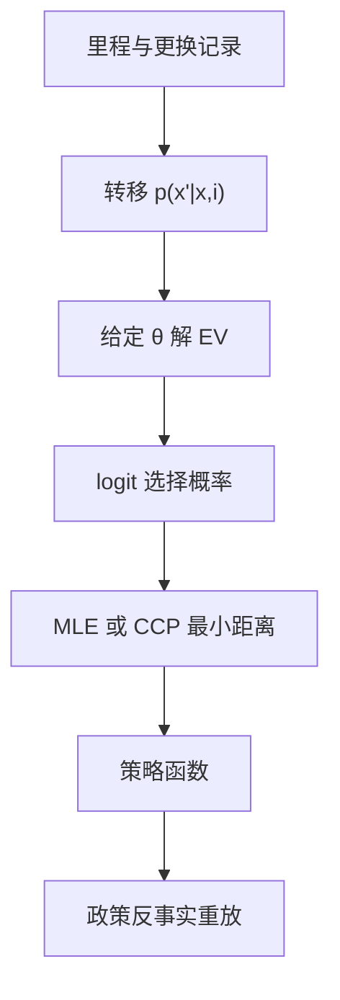

# 动态离散选择

换不换引擎不是看今天的维修账，是看里程这个状态通向的未来；把前向的账折成当期流效用，选择概率才与更换率对得上。

<footer>—— 据 Rust, Optimal Replacement of GMC Bus Engines, Econometrica 1987 整理</footer>

[上一课](/econ/se-blp-deep)把静态差异产品需求的工具与供给矩钉紧；那次购买没有日历。引擎更换、耐用品购买、出口参与、厂商退出，都是今天的选择改变明天的状态集，静态 logit 的弹性回答不了「何时」。本课把[贝尔曼方程](/econ/bellman-equation)的动态结构变成可估模型：状态、流效用、转移、折现，加一层随机效用误差，就是动态离散选择。主干计量课的[值函数迭代](/econ/value-function-iteration)在此从算法变成似然的内部器官。

## 问题

Harold Zurcher 每月决定换不换公交引擎。状态 $x_t$ 是里程，观测得到；$\nu_t$ 是他的维护生产率冲击，观测不到。他按

$$
V(x,\nu)=\max_{i\in\{0,1\}}\; u(x,i;\theta) + \varepsilon(i) + \beta\,\mathbb{E}\big[\,V(x',\nu') \mid x, i\,\big]
$$

行动，转移 $p(x'\mid x,i)$ 自己估计。缺口是三重的：这层不动点嵌在似然里，每个参数点都要重解一遍 $V$；$\nu$ 不可观测，选择之间存在模型没解释的序列相关；「结构性误差」$\varepsilon$ 的分布与流效用的量纲纠缠，不规范化就没有识别。

### 嵌套不动点与 CCP 的分工

标准写法（嵌套不动点）：给定 $\theta$，用条件独立假设把 $\nu$ 折进期望值函数，收缩映射解出 $EV(x)$，选择概率取 logit 形式，再对更换记录算似然。CCP（Hotz and Miller 1993）：先非参数估条件选择概率，再把 continuation value 写成选择概率的函数，跳过逐参数重解不动点——用一步非参数估计换嵌套循环。两者估同一对象，计算量与稳健性是取舍，不是两套经济学。

Rust 的规范化：流效用只能定到差一个正常数与一个正尺度。常数由「差不影响选择」吸收，尺度与 $\varepsilon$ 的极值参数合并——通常把 $\sigma$ 定为 1，估出的是 $u/\sigma$ 与 $\beta/\sigma$。折现因子与误差尺度不分开识别，报告时必须写明。

## 方法

估计分三段。第一段：状态的转移 $p(x'\mid x)$ 单独极大似然，与偏好无关。第二段：偏好参数进似然或矩——嵌套不动点走 MLE；CCP 走把观测更换率与模型概率匹配的最小距离。第三段：状态空间大时，积分用模拟，下一单元的模拟矩课接上。反事实：改折旧规则、改引擎价格、强制里程上限，都在解好的策略函数上重放——[卢卡斯批判](/econ/lucas-critique)在这里变成具体问题：若政策改变的是厂商对状态的感知而非回报，估好的策略不能外推。

## 机制

机制是前向账本。今天换引擎，付出固定成本，买到重置后的低里程状态与未来的维修节省；不换，状态恶化但保留选择权。估出的参数是这份账本的系数。状态变量必须穷尽决策者信息：Zurcher 看得见的隐性损耗若不在 $x$ 里，选择就有模型没解释的序列相关，估计会把它误读成折现或偏好。这也是不可观测状态 $\nu$ 要单独建模的原因——把看不见的异质扔进误差，参数全错。

与[上一课](/econ/se-blp-deep)对照：BLP 反演的对象是 $\delta$（当期效用的位置），本课反演的对象是 continuation value；前者一份份额就有一个方程，后者要靠跨期变异与转移结构。识别都声明在「变异从哪来」，不在计算。

## 边界

本课用条件独立与极值误差这两个强假设；它们放松时（误差序列相关、状态部分可观测），上面每个装置都要改装。大状态空间的职业选择模型（Keane–Wolpin 一类）要全新近似技术，本课不展开。折现因子与误差尺度的不分离是惯例性规范化，不是经济学结论。出口参与、退出这些结构性应用在下一课生产函数的深化里归位，本课不重复。

后课默认：前向选择先写状态、转移与规范化，再谈估计；CCP 与嵌套不动点是同一模型的两种算法。不要把静态 logit 的更换弹性直接拿去做政策外推。

## 小结

- 动态离散选择 = 状态 + 流效用 + 转移 + 折现 + 随机效用误差。
- 嵌套不动点解 $EV$ 进似然；CCP 用选择概率反演 continuation value，省掉逐参数求解。
- 状态要穷尽决策者信息，漏掉的异质会伪装成折现与偏好。
- 尺度与折现不分开识别，规范化要写明。
- 出处：Rust, *Econometrica* 1987；Hotz and Miller, *REStud* 1993；McFadden, *Econometrica* 1989。
