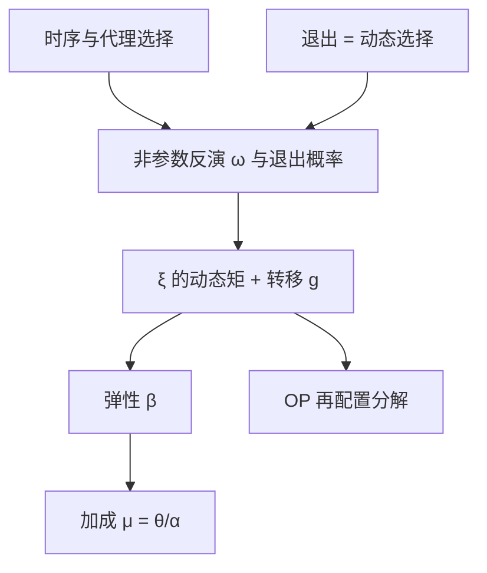
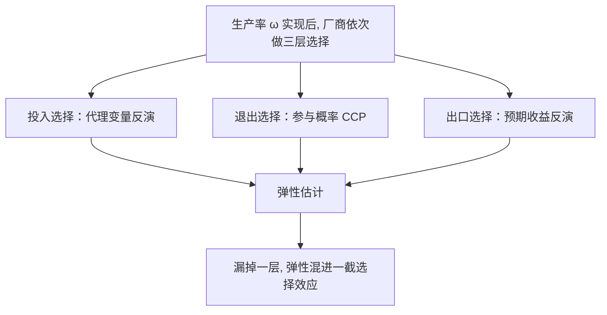

# 生产函数估计的深化

生产率不只是回归的残差：它是厂商的私有信息，是逐年滚动的状态，也是退出与出口的门票；估准了它的动态，弹性、加成与再配置才是一套账。

<footer>—— 据 Olley and Pakes, Econometrica 1996；De Loecker and Warzynski, AER 2012 整理</footer>

[上一课](/econ/se-dynamic-discrete-choice)把前向选择写成可估结构。生产函数里的 $\omega$ 正是这样一个状态：厂商看见它再选投入，太低的还会退出——[主干课](/econ/production-function-estimation)已经给了 OP/LP/ACF 的最小版本：代理单调、反演、创新矩。本课深化三处：第二阶段的动态写全、退出修正是动态选择问题而非修补、从弹性走到加成的最后一步。出口参与这个选择问题也一并归位。

## 问题

主干课把 $\omega$ 当「要赶出去的遗漏变量」；深化的立场是把它当对象本身。$y_{it}=\beta_k k_{it}+\beta_l l_{it}+\omega_{it}+\varepsilon_{it}$，若 $\omega$ 服从 $\omega_{it}=g(\omega_{i,t-1})+\xi_{it}$，那么 $\xi$ 才是新信息，矩条件是 $\mathbb{E}[\xi_{it}\mid\text{过去的资本与投入}]=0$——比主干课的第二阶段更精确，还允许生产率均值回归与异方差冲击。缺口在：退出不是样本麻烦，是经济行为；低 $\omega$ 厂商退出使样本里的 $\omega$ 被截断，修正要写成参与概率（上一课的装置）。而产出若是收入而非数量，价格随质量与市场势力变化，估出的「弹性」混着需求曲率。

直觉类比：$\omega$ 像厂商的「体质」，老板自己知道、外人看不见。体质好的多招人多投资、体质差的关门——所以数据里看到的厂商构成，已经是体质筛过一遍的结果。把回归残差当体质，等于只给幸存者做了体检。

### 从弹性到加成

De Loecker–Warzynski 把可变投入的一阶条件整理成

$$
\mu_{it} \;=\; \theta^{l}_{it}\big/\alpha^{l}_{it},
$$

$\theta^l$ 是产出对劳动的弹性（生产函数估计给出），$\alpha^l$ 是劳动支出份额（会计数据给出）。于是生产函数的产物不止 TFP：加成有了厂级时间序列。前提是劳动可灵活调整、无调整成本，且价格差异已被处理——每条前提都能坏。

数字实例：估出劳动弹性 $\theta^l=0.6$，会计数据显示劳动支出份额 $\alpha^l=0.3$，则加成 $\mu=0.6/0.3=2$——价格是边际成本的两倍。若存在解雇成本、劳动其实不灵活，这个「2」就系统性偏高，市场势力被高估。

Olley–Pakes 1996 的再配置分解：行业生产率变化 = 厂内成长 + 存活者间份额转移 + 进入 − 退出。宏观「全要素生产率提高」可能是厂内进步，也可能只是低效厂关门，政策含义完全不同。

## 方法

完整写法分四步。第一步：声明时序——资本预定，代理变量（投资或中间投入）在 $\omega$ 实现后选择。第二步：非参数第一阶段，把 $\omega$ 的现值与退出概率一并收进函数；退出概率正是上一课动态选择里的 CCP。第三步：第二阶段用 $\xi$ 对滞后状态的矩估 $\beta_k$，同时估转移函数 $g$ 与退出机制参数。第四步：把弹性代进加成公式，或把 $\omega$ 的分布送进 OP 再配置分解。

收入与数量的分岔是老坑：只有收入数据时需同时估需求（或控制价格），否则 $\beta_l$ 吸了加成差异。[上一课](/econ/se-dynamic-discrete-choice)的反演思想在出口参与处复用：厂商看见预期出口收益再选择进入，把它当外生切换会高估「出口学习效应」。

## 机制

机制仍是信息时序，但深化的位置在「谁在选择」。主干课让代理变量吸收选择；深化课承认选择是多层的——投入选择、退出选择、出口选择——且都基于 $\omega$。每层选择对应一个反演或一个参与概率，估错一层，弹性就混进一截选择效应。ACF 的警告在这里更尖锐：两支灵活投入不能同时从同一阶段拆出两个弹性，时序声明是识别而非文书。

转移函数 $g$ 让「生产率的持续性」可检验：若 $g$ 的斜率接近一，冲击是持久性的，投资与进入行为会放大它；若强均值回归，份额再配置主导。同一套矩既估弹性又估动态，这是把 $\omega$ 当对象的回报。

常见误区：初学者容易把「出口企业生产率更高」读成「出口让企业变强」。若体质好的企业先选择出口，把外生切换当因果就会把选择效应读成学习效应——修正办法是给出口决定单独建一个参与概率。

## 边界

本课不重算宏观 TFP 核算，也不把加成当成市场势力的完整度量——固定成本与进入壁垒不在 $\mu$ 里。Gandhi–Navarro–Rivers 的识别质疑（主干课提过）没有消失：某些完全竞争设定下弹性识别变薄，要靠需求边或风险价格补。加成公式的「劳动可灵活调整」若不成立（解雇成本存在），$\mu$ 系统性偏。质量调整与数量错测的坑照旧。

后课默认：厂级生产函数先写多层选择与时序；退出与出口是动态选择问题；收入数据要配需求或价格控制；弹性之外顺手报加成。下一课拍卖：对象换回博弈场，出价反演估值。

## 小结

- $\omega$ 是对象：转移 $g$ 与创新 $\xi$ 的矩让生产率动态可估。
- 退出与出口写成参与概率（CCP），不是样本清洗。
- De Loecker–Warzynski：加成 = 弹性 ÷ 支出份额，前提是劳动灵活调整。
- OP 分解把行业 TFP 变化拆成厂内、再配置、进入、退出。
- 收入数据混入价格差异，须配需求边。
- 出处：Olley and Pakes, *Econometrica* 1996；Levinsohn and Petrin, *RES* 2003；Ackerberg, Caves and Frazer, *Econometrica* 2015；De Loecker and Warzynski, *AER* 2012。
