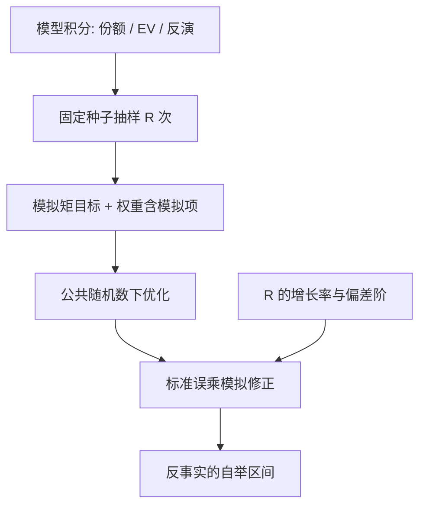
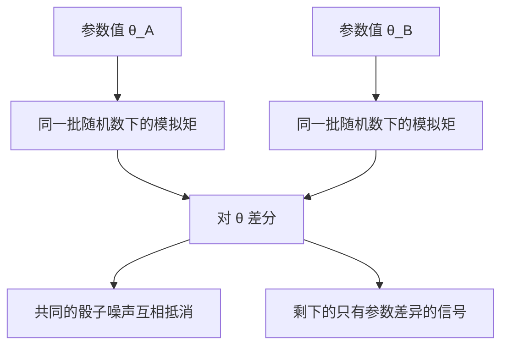

# 模拟矩方法

模型里的积分算不动，就用抽样代替；模拟误差必须以抽样的速度消失、并走进标准误，否则估计可以一致，推断却在说谎。

<footer>—— 据 McFadden, Econometrica 1989；Pakes and Pollard, Econometrica 1989 整理</footer>

[上一课](/econ/se-bayesian-structural)换了估计原则，但四课装置还有一个共同的数字尾巴：积分。BLP 的份额是 $\beta_i$ 上的积分，动态选择的期望值函数是状态上的积分，拍卖反演要核密度，模拟似然以抽样为引擎。本课把这些散在各课的模拟收拢成一门方法：[GMM](/econ/gmm-econ) 的框架不动，只是内层期望换成蒙特卡洛平均，而模拟误差要进渐近分布。

## 问题

写出 $\mathbb{E}[g(W,\theta)]=0$ 容易，算出 $g$ 难：份额积分维度随产品特征走，动态积分维度随状态空间走，数值积分在四维以上就不可行。用抽样平均

$$
\hat g(\theta) \;=\; \frac{1}{R}\sum_{r=1}^{R} g(\theta,\omega^r)
$$

代替，代价有二：目标函数随抽样抖动，换一批 $\omega$ 最优点就搬家，优化器在噪声上找零点；渐近方差多出模拟项——$R$ 有限时标准误要乘修正因子，否则置信区间过窄。

术语翻译：蒙特卡洛平均就是「算不动的期望用掷骰子代替」——从分布里抽 $R$ 个点，把函数值平均起来当期望。代价是这批骰子带来的抖动会跟着走进估计：目标函数变成随机的，换一批点，最优解就搬一次家。

### 平滑、公共随机数与抽法

三件套管理模拟误差。公共随机数：全参数路径用同一批 $\omega^r$，目标函数对 $\theta$ 连续（否则纯噪声），优化器才有的找。抽法：Halton 序列等拟蒙特卡洛在同样 $R$ 下覆盖更均匀，Train 的模拟估计教材给了系统对照。偏差阶：McFadden 1989 的模拟矩估计要求 $R$ 随 $n$ 增长，偏差与方差都写进极限分布；$R$ 固定则估计带模拟偏差，不能再当一致估计报告。

间接推断是 SMM 的近亲：用一个灵活的辅助模型（如 VAR 或简化式 logit）拟真实数据，再用结构模型模拟出数据拟同一辅助模型，以辅助参数的距离为目标。Gourieroux–Monfort 的间接推断与 McFadden 的 MSM 同属模拟估计家族，[校准与矩匹配](/econ/calibration-moments)课提过这门亲。

## 方法

实施清单：固定随机种子与抽法（可复现）；选 $R$ 并报告敏感性——$R$ 翻倍，估计动多少；两步最优权重用含模拟项的协方差（否则 $J$ 的水平失真）；模拟似然的情形（动态离散选择、多元 probit）用 McFadden 1989 的平滑模拟频率或 GHK 递归，选择概率的模拟估计以 $R^{1/2}$ 级收敛。反事实同样带模拟误差：均衡重解后的福利差要连同抽样的不确定性一起自举或后验化。

数字实例：模拟误差按 $1/\sqrt{R}$ 缩小——$R=100$ 时约是单次波动的 10%，$R=10000$ 时缩到 1%。要让模拟噪声与抽样误差同速消失，$R$ 必须随样本量一起涨；$R$ 固定的估计即使样本无限大，也停不到真值上。

## 机制

机制是偏差与方差的交换。模拟误差以 $1/\sqrt{R}$ 的速度进估计；公共随机数把「不同 $\theta$ 的比较」从蒙特卡洛噪声里解放出来——份额预测、策略函数的比较是差分，差分吃掉共同噪声。这正是模拟在结构模型里比在描述统计里更有用的原因：要的是 $\theta$ 变动前后的一致比较，不是绝对水平。效率的思想照旧：抽样密集区应靠近矩敏感区。

与[校准](/econ/calibration-moments)的分界在推断：矩匹配不优化、不报标准误，SMM 优化并完整报渐近分布；与[上一课](/econ/se-bayesian-structural)的接口是模拟矩也可以定义后验，两套口径对照报。

常见误区：初学者容易以为「固定随机种子 = 消除了抽样噪声」。种子固定只保证别人能复现你同一份抖动，抖动本身还在；$R$ 太小或标准误漏乘修正因子，置信区间照样说谎。

## 边界

$R$ 有限时「一致」是渐近修辞，报告要带 $R$ 敏感性。模拟不救识别：矩仍要能分开参数，$J$ 仍只是过度识别约束的内部一致。多元 probit 的 GHK、动态模型不动点内嵌模拟，各有专门文献，本课只立框架。不要把种子固定误当纯度——种子固定为可复现，不消除抽样噪声。

后课默认：带积分的模型一律声明抽法、$R$、公共随机数与模拟修正；推断不装作没有模拟误差。下一课结构模型的验证：矩拟合之后，反事实凭什么可信。

## 小结

- SMM = GMM 框架 + 内层期望换抽样平均，框架不变。
- 模拟误差进点估计（$R$ 的增长条件）与标准误（修正因子）。
- 公共随机数与拟蒙特卡洛管理目标函数的抖动。
- 间接推断用辅助模型参数做目标，与 MSM 同族。
- 出处：McFadden, *Econometrica* 1989；Pakes and Pollard, *Econometrica* 1989；Train, *Discrete Choice Methods with Simulation*；Gourieroux–Monfort 的间接推断。
