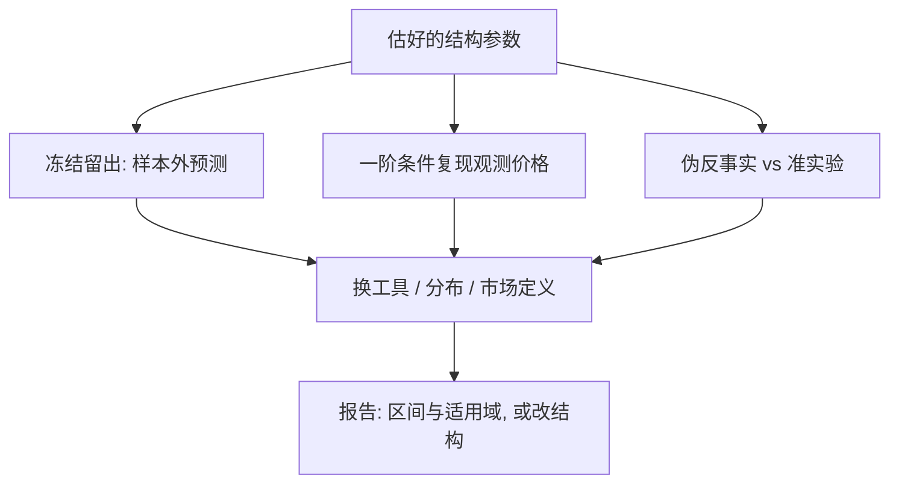
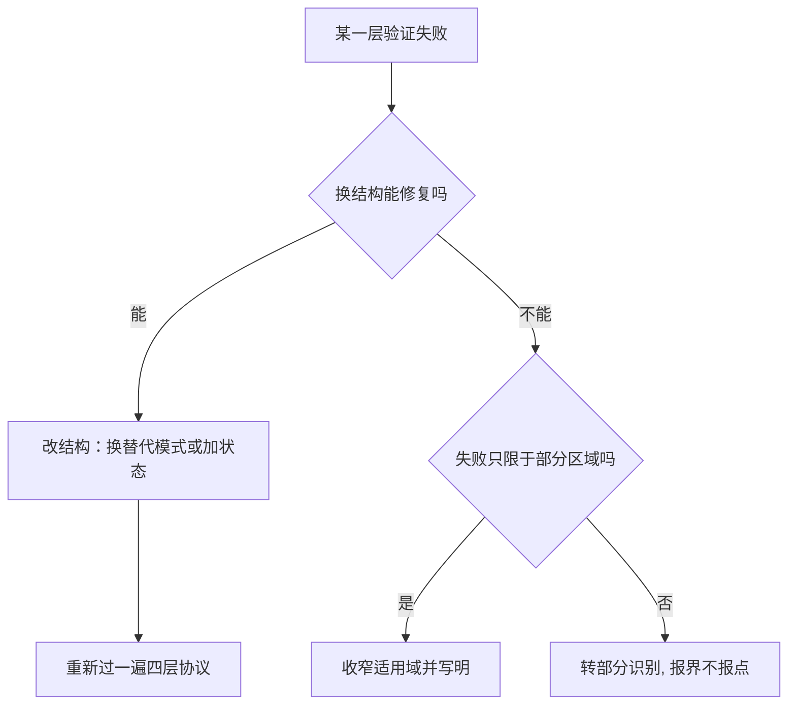

# 结构模型的验证

拟合得再好的矩也不背书反事实；验证的对象是不变性——换市场、换年份、换政策，估好的参数是否还在原处。

<footer>—— 据 Berry, Levinsohn and Pakes, Econometrica 1995；Peters, Evaluating the Performance of Merger Simulation, JLEO 2006 整理</footer>

[上一课](/econ/se-smm)把积分与模拟误差管住，至此估计与计算都有答案。还欠一件事：这些参数只是拟合了你选定的矩，反事实是模型在从未发生过的区域的输出。[结构对约化形式](/econ/structural-vs-reduced)主干课立了口令——结构的价值在不变形的参数；本课写「不变形」怎么被检验。合并模拟的实绩评估是最好的试验场：模型预测的合并涨价，与事后真实涨价比。

## 问题

验证的困难是结构性的：反事实的支持里没有数据，以后也不会有。能做的是把不变性拆成可检验的分段——跨市场的（同一需求在别的城市成立吗）、跨时间的（昨天的偏好在今年还稳吗）、跨政策的（行为对规则变化的反应被钉住了吗）。拟合优度不回答这些：$J$ 不拒绝只说明矩彼此一致（[GMM](/econ/gmm-econ) 课的旧话），观测等价的模型可以在支持外给出完全不同的反事实。缺口是操作协议：哪些检验、什么顺序、失败后怎么办。

术语翻译：「不变性」就是「参数是世界的性质，不是这次回归的副产物」——换城市、换年份、换政策，同一套偏好与成本还该适用。反事实的全部信用都押在这句话上，所以验证就是系统地给这句话找麻烦。

### 验证协议

四层。第一层，样本外预测：留出市场或年份，用估好的模型预测价格、份额、新品份额，预测误差与估计期拟合直接对比。第二层，约束复现：供给一阶条件在观测所有权下应能复现观测价格（[合并模拟](/econ/merger-simulation)课的检验步骤），失败即结构有缝。第三层，伪反事实：模型预测一个「其实发生过」的事件（已实施的政策、已完成的合并），与[双重差分](/econ/difference-in-differences)或[断点回归](/econ/rdd)的准实验估计对表——同一事件、两种口径。第四层，敏感性与不确定性：换工具、换分布假设、换市场定义重估；反事实区间用[自举](/econ/bootstrap-econ)或后验给出，不报裸点。

Peters 2006 把模拟预测与事后价格对照：需求弹性与方法的选择都会改变预测方向。单一案例的胜负不裁决模型，系统性对照才暴露「拟合好、反事实差」的组合；验证段要报负面结果，不能只留通过项。

## 方法

顺序即纪律：先检验后使用。留出集必须在估计前冻结，否则「样本外」只是同一样本的二次拟合。伪反事实要对表同事件：模型预测的是「若当时涨价一成」，DiD 估的是实际发生的那个事件，口径不一致的比较是修辞。不确定性分两条传：参数不确定性（自举或后验）与均衡解的数值误差分开报。失败后的选项按诚实度排：改结构（换替代模式、加状态）、收窄适用域、转部分识别报界——顺序不能倒，把界悄悄换成点估计等于没验。

直觉类比：留出集像考卷——必须在你答题之前封存。若先看过考卷再调模型，再高的分数也只是背过答案；「样本外预测」只有从估计那一刻起就没看见过的数据，才算数。

## 机制

机制是「验什么」。每个检验对应一段不变性声明：样本外预测验市场间不变，一阶条件复现验成本与行为假设，伪反事实验政策反应函数，敏感性验结论对不可检验假设的依赖。模型可以层层通过而仍在新政策上错——政策若改变模型未建模的边际（进入、产品重定位、合谋组织），那是结构的边界而非验证的失败，但要写出来。验证的产出不是「通过或不通过」，是「模型在哪些区域可信」的地图。

常见误区：初学者容易把「矩拟合得好、$J$ 检验不拒绝」当成模型通过了验证。那只说明你选的矩彼此自洽；两个观测上等价的模型，可以在数据没覆盖的区域给出方向相反的反事实。验证的对象是不变性，不是拟合。

## 边界

验证不产生证明：通过全部检验也不担保下一场干预。校准拟合不是验证（[校准与矩匹配](/econ/calibration-moments)的旧分别）。微观验证（二次选择、购买面板）是额外证据，不是豁免。伪反事实里准实验自身也有识别假设，对表时两边都要摆出假设账。

后课默认：结构论文的验证段报四层协议的结果与失败处理；没有验证段的结构估计是命题，不是证据。下一课收束：把七课装置放回案例，看它们各自回答过什么问题。

## 小结

- 拟合优度不验证反事实，验证对象是不变性的分段。
- 四层协议：样本外预测、约束复现、伪反事实对表准实验、敏感性加区间。
- 留出集估计前冻结，对表要同事件同口径。
- 失败后按诚实度处理：改结构、收窄域、报界，不得倒序。
- 出处：Berry, Levinsohn and Pakes, *Econometrica* 1995；Peters, *JLEO* 2006；准实验对照见 DiD 与 RDD 文献。
