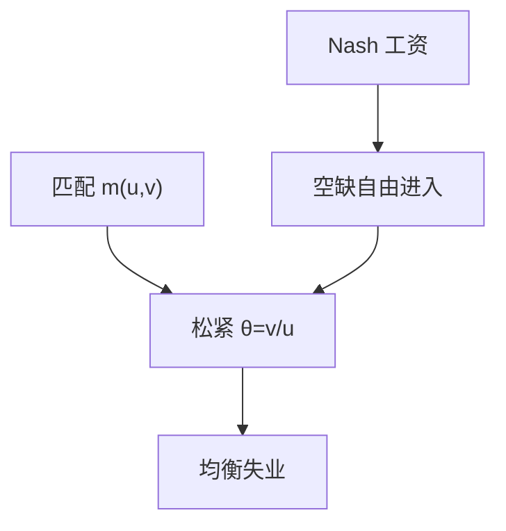

# DMP 搜寻匹配

失业可以是均衡：岗位与人要配对，空缺有成本，工资在匹配租上讨价还价；瓦尔拉斯的劳动市场出清不是默认。

<footer>—— Pissarides, Equilibrium Unemployment Theory；Mortensen and Pissarides, RES 1994；对照 Diamond 的搜寻均衡</footer>

[上一课](/econ/growth-vs-development-acct)用增长核算与发展核算收束增长主干：$L$ 被当成自然率上的投入。本课的缺口是：自然率本身从哪来。贝弗里奇曲线已经画出 $(u,v)$，还没有均衡。Diamond–Mortensen–Pissarides（DMP）把匹配函数、空缺进入与工资议价收成一条均衡失业。效率工资是下一课的另一条微观。

## 问题

瓦尔拉斯劳动市场：$w$ 使 $L^s=L^d$，$u$ 只剩摩擦或测量。增长核算需要这条出清来谈 $A$。观测上 $u$ 与 $v$ 同时为正。缺口不是再分解 TFP，而是：在规模报酬不变的匹配 $m(u,v)$ 下，失业与空缺如何成为稳态存量。Pissarides 的均衡失业、Mortensen–Pissarides 的内生破坏，是同一家族；Diamond 给出搜寻可以有多重或无效率均衡的先行结构。

匹配函数把两人相遇的流量写成 $u$、$v$ 的函数，类似生产函数。CRS 时松紧 $\theta=v/u$ 是充分统计：找工作概率 $f(\theta)$，填岗概率 $q(\theta)=f(\theta)/\theta$。

## 方法

空缺的自由进入：招人成本等于填岗后工作关系的期望现值。工作关系的租在工人与厂商间 Nash 分成，工资随生产率与 $\theta$ 动。稳态：失业流入（破坏）等于流出 $f(\theta)u$。于是一条向下倾斜的岗位创造曲线与贝弗里奇关系共同定 $(u,v)$。生产率上升：厂商多贴空缺，$\theta$ 升，$u$ 降——沿曲线走。匹配效率下降：曲线外移。

自然率 $u^*$ 在此是摩擦均衡，不是「不想工作」。参与仍在劳动力定义里；DMP 标准版本把劳动力当给定，把 $u$ 当劳动力内部的存量。

### 不是把 $u$ 写成需求缺口

周期里 $\theta$ 随需求与生产率动，$u$ 会偏离其稳态。那是 DMP 的波动，不是把匹配函数改回 Okun 的会计。Hosios 条件给出何时分散议价有效；一般不满足，搜寻有外部性——这是福利，不是「因此要用总需求填满」。

### 破坏率是另一条冲击

Mortensen–Pissarides 让岗位破坏内生：生产率落到阈值以下则拆伙，$u$ 的流入不再是常数。周期里 $u$ 可以因破坏跳升，而不只因 $f(\theta)$ 下降。

本课基准仍可用外生破坏率教学。定量波动之谜（Shimer）常从工资刚性或破坏冲击入手，不在此修参数。

## 机制

岗位有成本，不能瞬时找齐人，故 $v\gt 0$；人不能瞬时找齐岗，故 $u\gt 0$。破坏率上升（Mortensen–Pissarides）时，关系更短，进入条件要求更高的 $\theta$ 或更低的工资，$(u,v)$ 一起变。工资刚性会放大 $u$ 对生产率的反应——后课粘性工资会借这条通道，本课先保持灵活议价。

增长主干里的充分就业路径，应读成：在 DMP 的稳态 $u^*$ 与自然参与上使用的劳动。把调查 $u=0$ 当索洛的 $L$，与贝弗里奇课同一错误。本课不校准匹配弹性。

空缺的自由进入把 $v$ 变成均衡变量，于是贝弗里奇曲线不再只是观测云团：岗位创造曲线给出另一条 $(u,v)$ 轨迹，交点是稳态。生产率冲击主要沿曲线移动交点；匹配效率冲击移动曲线本身——与 U–V 课的沿曲线/外移对照同一句话，现在有了均衡支撑。工资议价若改成分享规则，交点跟着动，但匹配函数还在。

Shimer 指出标准校准下失业波动太小，是 DMP 的定量缺口，不是否定匹配装置。本课只钉结构，不修这个谜。

## 边界

本课不把招聘写成限价簿。效率工资下一课给出即使没有匹配函数也可以有均衡失业的纪律装置；二者可并存，不要写成互相取消。CIP 不在劳动匹配里。也不把搜寻摩擦写成发展核算的全部 $A$——错配可以含匹配，但不等于 DMP 已经识别了跨国 TFP。

匹配函数的规模报酬不变是方便：$\theta$ 成为充分统计。递增或递减报酬会改动态，本课不展开。岗位补贴、失业金进入议价与进入条件，比较静态要声明改的是哪一块，不能从「降低 $u$」反推福利。Hosios 已经警告分散均衡一般无效率。

后课默认：均衡失业可以来自匹配与空缺成本；$u^*$ 是摩擦存量。下一课：即使配对瞬时，工资作为纪律仍可留下非自愿失业。

## 小结

- 增长核算把 $L$ 当自然投入；本课给 $u^*$ 一个匹配微观。
- $m(u,v)$、空缺进入与议价共同定 $\theta$ 与 $u$。
- 贝弗里奇曲线是观测；DMP 把它收成均衡。
- 议价一般无效率（Hosios）；定量波动是另一缺口。
- 出处：Pissarides《均衡失业》；Mortensen and Pissarides, *RES* 1994；Diamond 搜寻均衡。
