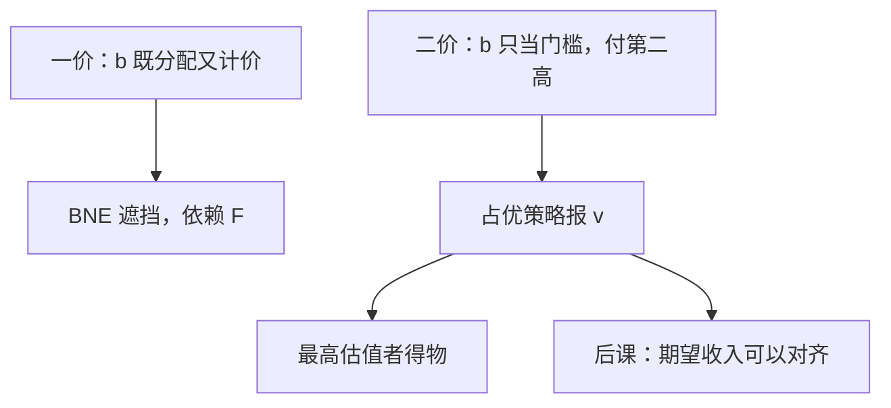

# 二价与维克里

第二价格密封拍卖中，报出真实估值是占优策略：报价只决定是否得到物品，应付价格由别人的最高报价钉住。

<footer>—— Vickrey, Counterspeculation, Auctions, and Competitive Sealed Tenders, Journal of Finance, 1961</footer>

[上一课](/econ/english-dutch-auction)（英式与荷式拍卖）。的一价均衡要算遮挡，函数依赖 $F$ 与 $n$。缺口是：有没有规则让说真话成为占优，从而不必知道先验？Vickrey 的第二价格密封：最高报价得物，支付**第二高**报价。本课钉占优策略真话，不把收入等价提前写成定理。

## 问题

IPV 仍在：$v_i$ 私有。每人报 $b_i$。令 $p_{(2)}$ 为别人报价中的最高。若 $b_i>p_{(2)}$ 则得物并付 $p_{(2)}$，否则得零。比较报 $b_i=v_i$ 与报别的数：

- 报高过 $v_i$：只在 $v_i<p_{(2)}<b_i$ 时改变结果，此时赢了但 $p_{(2)}>v_i$，净支付为负；其余情形与报真值相同。
- 报低于 $v_i$：只在 $b_i<p_{(2)}<v_i$ 时改变结果，此时本该赢的互利交易被自己丢掉。

故报真值对每一 $p_{(2)}$ 都不差，且对某些严格更好——占优策略，不只是某个先验下的 BNE。英式口头拍卖在 IPV 下与二价策略等价：一直留到价格碰到自己的 $v$。

### 真话不是道德，是支付与分配解耦

一价里同一数字既当「我要不要赢」又当「赢了付多少」，所以要遮挡。二价把支付钉在别人的报上，自己的报只当门槛。占优来自这条会计，不是来自「维克里拍卖更公平」。共同价值下真话不必占优：别人的报带着关于物品的信息，$p_{(2)}$ 不再是与你无关的数。

两人时，二价占优均衡的结果是：高估值者得物，付低估值者的报。若两人都说真话，成交价是第二高估值。一价均衡遮挡后，谁赢、期望付款，对称 IPV 下可以与这一结果对上——那是后课等价，本课只钉占优。

## 方法

对象：IPV、单一物品、第二价格规则（密封或英式）。结论：说真话是（弱）占优；均衡配置有效（最高估值者得物），不必解微分方程。风险厌恶不破坏占优真话——因为论证不对概率取期望。预算约束、保留价改参与，不改「已参与则报 $v$」。

多物品、公共物品的维克里–克拉克–格罗夫斯（VCG）把同一思想写成：付你给别人造成的外部性。本课单物品二价是 VCG 的特例，不展开一般机制。

## 机制

占优论证逐点打在 $p_{(2)}$ 上，因此不需要共同先验，甚至不需要知道有几个对手——只要 IPV、单物品、付第二高。这与[显示原理](/econ/revelation-principle)的占优策略版衔接：二价已经是直接机制，真话 IC 成立。一价不是：直接报 $v$ 在一价里不是均衡，必须先遮挡再报。

无效率从哪来？若价值有外部效应（拍卖品污染邻居），真话仍关于自己的 $v$，社会有效另要加项。若可合谋，两人可以压低第二价：占优是针对单人偏离，挡不住联盟。假名投标（一人扮两人）也能操纵第二价。占优不是联盟稳定。

### 与林达尔、庇古不是同一句话

公共品里「报 MRS」不是占优，林达尔要真实偏好却给谎报激励。维克里能真话，是因为支付按你给别人造成的边际伤害（把第二高挤掉）来收，把外部性内部化进自己的问题——单物品拍卖的「外部性」恰好是占走了物品。公共品多人受益，VCG 能真话但会破预算；那是后课机制，本课不把二价写成公共品融资。

荷兰式（降价）策略等价于一价；英式等价于二价。四种经典拍卖在 IPV 对称风险中性下期望收入相同，是收入等价的内容。本课只需要：二价占优真话，一价否。

## 边界

关联价值、赢家诅咒下，英式与二价密封不再策略等价：英式能看见别人退出，信息不同。风险厌恶改一价遮挡，不改二价真话。保留价提高效率可能下降（把物品留给卖方），但真话仍是占优。

弱占优：在 $p_{(2)}=v_i$ 的零测集上，报高报低都无差（反正支付为零）。严格来说真话是弱占优。这不影响「不必知道 $F$」：没有任何先验会让人严格想偏离真话。

拍卖课序下一步是收入等价：同一 $G(v)$ 的机制期望支付相同。本课默认：IPV 二价（维克里）中报真值是占优策略；有效性来自最高估值者得物，不来自卖方收入最大。

## 小结

- 二价把「是否赢」与「赢了付多少」拆开，真话占优。
- 论证不依赖 $F$ 与 $n$，只依赖 IPV。
- 一价必须遮挡；二价不必。
- 占优挡单人偏离，挡不住合谋与假名。
- 出处：Vickrey, *Journal of Finance*, 1961。
