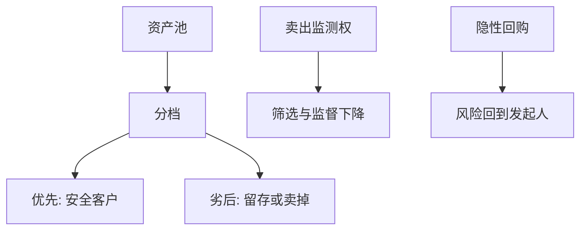

# 证券化与发起-分销

    
把贷款切成档、卖掉，可以把风险移出资产负债表，也把监测激励移出；发起–分销在信息不可验证时，用评级与结构替代关系。

    <footer>—— 据 Gorton and Metrick 对证券化与影子银行的综述；Keys, Mukherjee, Seru and Vig, Journal of Monetary Economics / QJE 相关工作；Tirole, Theory of Corporate Finance</footer>

[上一课](/econ/credit-rating-agencies)指出结构化产品是评级购物的温床。本课缺口是发起–分销（OTD）：企业（与银行）为何证券化、风险转移是否真实、监测如何退化。不重写主体评级的通过周期，不把限价簿上的 MBS 做市写成主线。

## 问题

持有至到期要求资本与监督。证券化：资产池、破产隔离、分档，把优先档卖给要安全资产的客户（Miller 客户、货币基金），留存或卖掉劣后。Gorton–Metrick：这是影子银行生产安全债的技术。Keys 等：当贷款更容易被证券化、监测标准下降时，违约更差——OTD 的道德风险。缺口是对企业融资的含义：应收账款、租赁、项目现金流都可以出表；看起来 WACC 下降，可能只是把风险与监测卖给了不理解档次的买家。

真实出售 vs 隐性担保：发起人为声誉在危机中把资产买回，风险未转移。APV 若按出表减债、又不计或有回购，会高估股权价值。

## 方法

动机清单：监管资本套利；分散地域/行业；获得比企业主体更优的档次定价（结构优于主体）；流动性。成本：开销、留存要求、柠檬（买家怕被选差资产）、监测下降。Tirole：可验证现金流（标准化按揭、合格应收）更适合分档；软信息贷款证券化则信息损失最大。

对企业资本结构：证券化像有抵押的优先债加出售期权。杠杆的经济口径应并表风险，而不是只看主体报表。动态权衡的 $D^\ast$ 若按表内债计算，会被 OTD 绕开——直到隐性担保实现。

与关系：OTD 是关系的反面——信息标准化、可转让。关系课的竞争与转卖在此完成。评级购物给优先档盖章，使不监测的买家愿意持有。

## 机制

机制是要求权再切与激励再切。MM 说切片不改变资产；OTD 试图改变的是**谁监测**与**哪套监管权重**。若监测改变资产本身的违约（筛选松了），资产收益流变了，不是纯切片。这是 MM 假设失败的又一例：切片技术改变了现金流。

危机：优先档的安全是条件安全，依赖相关违约不高、评级不跳。宏观课序的影子挤兑是优先档的批发融资逃跑。企业若依赖资产支持商业票据为营运资本融资，展期课的墙出现在表外管道。

### 不要把证券化写成「一定不好」

风险真正转移、监测用留存与对价维持时，专业化可以有收益。问题是激励不相容的 OTD 加监管套利。资本预算对出表融资应做并表情景与回购情景两套 APV。

Keys, Mukherjee, Seru, Vig：易于证券化的贷款质量更差，是监测激励的证据。引用其期刊论文即可，不要编造编号。

## 边界

不要把本课写成 CDO 结构图全集。下一课财务困境：当 OTD 失败、资产回到表内或管道冻结，企业进入重组。第 11 章处理的是主体，管道有另一套破产隔离——隔离失败是隐性担保的法律表达。

后课默认：OTD 改变监测与监管口径；经济杠杆可以与表内杠杆分家。评级与安全档客户是需求侧。真实出售假设必须做压力。

## 小结

- 证券化分档服务安全债客户，也把监测从发起人挪走。
- 筛选下降与隐性担保使 MM 切片假设失败：资产本身变了。
- 出表不能自动降低经济资本成本；APV 要并表与回购情景。
- 出处：Gorton–Metrick；Keys, Mukherjee, Seru and Vig；Tirole。
