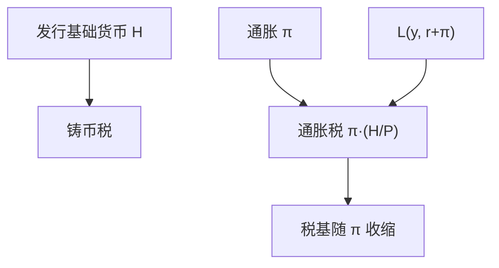

# 通胀税与铸币税

发行基础货币的收入，等于公众为持有实际余额而交给发行者的资源；通胀把这笔税藏进 $P$ 的上升里。

<footer>—— 据 Friedman 对通胀税的分析；Cagan, The Monetary Dynamics of Hyperinflation, 1956</footer>

[上一课](/econ/quantity-theory)把 $MV=Py$ 推进到长期中性：$M$ 的水平主要定 $P$。本课的缺口是：政府（或央行）为什么要增加 $M$。若新发行的基础货币用来买实际资源或兑付名义负债，发行者得到**铸币税**；持有实际余额的人承担通胀税。菲利普斯曲线把通胀接到失业，那是下一课；本课只把税写清楚。

## 问题

中性说 $M$ 不改变 $y^*$，但改变 $M$ 的过程可以把资源从持币者转到发行人。记基础货币为 $H$（外部货币），铸币税的流量近似为

$$
\frac{\dot{H}}{P} = \pi\cdot\frac{H}{P} + \frac{d}{dt}\Bigl(\frac{H}{P}\Bigr),
$$

即通胀税 $\pi\cdot(H/P)$ 加上实际余额的积累。稳态里实际余额不变，铸币税就是 $\pi$ 乘实际基础货币。这不是会计把戏：公众为了把 $M/P$ 维持在需求曲线上，必须不断放弃货物去换新发行的名义余额。

Cagan（1956）在恶性通胀里把货币需求写成预期通胀的函数：$\pi$ 越高，$H/P$ 越小，税基收缩。税率与税基对冲，铸币税对 $\pi$ 可以有拉弗型峰值。本课用这条结构，不估计某次改革的具体数字。

有利息的准备金改变税基：若 $H$ 几乎都付市场利率，传统铸币税缩小。Woodford 的利息规则把操作目标从 $H$ 转到政策利率，税的故事要改口，但零利率或低息通货仍可征税。

## 方法

货币需求 $H/P=L(y,i)$，$i=r+\pi^e$。稳态 $\pi^e=\pi$，实际铸币税 $\pi L(y,r+\pi)$。极大化铸币税的 $\pi$ 满足税基弹性条件，与普通商品税同一形状。恶性通胀是需求弹性已经很大、预期追上甚至超过当前 $\pi$ 的区域：再加速发行，税基塌陷，实际收入反而下降。

财政会计：铸币税是弥补 $G-T$ 的一种融资，与发债并列。若债要靠未来铸币税偿还，预期通胀会立刻进入 $P$——这是后课时间不一致与财政的接头，本课只记下：预算约束里有一项 $\dot{H}/P$。

### 通胀税不是 CPI 的全部

相对价格、间接税、汇率也会动 $P$。铸币税专指因发行 $H$ 而转移的资源。用 CPI 涨幅乘广义 $M2$ 会算错税基：内部货币的「税」一部分是银行的负债重估，不是政府收入。

## 机制

持币者要维持实际余额，必须把一部分收入换成新钞票，等于缴税。预期一旦形成，名义利率上升，人人少持 $H$，税基变小——所以「稍微多印一点」在高通胀区并不提高收入。Cagan 的适应性预期把 $\pi^e$ 写成滞后通胀；理性预期下，不可信的财政计划会让 $P$ 跳跃，铸币税的现值仍要满足跨期预算。

自然率仍然在：长期 $y$ 回到 $y^*$，通胀税改变的是持币成本与福利，不是用 $\pi$ 永久买到更高产出。超中性在此失败：$\pi$ 进入 $L$，从而进入稳态的实际余额与可能的交易成本。

Sargent–Wallace 的不愉快算术：若财政主导，债券路径不可持续，即使央行今天收紧，公众预期未来仍要印钞，$P$ 今天就可以跳。货币主导则是财政必须调整以配合通胀目标。独立央行把 $\mu$ 从日常缺口切开，铸币税变成残余；债务以本币计且财政不调整时，切开只是推迟。

准备金付息吃掉铸币税。现代操作把目标从 $H$ 转到政策利率，税的故事要改口，但低息通货仍可征税。

## 边界

本课不把恶性通胀写成政治史，也不写最优 $\pi$ 是否为零（Friedman 规则还要对齐名义利率与资本边际产出）。银行内生存款会放大名义量，但不自动把铸币税税基扩到 $M2$。量化栏没有「印钞」；本栏的 $H$ 是宏观外部货币。归宿可能累退：穷人现金比例高。外币替代缩小税基，加速崩溃。

后课默认：趋势通胀有财政–货币融资的一面；$\pi$ 不是免费的失业工具。下一课把 $\pi$ 接到 $u-u^*$ 与预期。

## 小结

- 铸币税是发行 $H$ 换来的实际资源；稳态里等于通胀税。
- 税基是实际余额，随预期通胀收缩，可有拉弗峰值。
- 税基是基础货币，不是任意 $M$ 层次。
- 财政主导下今天的 $P$ 已经含未来的 $\mu$。
- 长期中性仍在；$y^*$ 不靠 $\pi$ 购买。
- 出处：Cagan 1956；Friedman 的通胀税与货币需求；Sargent and Wallace 的不愉快算术。
