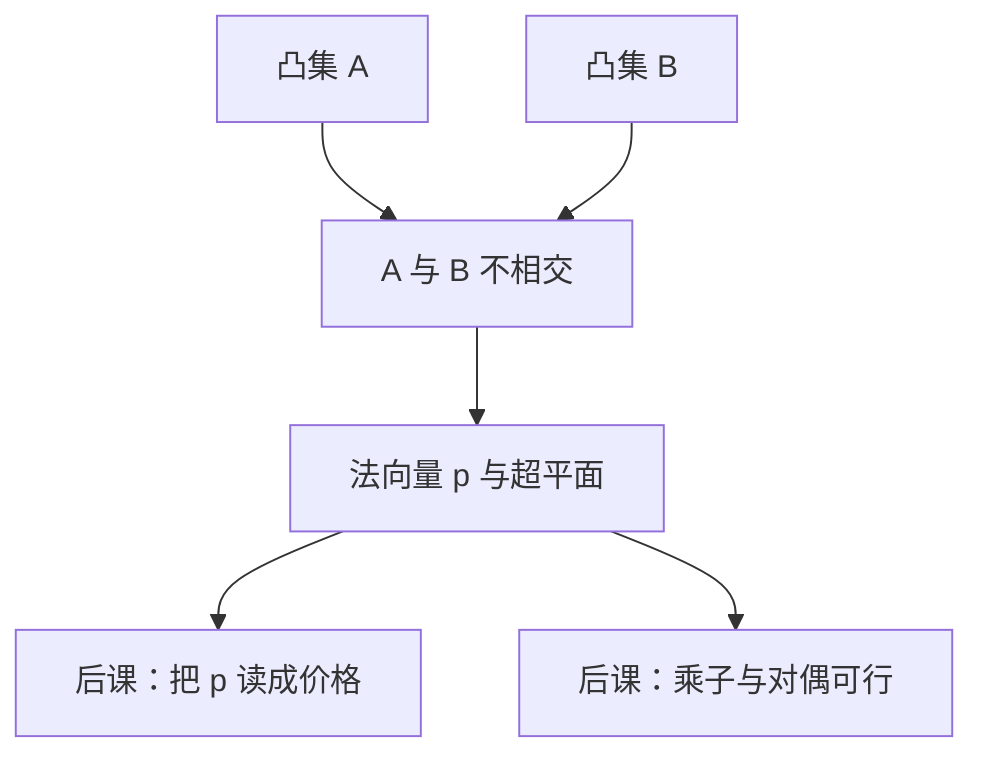

# 分离超平面

两个不相交的凸集可以被一张超平面隔开；经济学把这张平面的法向量读成价格。

<footer>—— 据 Rockafellar, Convex Analysis, 第 11 节；Debreu, Theory of Value, 1959；Boyd and Vandenberghe 第 2 章整理</footer>

上一课[上境图与下水平集](/econ/epigraph-sublevel)把凸函数收成凸点集。两个凸集仍可能「挨着却不相交」：最优消费在预算边界上，上优集在另一侧。缺口是：何时存在向量 $p\neq 0$ 把它们分到两边。这张 $p$ 就是后课福利定理与 Kuhn–Tucker 乘子的共同几何。

## 问题

$A,B\subset\mathbb{R}^n$ 非空凸。若 $A\cap B=\emptyset$，在有限维里通常可以**分离**：存在 $p\neq 0$ 与常数 $c$，使
$p\cdot a\le c\le p\cdot b$ 对一切 $a\in A$、$b\in B$。若一边有内点，可加强为严格分离或适当分离，避免整张空间都落在超平面上。支撑超平面是特例：从凸集外（或边界上）的一点，分离该点与集合。

几何一旦有了 $p$，经济学就把它读成价格：一边是「值得不超过 $c$」，另一边是「值至少 $c$」。第一福利定理的反向——帕累托最优配置可被价格支撑——靠的正是把上优集与可行集分离。本课不写福利定理，只把分离本身钉死。

### 分离不是投影

把点投影到子空间，得到的是最近距离，不必给出把两个集合完全隔开的法向量。非凸时最近距离仍可定义，分离可以失败：月牙形和点可以「挡不住」。Farkas 引理是分离的线性代数版：要么 $Ax=b$、$x\ge 0$ 有解，要么存在 $p$ 使 $A^\top p\ge 0$ 且 $p\cdot b\lt 0$。后课 KKT 的对偶可行性从这里来，不必先写 Lagrange。

适当分离允许两边都碰到超平面。严格分离要求 $p\cdot a\le c-\varepsilon$、$p\cdot b\ge c+\varepsilon$。紧凸与闭凸不相交时可严格分离；两个开凸可以分得开却碰不到闭包。

## 方法

标准定理（有限维）：$C$ 闭凸，$x\notin C$，则存在 $p\neq 0$ 使 $p\cdot x\gt \sup_{y\in C}p\cdot y$。证明想法：取 $C$ 中到 $x$ 最近的点 $y_0$（闭凸在 Hilbert 意义下有唯一投影），法向量 $p=x-y_0$。这是后课敢写「凸技术被价格支撑」的数学许可。

两个凸集 $A,B$ 分离，等价于分离 $A-B$ 与 $\{0\}$。超额需求的几何：没有方向能同时让所有人更好且保持可行，零才被分离在可行差集之外。Debreu 的价值理论把这套语言用在商品空间上；本课只保留有限维欧氏版。

支撑函数 $h_C(p)=\sup_{x\in C}p\cdot x$ 把集合编码成 $p$ 上的凸函数。利润函数、支出函数都是支撑函数的变体。下一单元优化会从内部用导数碰这些函数；本课只承认它们是分离的数量记录。

## 机制

超平面 $\{z:p\cdot z=c\}$ 把空间分成便宜一侧与昂贵一侧。若上优集整块落在「更贵」一侧，而可行集落在「不超过 $c$」一侧，切点就是被价格支撑的最优。没有凸，上优集可以绕过超平面，帕累托最优不必有支撑价格——第二福利定理失败。这是凸偏好与凸技术在福利理论里不可省的原因。

KKT 把同一几何写在约束的法锥上：最优处，目标的梯度必须落在约束梯度张成的锥里，否则存在一个可行方向让目标继续降。那条「否则」就是分离失败的逆否。本课不写一阶条件公式，只指出乘子是法向量。

$p$ 可整体乘正标量。计价物归一是后课[瓦尔拉斯定律与计价物](/econ/walras-law-numeraire)的事；分离只给出射线，不给出单位。

## 边界

无穷维分离要超平面定理的代数形式与选择公理，不在主干。非凸分离可能只有「局部」超平面，全局支撑失败。不要把本课写成 Hahn–Banach 讲义。也不进入限价簿：这里的 $p$ 是支撑价格，不是订单簿上的挂单价。下一课离开几何，进入无约束的一阶与二阶条件。

后课默认：不相交凸集可分离；支撑价格存在时，法向量就是候选乘子。

## 小结

- 不相交凸集可被超平面分离；闭凸外一点可被严格支撑。
- 法向量在经济学里读成价格或影子价格。
- Farkas 是线性版分离，给 KKT 对偶可行。
- 非凸时帕累托最优不必有支撑价格。
- 下一课：[无约束一阶与二阶条件](/econ/unconstrained-fonc)。
- 出处：Rockafellar, *Convex Analysis*；Debreu, *Theory of Value*；Boyd–Vandenberghe。
