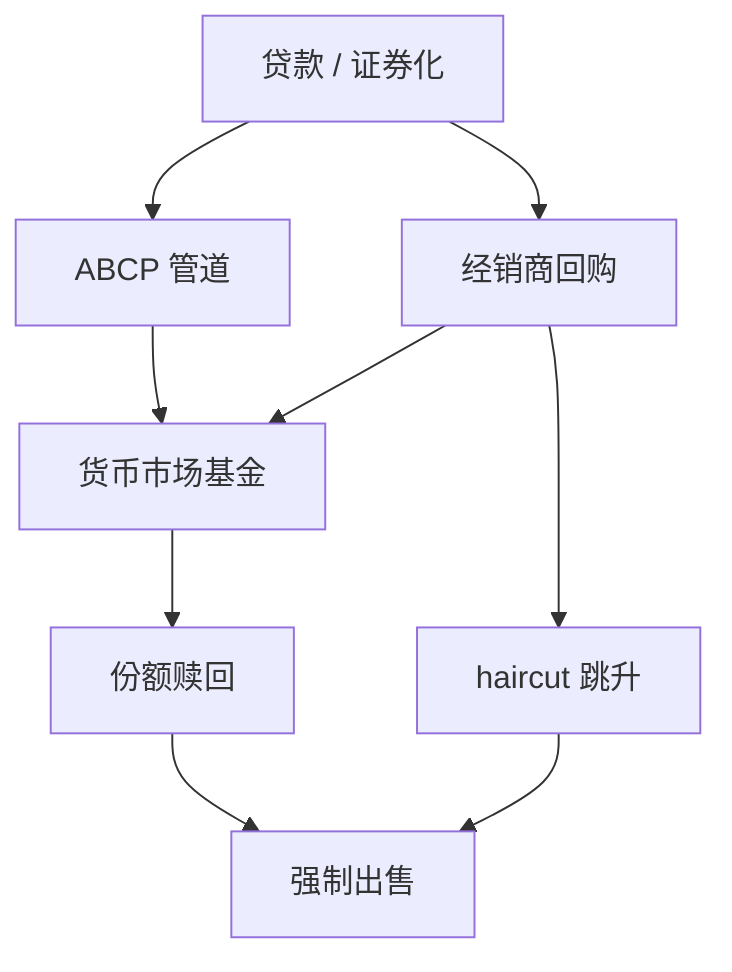

# 影子银行

期限转换若被资本与流动性比率赶上，就会改写负债合同，搬到并表银行外面继续做。

<footer>—— 据 Pozsar, Adrian, Ashcraft and Boesky, Shadow Banking, FRBNY Staff Report / Economic Policy Review；Gorton and Metrick, Securitized Banking and the Run on Repo, Journal of Financial Economics 2012 整理</footer>

定位：[上一课](/econ/lcr-nsfr)。并表银行已经被两道流动性比率加上资本阀钉住。本课缺口是跑到监管外面的期限转换：资产支持商业票据、回购、货币市场基金把短而可提取的债权，配到长而难变现的信贷。不重写 LCR 公式，不把影子银行写成另一套 Diamond–Dybvig 证明。

## 问题

Gurley–Shaw 的转换功能不要求牌照。若银行持有贷款的稳定资金变贵，贷款可以先被证券化，再由愿意持有短负债的实体去融资：ABCP 管道、经销商的回购账、MMF 的可赎回份额。公众仍以为自己持有「近货币」，发行人不受存款保险、LCR 与巴塞尔分子约束。Pozsar 等人把这条链称为影子银行：从贷款到可赎回批发债权的切割与再包装。

缺口不是道德故事，而是：同一期限转换换了合同之后，挤兑以批发形式出现——赎回、加 haircut、停滚发行。Gorton 与 Metrick 把回购 haircut 的跳升写成这种挤兑的价格。

影子不是「非银行所以不创造信用」。它创造的是可交易的近货币债权。近货币一旦按面值被当成结算替代，挤兑的逻辑与活期存款同构，法律身份不同。

## 方法

沿一条简化的链。贷款从银行或非银行发起，进资产支持证券；优先级再被管道用 ABCP 融资，或被经销商用回购融资；MMF 持有 ABCP / 回购，对家庭与公司发行可赎回份额。每一环都在做期限或流动性转换，每一环的「存款保险」往往是超额抵押、第三方流动性便利或发行人的隐担保，而不是基金。

挤兑的操作：MMF 赎回迫使管道停滚 ABCP；管道卖券或抽流动性便利；经销商提高回购 haircut，等于要求更多抵押来滚动同一负债——Gorton–Metrick 的「run on repo」。haircut 上升是数量配给，不是温和的价格调整：同一资产池能支撑的批发负债突然变少。

与并表银行的关系：银行常常提供流动性便利或把管道留在监管资本的缝里。影子链不是与银行平行的另一个星球，是被比率赶出去的表外腿。

## 机制

机制是监管相对价格。资本与 LCR/NSFR 提高并表期限转换的成本，不提高未并表近货币的成本，于是转换迁出。迁出之后，挤兑没有存款保险删坏均衡，也没有明确的 Bagehot 抵押窗口——除非危机中把窗口扩到经销商与 MMF。于是上一课的流动性比率在并表内生效，在系统层面被绕开。

这与[传染](/econ/bank-contagion)的网络同构：管道、经销商、MMF 互相持有短债权，不完全连接时 haircut 与赎回沿链传递。差别是合同：活期存款有序贯服务与面值；回购有抵押和 haircut，挤兑表现为抵押率而不是柜台上的排队。

### haircut 是批发版的提款

haircut 从 0 到正，等于债权人提取一部分融资、留下同一券。资产没有必要先「变坏」到资不抵债；抵押率的信念可以自实现，把流动性问题做成清偿问题——又是 Bagehot 要分开的那两层，只是发生在银行牌照外。不要把 haircut 跳升读成普通的风险溢价变动；数量上它抽掉的是滚动负债。

MMF 的稳定净值承诺，把份额写成准存款。一旦跌破，赎回加速。改革后的浮动净值改变的是合同，不是期限转换本身是否还存在。

## 边界

不要把所有非银行中介都叫影子银行：养老金与共同基金持有长期资产、发行不可随时按面值赎回的债权，转换弱。也不要把证券化本身当成挤兑：证券化可以是风险转移；挤兑来自用短负债去持有那些券。本课不写 LOB 上的回购特殊券微观结构——那是量化栏的协议。

银行课序在此结束。下一课进入公司金融的无摩擦基准 [MM](/econ/modigliani-miller)，不再把表外管道当资本结构理论。

后课默认：期限转换可在监管外用近货币合同继续做；批发挤兑表现为赎回与 haircut，而不是柜面排队。资本与流动性比率赶的是并表银行，不是转换功能。

隐担保（银行对管道的便利、对 MMF 的声誉）把影子链接回并表。赶出去的往往是资本，不是风险。

不要用 1983 年的定理直接给 MMF 定价。同构是功能，不是同一篇文章。

## 小结

- 资本与 LCR/NSFR 改变并表转换的相对成本，转换迁到近货币链。
- Pozsar 的链：贷款 → 证券化 → ABCP / 回购 → MMF。
- Gorton–Metrick：回购 haircut 跳升是批发挤兑。
- 出处：Pozsar et al., FRBNY；Gorton and Metrick, *JFE* 2012。
