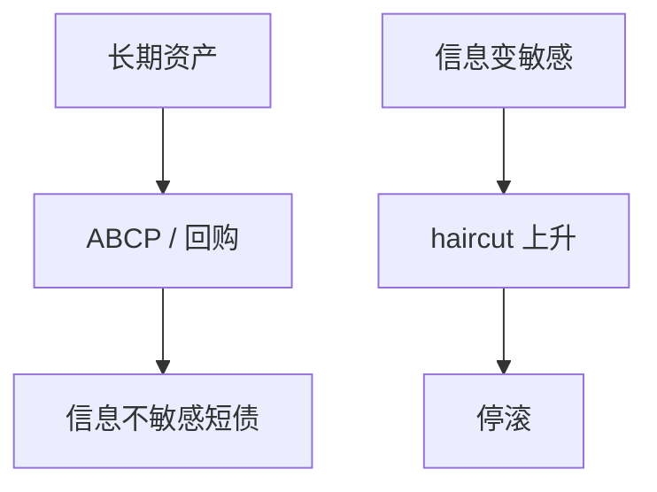

# 影子银行挤兑

不受存款保险覆盖的短债，一样可以挤兑。2008 年停的是 ABCP、回购和货币市场基金份额，不只是柜面排队。

<footer>—— Gorton and Metrick, Securitized Banking and the Run on Repo, JFE 2012；Covitz, Liang and Suarez 的 ABCP 挤兑</footer>

[上一课](/econ/banking-crises-history)把模式钉在信贷与短债上。缺口是：许多短债不在银行牌照里。本课钉影子挤兑；央行表下一课才讲谁来买这些资产。不重写 DD 的存款合约。

## 问题

影子银行用证券化、回购、ABCP 把长期资产做成「信息不敏感」的短债（Gorton）。haircut 或展期一旦跳升，等同挤兑：不是取现金，是不再续作。2007–08 的 ABCP 与回购是这一机制的现场。若模型里只有受保存款，会把危机写成「监管没覆盖的边角」，而不是核心滚动市场。

Pozsar 等人的影子银行地图。Krishnamurthy, Nagel and Orlov 的回购。Run on repo 的定量大小有争论，机制仍是 haircut 与停滚。

## 方法

把影子负债当成与存款同类的需求：安全、短期、可转手。挤兑触发：资产信息变敏感、haircut 上升、MMF 跌破 $1。政策：流动性工具扩到一级交易商与 CP，等于把最后贷款人边界外推。宏观：$\phi$ 约束突然收紧，与 GK 的净值冲击同向。

## 机制

信息不敏感债在好状态下不需要尽调，所以便宜；坏状态一开始，所有人都要尽调，市场冻结（Dang–Gorton–Holmström）。haircut 是抵押品风险的价格，跳升就是挤兑税。

## 边界

不是所有非银都是影子银行。保险公司长期负债不是同一挤兑。下一课看央行如何用资产负债表承接停滚后的资产。不写 2010 年后每一条 SEC MMF 改革细则。

## 小结

- 影子挤兑是停滚与 haircut，不是柜面。
- 信息不敏感短债在坏状态下集体尽调，市场冻结。
- 出处：Gorton and Metrick, *JFE* 2012；Covitz, Liang and Suarez 的 ABCP。
