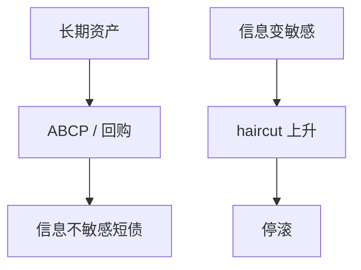

# 影子银行挤兑

不受存款保险覆盖的短债，一样可以挤兑。2008 年停的是 ABCP、回购和货币市场基金份额，不只是柜面排队。

<footer>—— Gorton and Metrick, Securitized Banking and the Run on Repo, JFE 2012；Covitz, Liang and Suarez 的 ABCP 挤兑</footer>

[上一课](/econ/banking-crises-history)把模式钉在信贷与短债上。缺口是：许多短债不在银行牌照里。本课钉影子挤兑；央行表下一课才讲谁来买这些资产。不重写 DD 的存款合约，也不重走[影子银行](/econ/shadow-banking)课的链路记账——这里要的是挤兑现场与它的证据。

## 问题

影子银行用证券化、回购、ABCP 把长期资产做成「信息不敏感」的短债（Gorton）。haircut 或展期一旦跳升，等同挤兑：不是取现金，是不再续作。2007–08 的 ABCP 与回购是这一机制的现场。Covitz, Liang and Suarez 把 ABCP 的死法分了阶段：先是发行量萎缩、展期期限越滚越短，管道靠发起银行的支持线度日；2007 年 8 月资产方坏消息一到，续作集体撤出，1.2 万亿美元量级的市场一年之内缩去三成。若模型里只有受保存款，会把危机写成「监管没覆盖的边角」，而不是核心滚动市场。

Gorton and Metrick 的证据链是一条时间序列：向交易商收集证券化抵押品的回购 haircut，合成一个「影子银行系统」指数。2007 年初，AAA 证券化券的隔夜回购 haircut 接近零——一分抵押借一分钱；从当年 12 月起大约每季翻倍，2008 年底平均到 45% 附近。同一笔融资要压近一倍的抵押进去，等于债权人集体抽走一半滚动负债。指数走低先于投资下滑，这是「挤兑」的价格记法：柜面上没有排队，账本上全是。

Pozsar 等人的影子银行地图：链上每一环都在做期限或流动性转换。Krishnamurthy, Nagel and Orlov 的回购：三方市场以国债与代理 MBS 为主、危机中大体照常滚动，挤兑集中在双边证券化回购——「回购崩了」要说清是哪一层。Run on repo 的定量大小有争论，机制仍是 haircut 与停滚。

## 方法

把影子负债当成与存款同类的需求：安全、短期、可转手。挤兑触发：资产信息变敏感、haircut 上升、MMF 跌破 $1。政策：流动性工具扩到一级交易商与 CP，等于把最后贷款人边界外推。宏观：$\phi$ 约束突然收紧，与 GK 的净值冲击同向——中介能杠杆的资产集变小，溢价与产出一起动。

```mermaid
flowchart TD
  ABS["长期资产"] --> ST["ABCP / 回购"]
  ST --> INS["信息不敏感短债"]
  NEWS["信息变敏感"] --> HC["haircut 上升"]
  HC --> RUN["停滚"]
```

## 机制

信息不敏感债在好状态下不需要尽调，所以便宜；坏状态一开始，所有人都要尽调，市场冻结（Dang–Gorton–Holmström）。关键在信息获取是策略互补的：没人收集信息时，一家独查是白花钱，债权照面值易手，「无知」是设计出来的公共品；一旦有人开始查，不查的那位就在接别人挑剩的资产，于是尽调集体爆发。对称的无知一破，交易对手再分不清谁手里是金子谁手里是雷，市场停摆。危机的定义因此不是坏消息本身，而是「无知时代的终结」。

haircut 是抵押品风险的价格，跳升就是挤兑税。它与存款挤兑的差别在合同、不在逻辑：存款是序贯服务加存款保险，挤兑表现成柜面排队，保险把坏均衡删掉；回购是抵押加续作，挤兑表现成抵押率抬升与拒绝续作，债权人是识货的对家而不是储户，而且没有现成的保险与便利。挤兑因此更安静也更快：一封不续作的邮件，抵得上一个营业日的排队。这也解释政策为何要现造工具——一级交易商不是银行，贴现窗本来对它不开放；PDCF、AMLF、CPFF 是临时改写[最后贷款人](/econ/lender-of-last-resort)的资格表。

haircut 的跳升先于 Lehman：2007 年 8 月起双边回购已在收紧，雷曼之后是全面的数量配给。把「雷曼倒闭」当起点会读反因果：起点是抵押品信息变敏感，雷曼只是把不确定性钉死。

## 边界

不是所有非银都是影子银行。保险公司长期负债不是同一挤兑：债权不可按面值日赎，挤兑要走退保价值与再融资渠道换算。影子挤兑也不等于「回购市场整体崩塌」：国债端照常滚动，崩的是证券化抵押那一层。下一课看央行如何用资产负债表承接停滚后的资产。不写 2010 年后每一条 SEC MMF 改革细则。

后课默认：「挤兑」一词同时用在存款与批发债上，指的都是同一件事——短期债权在坏状态被集体拒绝续作；宏观模型里它是 $\phi$ 的离散跳变，不再只是 DD 的提款队列。

## 小结

- 影子挤兑是停滚与 haircut，不是柜面。
- Gorton–Metrick：haircut 从近零到 45%、每季翻倍，是挤兑的价格记法。
- 信息不敏感短债在坏状态下集体尽调，市场冻结；「无知」是设计，不是运气。
- 与存款挤兑差在合同：序贯服务与保险对抵押与续作，挤兑税与政策工具都随之换形。
- 出处：Gorton and Metrick, *JFE* 2012；Covitz, Liang and Suarez 的 ABCP；Dang–Gorton–Holmström。
