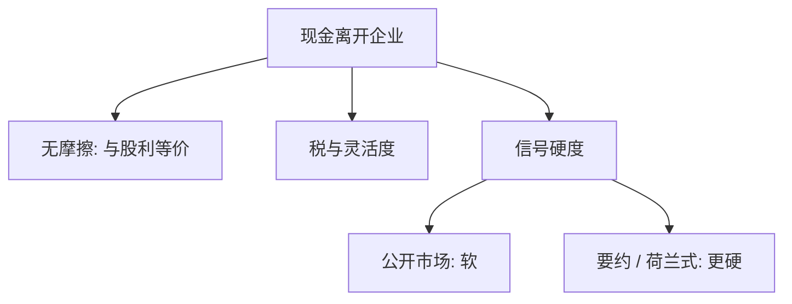

# 股票回购

回购与现金股利在无摩擦世界里同是把现金交给股东；有税、有信号、有灵活度时，二者不再是同一张支票。

<footer>—— 据 MM 1961 的支付无关；对照 Comment and Jarrell, The Relative Signalling Power of Dutch-Auction and Fixed-Price Self-Tender Offers and Open-Market Share Repurchases, Journal of Finance, 1991</footer>

[上一课](/econ/dividend-signaling)把派息写成昂贵信号或盈余推断。若信号必须烧现金，回购也能烧。本课缺口是替代：何时用回购代替股利，信号强度是否相同。不重做 Bhattacharya 的分离，不把回购当成微观结构上的买卖。

## 问题

MM 1961：投资给定，现金股利与回购都只是资产换成现金，股东自制可得。引入税与信息之后，回购常被当作「更灵活的股利」：没有 Lintner 式的下调惩罚，资本利得税往往低于股利税，并且可以向未出售的股东做隐式选择。缺口是：灵活是否同时削弱信号？Comment 与 Jarrell（1991）给一句对照：固定价格与荷兰式要约回购的信号，强于公开市场回购——承诺更硬、折价更明确的，说话更响。

本课不把这句话做成事件研究表。只要钉：替代不是完全的，形式携带承诺硬度。

公开市场回购是授权后相机买回，可撤。要约回购在窗口内以指定价格（或荷兰式区间）买固定数量，更接近一次性昂贵行动。

## 方法

先保留无关性基准：同一现金离开企业，总价值在无摩擦时不变，只改股份数与每股。再放进三块摩擦。税：回购把应税事件推到卖出时点。代理：回购与股利一样降低 FCF，但经理可把授权当储备、不执行。信号：上一课的分离要求成本；公开市场回购的成本是软的，要约回购更接近股利承诺。

优序：回购常发生在经理认为股份被低估时，与发股的柠檬对称。这与信号一致，但不要把每一笔授权都叫成分离均衡——授权可以是期权，执行才是行动。

### 一句对照，不审表

Comment–Jarrell：荷兰式与固定价格自要约的公告反应，大于公开市场回购。本课用它标明「硬度梯度」，不报告百分点，不把样本写成定理。后文若要超额与异常收益，换量化栏或事件研究课，本栏不到限价簿上数买盘。

## 机制

机制是支付形式选择。股利把同一每股现金给所有人，下调有历史锚。回购让边际股东自我选择卖出，留下的股东提高份额；经理对价格的判断（低估才买）同时泄漏信息。要约把价格写进合同，模仿成本更高，于是更像 Bhattacharya 的贵行动。公开市场把行动拆成许多天的相机购买，差类型更容易假装。

Jensen 的 FCF 两条都能吐现金；Lintner 平滑主要绑在股利上，这正是成熟企业并行使用两种工具的理由：用股利说持久，用回购说暂时多余。不要把并行写成「投资者非理性地喜欢股利」。

回购减少股份，每股盈利机械上升。那不是价值创造。价值在于现金离开与信息，不在于 EPS 算术。

## 边界

不要在本栏做回购异象或长期弱势。不要把公开市场回购写成在限价簿上吃卖盘的执行算法——那是量化栏。下一课 [可转债](/econ/convertible-security)换融资工具：不是把现金吐出，而是把债做成后门权益。

后课默认：回购在 MM 下与股利等价；税、灵活度与承诺硬度使它们成为不完全替代。Comment–Jarrell 标明要约比公开市场更像信号。

内幕期间买回受管制约束，本课不写合规清单。强式失败仍是经理信息的前提。

加速摊薄的期权、员工持股，会使经理更喜欢回购而不是股利——那是激励合同，不是 MM 的支付无关被否证。本课不把补偿设计写成主线。

可转债下一课换融资侧：现金进来而不是出去。支付形式与证券设计是公司金融里对称的两块摩擦。

## 小结

- 无摩擦时回购与现金股利同为支付；摩擦下二者不完全替代。
- 公开市场软，要约与荷兰式更硬；Comment–Jarrell 用公告反应对照这一句。
- 代理吐出现金与信号揭示低估可以并存，EPS 机械上升不是机制。
- 本课不把公开市场回购写成在限价簿上吃卖盘。
- 下一课可转债换融资工具：后门权益，不是把现金吐出。
- 出处：Miller and Modigliani 1961 的支付基准；Comment and Jarrell, *JF* 1991。
