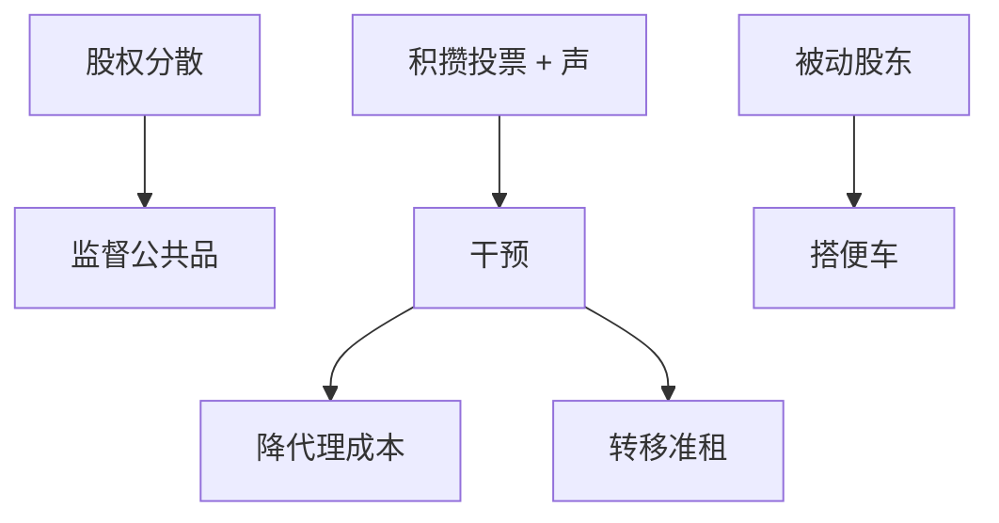

# 股东激进主义

    
积极股东付监测成本、积攒投票权、逼董事会改杠杆或换经理；收益部分外溢给搭便车的被动股东，因此积极主义只会不足，不会过多——除非另有私人收益。

    <footer>—— 据 Shleifer and Vishny, Large Shareholders and Corporate Control, Journal of Political Economy 1986；Brav, Jiang, Partnoy and Thomas, Journal of Finance 2008</footer>

[上一课](/econ/executive-compensation)把内部合同写完。本课缺口是外部大股东与对冲基金激进主义：谁付监督成本，以及干预是价值还是转移。不重做薪酬一阶条件，不把 Grossman–Hart 要约收购提前。

## 问题

董事会可能被俘获，薪酬可能是租金。Shleifer–Vishny：大股东有激励监测，因为现金流权够大。代价是不分散的风险与可能的私人收益（掏空）。对冲基金激进主义是短期积攒的少数股权加公开施压、代理权争夺，不是全面收购。Brav 等描述干预手段与公告回报。缺口是：分散股权下监督是公共品，激进主义者提供公共品并试图用公告升值获利；若升值全外溢，激励不足。这与后课接管免费搭车同构，程度更轻（不必买到 100%）。

搭便车：被动指数基金享受治理改善却不付干预成本。基金业结构改变谁能当激进者。本课不写资产管理机构的微观结构。

## 方法

干预菜单：要求回购与加杠杆（Jensen FCF）、换董事、分拆、换 CEO、限制并购。价值假说：降低代理成本。转移假说：把债权人、雇员、客户的准租转给股东，或短期推高股价便于减持。债务契约与评级悬崖会约束「加杠杆」菜单——债权单元刚写完。

与关系：激进主义是公开的硬信息干预；关系银行是私下。对象常是成熟、低托宾 Q、高现金——Jensen 样本，不是融资约束成长企业。

公告正回报不自动等于社会有效：可以是转移。识别课会提事件研究的问题。本课只要两种机制并列。

## 机制

机制是把董事会议价外移。激进股东改变董事提名池，削弱 Hermalin–Weisbach 的经理俘获。成本：错误干预、打断顾问功能、迫使削减正 NPV 的长期投资（实物期权被提前执行或放弃）。薪酬合同若已高能激励，再加外部压力可能重复或冲突。

与择时：激进主义要求在低估时回购，像反向 Baker–Wurgler。若市场有效，回购只改切片；若无效或代理，则改 $V$。

### 不是「基金都是短视的」

持有期数据与合约形式（13D）比标签重要。短视假说要证明被砍的是正 NPV 而不是 FCF 浪费。Tirole：可验证的派息容易被要求，不可验证的长期项目容易被牺牲——又是多任务。

Gillan–Starks 等区分公共养老基金与对冲基金的手段。机制同是投票与声，私人收益与视野不同。

## 边界

不要把本课写成 13D 案例集。下一课：全面接管时搭便车更致命，Grossman–Hart 给出要约必须留下利润才有人付溢价。激进主义是部分收购加语音，不是要约收购全文。

后课默认：积极股东提供公共监督，激励因搭便车而不足；干预有价值与转移两读。对象偏向 FCF 企业。

## 小结

- 大股东/激进基金付监测成本，被动股东搭便车，故积极主义供给不足。
- 菜单是杠杆、董事、资产重组；价值对转移要并列。
- 与内部薪酬、董事会互补，不是替代一切合同。
- 出处：Shleifer and Vishny, *JPE* 1986；Brav, Jiang, Partnoy and Thomas, *JF* 2008。
