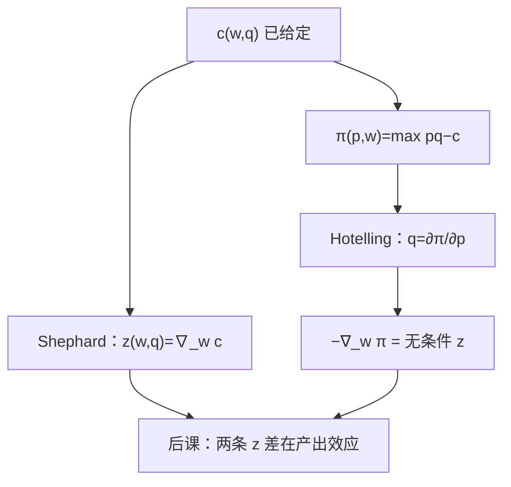

# 谢泼德引理与霍特林引理

    
值函数对价格的导数就是选择：成本对要素价格求导得条件需求，利润对产品价格求导得供给。

    <footer>—— 据 Shephard, Cost and Production Functions, 1953；Hotelling, Journal of Political Economy, 1932 整理</footer>

[上一课](/econ/cost-fn-properties)（成本函数性质）。已经解出 $c(w,q)=\min_z w\cdot z$ s.t. $f(z)\ge q$，并把切条件写成 TRS 等于要素价格比。本课不重解这道规划，也不把 $c$ 的凹、齐次再证一遍。缺口是把两条包络收成可调用的引理：$\nabla_w c$ 即条件要素需求；利润函数对产品价格的导数即供给——后课不必每次回到 $f$。

## 问题

成本最小化给出值函数 $c(w,q)$。条件需求 $z(w,q)$ 是解。若每次要用 $z$ 都回去解约束规划，对偶没有节省任何东西。缺口是 Shephard 引理：在可微点

$$
\frac{\partial c}{\partial w_j}(w,q)=z_j(w,q).
$$

对称地，把产出价格 $p$ 放进利润值函数 $\pi(p,w)=\max_q\,pq-c(w,q)$（或直接 $\max_{y\in Y}p\cdot y$），Hotelling 引理说

$$
\frac{\partial\pi}{\partial p}=q(p,w),\qquad \frac{\partial\pi}{\partial w_j}=-z_j(p,w).
$$

第一式是供给，第二式是无条件要素需求。产量此时已经对 $p$ 优化过。本课只钉包络，不把接受者均衡、进入、市场结构提前写完——那是利润与供给课的对象。

### 两条引理不是同一层 $z$

Shephard 的 $z(w,q)$ 锁住 $q$。Hotelling 对 $w$ 的导数锁住的是已经调过的 $q(p,w)$。下一课专门比较这两条要素需求；本课先承认二者都由包络读出，不要把 $\partial c/\partial w$ 与 $-\partial\pi/\partial w$ 画成一条曲线。

消费者一侧：支出函数的 Shephard 读希克斯需求，Roy 从间接效用读马歇尔需求。本课是厂商平行物。不要把 Roy 写进 $c(w,q)$。

## 方法

包络定理：最优值对参数的一阶变化只走目标里的直接项，约束里的调整被一阶条件消掉。$c$ 对 $w$ 的直接项就是 $z$；$\pi$ 对 $p$ 的直接项就是 $q$。可微、内点、严格二阶条件保证单值。折拐时改超微分，引理变成含入。

一次齐次与凹（$c$ 对 $w$，$\pi$ 对价格）已由上一课与对偶给出。引理把这些形状翻译成：条件需求对自身要素价格的斜率半负定（替代矩阵），供给对 $p$ 不降。本课不估计这些弹性。

本课不引入沉没。一切投入仍按当期 $w$ 付。也不把 $\pi$ 写成会计利润或限价簿价差。

## 机制

为什么导数就是选择：参数涨一丁点，已经选好的计划按直接的价格项吃亏或占便宜；再优化只能是二阶小量。于是观测 $c$ 或 $\pi$ 的梯度，等于观测需求与供给。后课实证与理论都走这条路：估值函数，不估 $f$。

与[齐次生产](/econ/homothetic-production)的接口：一次齐次则 $c(w,q)=q\,c(w,1)$，Shephard 给出 $z(w,q)=q\,z(w,1)$，条件需求对 $q$ 线性。Hotelling 在 CRS 无固定成本时碰到刀刃：$\pi$ 为 $0$ 或 $+\infty$，供给对应可以是射线，导数要读成支撑。

Hotelling 1932 讨论税收与供需可积，引理是副产品。不要与 1929 年线性城市那篇霍特林混成一篇；市场结构课才用后者。

## 边界

$q$ 仍可以当参数只做 Shephard，不必进入 $\pi$。本课引入 $\pi$ 只为配对第二条包络；完整的 $p=\mathrm{MC}$、歇业规则、短长期在后课。要素买方垄断会让 $w$ 不再是参数，两条引理整段暂停。

不可微、配额、不可逆投入，超微分或角点使「导数」变成对应。联合生产时 $q$ 是向量，Hotelling 对 $p$ 的梯度是供给向量。也不把引理写成账本上的历史成本对价格的差商。

后课默认：条件需求由 Shephard 从 $c$ 读出；供给与无条件要素需求由 Hotelling 从 $\pi$ 读出。

## 小结

- Shephard：$\nabla_w c(w,q)=z(w,q)$；Hotelling：$\partial\pi/\partial p=q$，$-\nabla_w\pi$ 为无条件要素需求。
- 包络消掉最优调整的一阶项，故值函数携带选择。
- 两条 $z$ 不是同一对象；下一课比较它们。
- 本课不写市场结构；$\pi$ 只是对偶值函数。
- 出处：Shephard, *Cost and Production Functions*, 1953；Hotelling, *JPE*, 1932。
