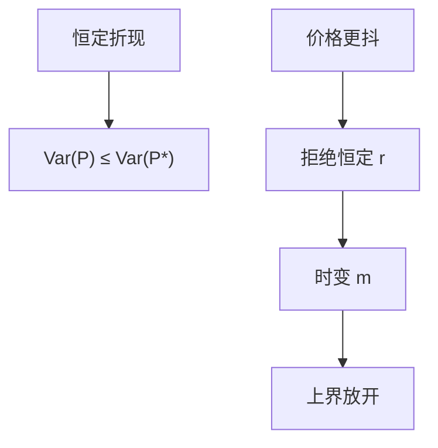

# Shiller 过度波动

若折现率恒定，价格应是未来股利的平滑；观测到的价格比事后实现的现值更抖，恒定折现撑不住。

<footer>—— Shiller, Do Stock Prices Move Too Much to be Justified by Subsequent Changes in Dividends?, American Economic Review, 1981</footer>

[上一课](/econ/present-value-identity)从 $d-p$ 推出：股利通道弱则回报必须可预测。本课缺口是同一会计的波动版本：恒定预期回报时，价格是股利的平滑，方差有上界；观测价格往往打破上界。不重写 CS 公式，不把过度波动写成「市场疯狂」的终审。

## 问题

Shiller（1981）：若 $P_t=\mathrm{E}_t\sum \beta^j D_{t+j}$（恒定折现），则事后实现的现值 $P_t^*$ 应比 $P_t$ 更抖——因为 $P_t$ 是 $P_t^*$ 的条件期望，方差不等式 $\mathrm{Var}(P)\le\mathrm{Var}(P^*)$。用实际股利路径构造 $P^*$，历史价格常常更抖，不等式翻。缺口是：拒绝的是「恒定折现加理性预期加这组股利」，不是拒绝存在 $m$。时变折现（上一课的回报通道）会放开上界。

Lucas 树在果实波动很小、 $u$ 接近线性时接近恒定折现，会被同一界限打到；习惯与时变风险厌恶让 $m$ 抖，价格可以比股利更抖。本课不重做那些偏好，只钉界限的假设。

Shiller, *AER* 71(3), 1981。LeRoy–Porter 几乎同时给出类似方差界。后文对单位根、小样本的批评改变测量，不改变「恒定折现 ⇒ 平滑」的逻辑。

## 方法

在恒定 $r$ 下把 CS 分解的 $r$ 通道关掉，$d-p$ 只含预期 $\Delta d$。股利若近单位根，水平的方差界技术上麻烦，但精神仍是：价格不该相对股利流有额外的自由波动。打开 $r$ 通道，价格波动可以来自贴现率消息，Campbell 方差分解把意外回报拆成股利消息减折现率消息——过度波动在会计上就是折现率消息这一项大。

不要把 $P^*$ 的构造写成事件研究。那是全样本股利路径的事后现值，信息集是计量经济学家的，不是 $t$ 时刻的 $\mathcal{F}_t$。界限用的正是这一点：理性价格是更小信息集上的投影，理应更平滑。

## 机制

机制是条件期望的收缩。新信息若只关于股利，价格变动是股利路径的修正，平滑过的对象波动小于对象本身。若新信息主要关于 $m$（风险厌恶、中介约束、安全资产便利——后课），价格可以大动而股利不动，界限失效。信息课序的美人竞赛提供另一条：公共噪声进入高阶，价格可以跟噪声抖，股利仍平滑——那是对 $\mathbb{P}$ 下投影的偏离，与时变 $m$ 要靠联合假说区分。

与 GS：部分揭示减少的是价格对 $\theta$ 的敏感，通常让价格更钝而不是更抖。过度波动不像采集不足，更像折现率或高阶噪声。

泡沫项也会加波动。理性泡沫课已写横截失败。Shiller 原文的精神更接近「基本面折现太平滑」，后文把时变折现当成主流修补。

## 边界

本课不裁定单位根争论，不重画 1981 年的图。下一课把可预测性落到股利–价格比作为回报预测变量：过度波动的对偶是 $d-p$ 有预测力。两者一起指向时变贴现率，仍不是 CAPM 截面异象。

后课默认：恒定折现 ⇒ 价格相对事后现值更平滑；观测到的过度波动拒绝恒定 $r$，不自动拒绝 FTAP 或 EMH。时变 $m$ 是许可的出口。

## 小结

- Shiller 界：恒定折现下 $\mathrm{Var}(P)\le\mathrm{Var}(P^*)$。
- 价格更抖，拒绝恒定预期回报，不拒绝存在 $m$。
- 与 $d-p$ 预测回报是同一会计的波动端与预测端。
- 出处：Shiller, *AER* 1981；对照 LeRoy and Porter；Campbell 方差分解。
