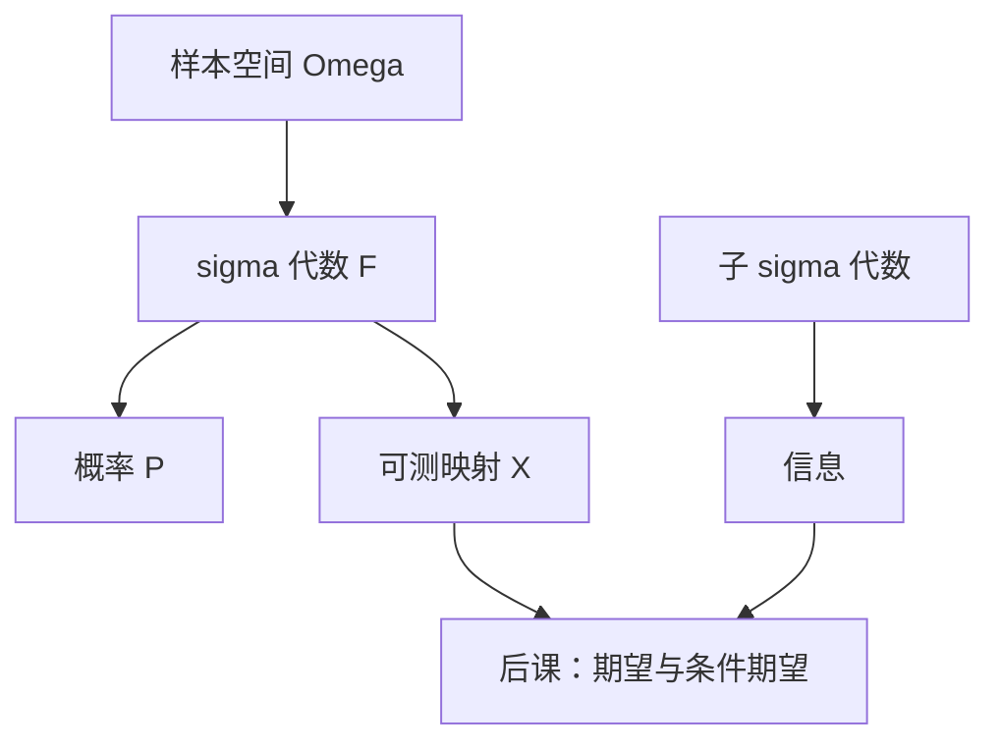

# 样本空间与 σ-代数

随机不是「再加一个噪声符号」：哪些集合可被赋予概率，决定了什么叫可测、什么叫信息。

<footer>—— 据 Billingsley, Probability and Measure, 选章；Stokey, Lucas and Prescott, Recursive Methods 第 7 章整理</footer>

上一课[值函数迭代](/econ/value-function-iteration)在确定转移 $s'=g(s,a)$ 上把 $T$ 算清楚。宏观与风险下的贝尔曼要把续值写成期望，微观的彩票、信息经济学的类型，都需要概率空间，而不是临时写一个 $\varepsilon$。缺口是最小词汇：样本空间、$\sigma$-代数、概率测度、可测函数。下一课才把条件期望当投影。本课不写成测度论教材，只留后课用得到的一层。

## 问题

样本空间 $\Omega$ 是可能状态的全集：自然状态、冲击序列、类型剖面。事件是子集。若任意子集都要概率，不可数 $\Omega$ 上无法同时保住可数可加与非平凡。**$\sigma$-代数** $\mathcal{F}$ 是对可数并、交、补封闭的事件族。概率 $P:\mathcal{F}\to[0,1]$ 可数可加，$P(\Omega)=1$。后课只对 $\mathcal{F}$ 里的事件谈概率。

随机变量是可测函数 $X:\Omega\to\mathbb{R}$：$\{X\le t\}\in\mathcal{F}$。这不是「随机的变量」，是把结果编码成数，且编码与信息结构兼容。分布是推前 $P\circ X^{-1}$。后课期望效用写 $\mathbb{E}u(X)$，默认 $u(X)$ 可积；本课先保证 $X$ 可测，否则积分没定义。

### σ-代数是信息，不是「数学洁癖」

子 $\sigma$-代数 $\mathcal{G}\subset\mathcal{F}$ 描述「目前能分辨哪些事件」。精炼信息 = 更大的 $\sigma$-代数。公开价格生成的信息、代理人私有类型生成的信息，都是子 $\sigma$-代数。后课[条件期望](/econ/conditional-expectation-econ)是相对于 $\mathcal{G}$ 的投影：只使用这些事件。把 $\sigma$-代数当成无意义的技术条件，后面的「基于信息的策略」「适应性过程」会变成口头禅。

有限 $\Omega$ 上 $\sigma$-代数就是分划生成的事件族。分划的每一块是一个信息集。无限 $\Omega$ 用 $\sigma$-代数代替分划，避免逐点谈论「这个 $\omega$ 知道什么」。

## 方法

常用 $\Omega=[0,1]$ 或 $\mathbb{R}^k$ 配 Borel $\sigma$-代数（开集生成的最小 $\sigma$-代数）。开集语言来自第一课[欧氏空间与开集](/econ/euclidean-open-set)：Borel 正好让连续函数自动可测。离散冲击用有限支撑、幂集。乘积空间上的柱集生成乘积 $\sigma$-代数，用来写冲击序列 $\{z_t\}$ 的历史。

概率空间 $(\Omega,\mathcal{F},P)$ 一旦固定，几乎必然（a.s.）语句 = 除一个零测集外成立。均衡、欧拉方程在随机里都是 a.s. 成立。零测集上改策略不改变积分，故「逐状态处处」过强，也常不可行。

## 机制

可数可加让连续性从单调事件传来：$A_n\uparrow A\Rightarrow P(A_n)\to P(A)$。没有它，极限与概率不能交换，大数定律、条件期望的控制收敛都没入口。有限可加的「概率」在决策理论里作为主观概率的弱化出现，主干客观冲击仍用可数可加。

可测保证 $\{u(X)\gt c\}$ 仍是事件，期望作为积分才合法。连续 $u$ 对 Borel $X$ 自动可测。后课随机占优比较的是分布（推前测度），不需要每次回到 $\Omega$；但条件期望、适应性策略必须记住底层 $\sigma$-代数，因为两个随机变量可以同分布、信息却不同。

不要为每个冲击发明一个新的「随机符号」而不写谁对谁可测。$x_t$ 对 $\mathcal{F}_t$ 可测 = 不偷看未来。这是随机动态规划策略合法的定义。

## 边界

本课不证 Carathéodory 扩张，不讲 Lebesgue 不可测集，不把滤波理论写成教材。也不进入限价簿的微观结构噪声。下一课在已经可测的随机变量上定义条件期望，作为信息给定后的最优预测，并接到随机贝尔曼。

后课默认：冲击住在概率空间上；策略对当时信息可测；期望指对 $P$ 的积分。

## 小结

- 概率只定义在 $\sigma$-代数上；随机变量是可测函数。
- 子 $\sigma$-代数编码信息；精炼 = 更细的事件。
- Borel 结构让连续函数自动可测，接上第一课开集。
- 随机陈述默认几乎必然，不强求处处。
- 下一课：[条件期望](/econ/conditional-expectation-econ)。
- 出处：Billingsley, *Probability and Measure*；Stokey–Lucas–Prescott 第 7 章。
