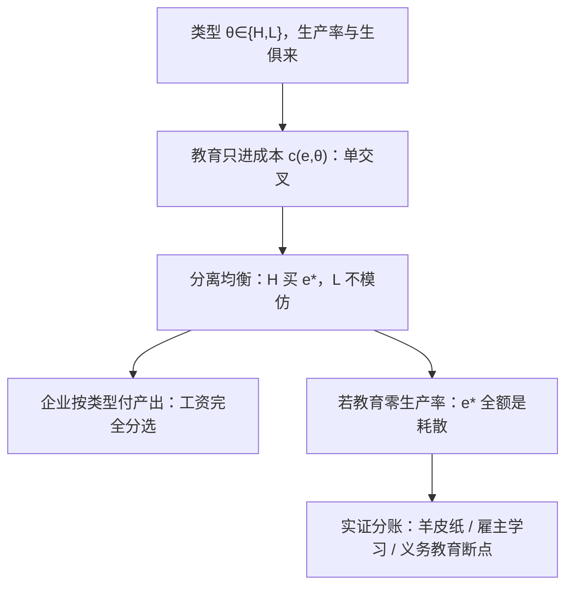

# 教育作为信号

若完成教育的成本对高生产率者更低，文凭就能分离类型——哪怕教育本身一无所教。

<footer>—— 据 Spence, Job Market Signaling, QJE, 1973</footer>

[上一课](/econ/skill-premium-tinbergen)把溢价写成技能的相对价格，前提仍是教育在生产技能。但教育与工资的正相关有另一条通道：教育不改变生产率，只是标签。信号博弈的技术部分——单交叉、分离与混同、路径外信念——本栏的[信号发送](/econ/spence-signaling)已经钉完；本课把那个模型放回劳动市场，算两笔账：信号耗散多少资源、实证怎么把人力资本与信号分开。

## 问题

Becker 口径里教育是投资：付学费买未来的生产率。Spence 口径里教育是筛选装置：类型 $\theta\in\{H,L\}$ 的生产率 $\theta_H\gt\theta_L$ 与生俱来，教育 $e$ 只改成本 $c(e,\theta)$、不改产出；单交叉 $c_e(e,L)\gt c_e(e,H)$ 让「高类型买高学历」成为均衡，企业按期望产出付工资。缺口不在解均衡，在分账：两个口径里教育的私人回报都为正，社会回报完全不同——若教育零生产率，分离均衡里整个信号支出都是耗散，没有一单位产出为此增加。

### 耗散的规模由阈值区间决定

分离要求低类型不愿模仿、高类型自愿买单：$c(e^\ast,L)\gt w_H-w_L$ 且 $c(e^\ast,H)\lt w_H-w_L$。区间内任何 $e^\ast$ 都是分离均衡，通常聚焦最低成本分离。均衡比较是关键一步：教育补贴降低买信号的成本，分离所需的 $e^\ast$ 反而上升——人人买更多教育才能分开，产出不变、耗散变大。同一个补贴在 Becker 口径里降低投资成本、抬高真实技能：两个口径对同一政策的福利判断相反。

## 方法

实证分账靠三个可检验的差别。一、羊皮纸效应：若教育是技能增量，工资应随年限平滑上升；若教育是标签，跨过毕业线那年应出现离散跳升。羊皮纸文献确实找到跳升，但同等年限下「多读一年」的平滑部分也在——两种成分并存。二、雇主学习动态：纯信号预测雇佣后雇主逐渐看到真实生产率、教育对工资的预测力随工龄衰减；Altonji–Pierret 2001 发现教育系数随工龄确实下行，但下行慢、不归零——数据落在两口径之间、偏人力资本一侧。三、义务教育断点：被法律多按住一年书的学生后来工资更高，工具变量回报与 OLS 同量级（Card 1999 的口径），这对「只有高能力者才从教育赚钱」的纯信号版故事不利——多读一年对被按住的那类人也增产。

## 机制

为什么信号在劳动市场特别强：雇佣前生产率不可见——比柠檬市场更极端，买方连「这辆车」都还没拿到手，只能按类型分布与信号定工资；按事后产出付薪的合同难以执行，事前分选就成了主要机制。信号支出因此是军备竞赛：单个人少买信号会被误判为低类型；均衡里所有人的投入高于最低分离阈值时，超额部分纯是耗散——这与[信号发送](/econ/spence-signaling)里精炼常留下最小成本分离的结论相接。

纯信号世界里教育补贴放大耗散：补贴降低信号成本，分离均衡需要的信号量上升，耗散随补贴增加。真实世界两成分并存，补贴的净效应取决于技能增量与标签成分的占比——评估教育政策最常被跳过的分账。

## 边界

两个口径不互斥，占比随教育层次与专业变。别把信号课读成「教育无用」：义务教育断点的正回报、教育对健康的独立效应都在往人力资本一侧加码；也别读成「信号无害」：即便教育真提技能，为分离而过度选购的部分仍是耗散。社会回报与私人回报的差取决于两个参数——信号的耗散份额、技能的生产率增量——现有文献给的是有符号的证据，不是占比的定数。

## 小结

- 教育的私人回报在两个口径下都为正；分账要看社会回报与耗散。
- 单交叉下分离均衡存在且多重；聚焦最低成本分离。
- 纯信号世界里补贴教育放大耗散；纯人力资本世界里补贴抬高产出，政策判断相反。
- 实证分账靠羊皮纸效应、雇主学习动态与义务教育断点；证据两头都有，偏人力资本一侧。
- 出处：Spence, QJE 1973；Altonji and Pierret, QJE 2001；Card 1999；Jaeger and Page 1996；Tyler, Murnane and Willett 2000。
