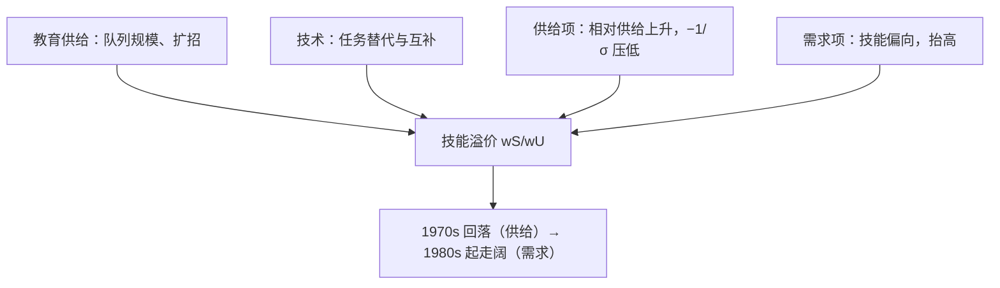

# 技能溢价与 Tinbergen 竞赛

不平等的走向由一场竞赛决定：教育在一边扩大供给，技术在另一边拉高需求。

<footer>—— 据 Tinbergen, Income Distribution: Analysis and Policies, 1975；Katz and Murphy, Changes in Relative Wages, 1963–1987: Supply and Demand Factors, QJE, 1992 整理</footer>

[上一课](/econ/human-capital-becker)解释了个人为什么投资教育与培训、剖面为什么凹，但把教育回报 $\rho$ 当成了给定参数。缺口是市场层面的问题：大学毕业生对高中毕业生的工资溢价，为什么 1970 年代回落、1980 年代起大幅走阔？本课讲 Tinbergen 的「教育与技术竞赛」与 Katz–Murphy 的供需框架：把劳动切成技能两组，用 CES 聚合把「技术偏向」从一个形容词变成参数。

## 问题

$\rho$ 是个体回归系数；溢价是相对价格，供给与需求两条线都在动。美国的形态：1970 年代大学溢价回落——战后婴儿潮与大学扩招把技能相对供给推大；1980 年代起溢价陡升，供给仍在增长，涨得更快的只能是需求侧。缺口是给这两条线一个共同的账本，能分解出供给贡献多少、需求贡献多少。

## 方法

SB 模型（Katz–Murphy 1992 的口径）：技能与非技能劳动进 CES 聚合，

$$
Y = \Big[(A_S L_S)^{\frac{\sigma-1}{\sigma}} + (A_U L_U)^{\frac{\sigma-1}{\sigma}}\Big]^{\frac{\sigma}{\sigma-1}},
$$

技能溢价由一阶条件直接写出：

$$
\frac{w_S}{w_U} = \left(\frac{A_S}{A_U}\right)^{\frac{\sigma-1}{\sigma}} \left(\frac{L_S}{L_U}\right)^{-\frac{1}{\sigma}} .
$$

读法：相对供给 $L_S/L_U$ 上升压低溢价，弹性 $-1/\sigma$；技能相对效率 $A_S/A_U$ 上升抬高溢价——这就是技能偏向的技术进步（SBTC）。$\sigma$ 用相对工资与相对供给的时间序列联合估出，Katz–Murphy 的估计在 1.4 上下：替代不完全，供给扩张平滑不掉需求冲击。分解由此可行：1970 年代的回落几乎全是供给项（婴儿潮队列涌入大学毕业生市场），1980 年代的走阔供给解释不动，需求项必须正增长——技术的偏向被反推出来。

## 机制

技术为什么偏向技能：计算机替代可编码的例行任务，与问题解决、抽象任务互补——任务口径的证据见 Autor–Levy–Murnane 2003。偏向本身是内生的：本栏[有偏技术进步](/econ/directed-technical-change)的一般框架说，要素规模与价格反过来引导创新方向——大学毕业生越多，瞄准他们的技术越有人做。竞赛因此有两个速度：教育供给一个世代才变一次（人口与学制的节奏），技术需求每十年就能换一轮；1980 年代后美国的教育增速放缓，比分开始偏向技术。自动化补记：新近文献把「替代任务」与「新增任务」分开（Acemoglu–Restrepo 的任务模型），溢价上升不只读成技能偏向，也读成自动化净替代了中等技能的例行岗位——中间层次的空洞是两组模型之外的事实。

大学对高中的相对周薪溢价从 1970 年代末的低点走到 2000 年代，按 Goldin–Katz 的序列几乎翻倍：供给解释了 1970s 的回落，解释不了 1980s 的斜率——这是「竞赛」叙事的实证底盘，也是 SBTC 作为残差项被反推出来的方式。

## 边界

两组模型把技能当一维，真实的是职业与任务的连续谱；「中空化」要任务口径才能说全。$\sigma$ 与 SBTC 在时间序列里难分家：两者都动相对需求，识别靠函数形式与外部证据，把残差一律标成「技术」有循环风险。也别把溢价全记在技术上：同一时期最低工资的实际值被侵蚀、工会密度下降、贸易冲击都在动相对工资——竞赛是主叙事，不是唯一叙事；把它当成唯一解释，会在制度变量上错归因。

## 小结

- SB 模型把溢价写成供需比：$(A_S/A_U)^{(\sigma-1)/\sigma}(L_S/L_U)^{-1/\sigma}$。
- 替代弹性有限（约 1.4），供给扩张平滑不掉需求冲击。
- 1970s 回落是供给（婴儿潮与扩招），1980s 起走阔要靠技能偏向的需求增长。
- 竞赛两速：教育一个世代一变，技术十年一变；自动化是新的第三只手。
- 出处：Tinbergen 1975；Katz and Murphy, QJE 1992；Goldin and Katz 2008；Autor, Levy and Murnane 2003。
