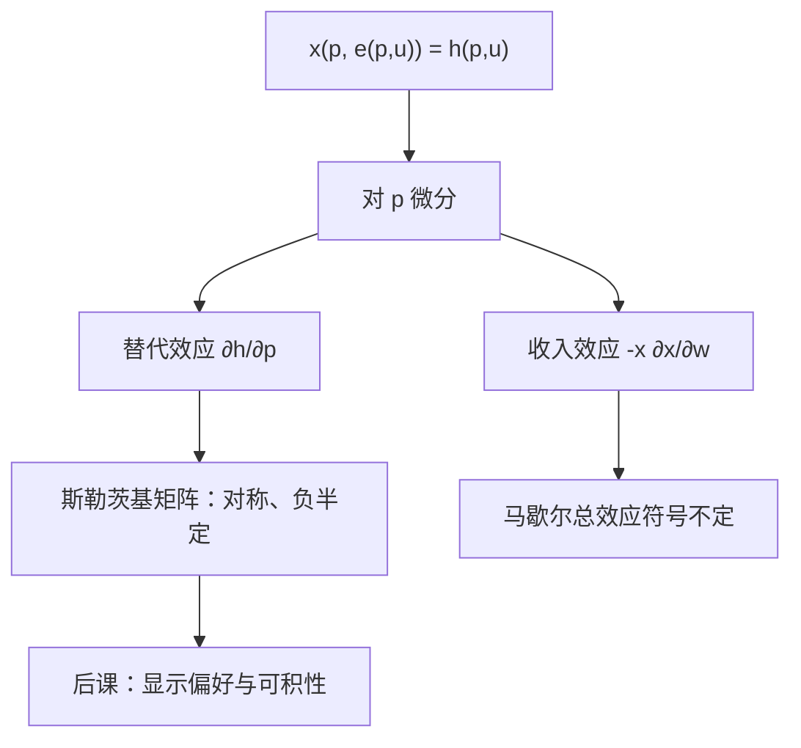

# 斯勒茨基方程

价格变动的总效应，等于保持购买力的替代效应，加上真实收入变动引起的收入效应。

<footer>—— 据 Slutsky, Sulla teoria del bilancio del consumatore, 1915；Mas-Colell, Whinston and Green, Microeconomic Theory 第 3 章整理</footer>

[上一课](/econ/hicksian-demand)（希克斯需求）。钉死了 $v$、$e$ 以及 $x(p,w)=h\bigl(p,v(p,w)\bigr)$。本课不重讲对偶定义，也不再写罗伊与谢泼德。缺口是：马歇尔需求对价格的导数符号不定，后课却经常需要「替代矩阵负半定、对称」这种结构。必须把 $\partial x/\partial p$ 拆开，让受过补偿的那一块单独站出来。

## 问题

只看见 $x(p,w)$ 时，涨价有两件事同时发生：相对价格变了，以及预算能买到的真实购买力变了。两件事搅在一起，自价格弹性可以为正（吉芬），交叉弹性的符号也不能从偏好凸性直接读出。缺口不是再求一次一阶条件，而是沿两条路径求导：一条钉住效用（希克斯），一条钉住名义财富（马歇尔）。

把恒等式 $x\bigl(p,e(p,u)\bigr)=h(p,u)$ 对 $p_j$ 微分，再用 $w=e(p,u)$ 代回，得到斯勒茨基方程

$$
\frac{\partial x_i}{\partial p_j}(p,w)=\frac{\partial h_i}{\partial p_j}\bigl(p,v(p,w)\bigr)-\frac{\partial x_i}{\partial w}(p,w)\,x_j(p,w).
$$

右端第一项是替代效应，第二项是收入效应。本课的任务是承认这一分解，并读出斯勒茨基矩阵 $S=\bigl(\partial h_i/\partial p_j\bigr)$ 的性质；不把商品逐个讲成「正常」或「劣等」的百科。

### 补偿的两种口径不要混

希克斯补偿钉住效用：$de=h\cdot dp$。斯勒茨基补偿钉住原消费束刚好仍买得起。可微点上二者一阶相同，经验上常用斯勒茨基补偿，因为原束可观测、原效用不可观测。方程以希克斯形式写出，是因为 $S$ 正是 $e$ 的海塞，形状干净。

吉芬商品是收入效应压过替代效应的马歇尔现象。希克斯需求的自价格效应仍非正：补偿过的需求不向上倾斜。

## 方法

$e(p,u)$ 对 $p$ 一次齐次且凹，故海塞 $S(p,u)$ 对称、负半定，并且 $S p=0$（齐次性）。对称是可积性的微分形式：交叉替代效应相等。负半定把「替代项不增加支出」写成二次型。后课从需求恢复偏好，缺的就是观测上能否找回一个这样的 $S$。

马歇尔矩阵 $D_p x$ 一般不对称。收入效应 $-x_j\,\partial x_i/\partial w$ 没有理由等于 $-x_i\,\partial x_j/\partial w$，除非偏好把财富效应排成与 $x$ 成比例的特殊形状（例如位似）。位似是后课偶尔用的刀，不是本课的默认。

经验策略是：先估计马歇尔弹性与收入弹性，再用方程把 $S$ 构造出来，检查对称与负半定。本课只提供恒等式，不讨论估计。

## 机制

替代效应沿无差异面滑动：相对价格变，真实收入按支出函数补回。凸偏好使消费者滑向相对变便宜的商品，故 $S$ 负半定。收入效应沿财富轴移动：名义价格涨等于真实财富降，正常品少买、劣等品多买。总效应是二者之和，所以「需求向下倾斜」不是定理，只是替代压过收入时的正则情形。

计价物与齐次性还意味着 $S$ 的秩至多 $n-1$。独立的价格方向只有相对价格。后课一般均衡用超额需求时，会再次用到这条降维。

补偿变化用 $e$ 积分，路径无关正因为 $S$ 对称。不对称的马歇尔导数不能拿来当福利积分的被积函数。

## 边界

分解要求 $x$ 与 $h$ 在所论的 $(p,w)$ 可微。角点、折拐的无差异集上，$S$ 应读成超微分，方程改成对应的包含关系。吉芬现象在两种商品、一种劣等且占预算很大时可以出现，不是悖论。

本课仍在「已知偏好 → 需求形状」的方向上。下一课反过来：只看见选择，如何约束偏好。量化栏的冲击响应、订单流不是这里的收入效应；不要把斯勒茨基矩阵写成限价簿里的价格冲击分解。

位似偏好使收入扩张路径是射线，$S$ 的收入项与 $x$ 成比例，马歇尔交叉弹性更易认。拟线性则把收入效应赶到计价物。二者都是特例；一般 $S$ 只保证替代块的符号，不保证马歇尔自价格为负。

后课默认：谈到价格弹性，可以随时拆成 $S$ 与财富项。

## 小结

- 马歇尔价格效应 = 希克斯替代 + 收入效应，这是恒等式而不是估计式。
- 斯勒茨基矩阵是支出函数的海塞：对称、负半定、$Sp=0$。
- 需求向下倾斜不是公理；吉芬合法。
- 对称性是后课可积性的微分预告。
- 出处：Slutsky, 1915；Mas-Colell, Whinston and Green 第 3 章；Varian, *Microeconomic Analysis*。
