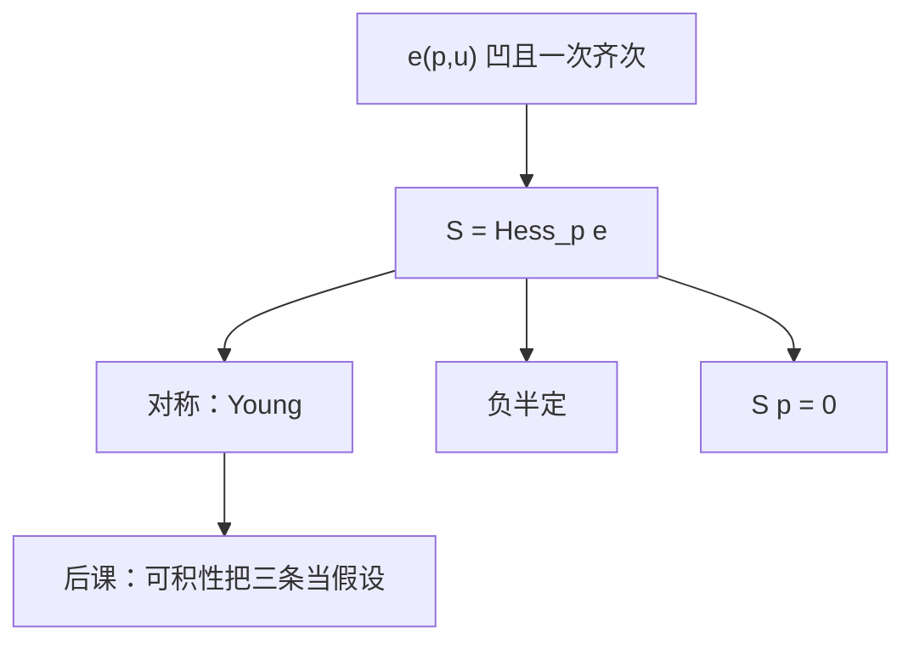

# 斯勒茨基对称与负半定

补偿需求对价格的导数矩阵，不是又一条弹性表，而是支出函数的海塞：对称、负半定、沿着价格向量为零。

<footer>—— 据 Mas-Colell, Whinston and Green, Microeconomic Theory 第 2–3 章；Varian, Microeconomic Analysis 整理</footer>

[上一课](/econ/slutsky-equation)把马歇尔价格效应拆成替代项加收入项，并写出 $S=\bigl(\partial h_i/\partial p_j\bigr)$。本课不重推那条恒等式，也不再定义 $e$ 与 $h$。缺口是：上一课把「对称、负半定、$Sp=0$」当作形状描述一带而过；后课[可积性](/econ/integrability)要把同一组性质**反过来**当假设。必须把这三条收成矩阵定理，并标明马歇尔矩阵 $D_p x$ 一条也不继承。

## 问题

恒等式已经承认 $D_p x=S-x(\partial x/\partial w)^\top$。剩下的问题不是再拆一次，而是问 $S$ 作为 $n\times n$ 矩阵究竟有哪些必然性质。若只知道自价格替代非正，后课无法检验交叉项，也无法从需求恢复偏好。缺口是三条，绑在一起：

1. 对称：$S_{ij}=S_{ji}$。交叉补偿效应相等。
2. 负半定：对一切 $z$，$z^\top S z\le 0$。补偿过的自价格效应「平均」非正。
3. $Sp=0$，因而秩至多 $n-1$。沿价格射线的补偿需求不变。

这三条来自 $e(p,u)$ 对 $p$ 一次齐次且凹，海塞即 $S$。本课把它们从支出函数读出，不把商品逐个讲成净替代或净互补的百科。

### 对称不是马歇尔交叉弹性相等

$\partial x_i/\partial p_j$ 一般不等于 $\partial x_j/\partial p_i$。收入项 $-x_j\partial x_i/\partial w$ 没有理由对换。观测到马歇尔交叉弹性不对称，并不拒绝偏好；拒绝偏好要看构造出来的 $S$。上一课边注已预告：福利积分走 $e$，正因为 $S$ 对称才路径无关。

希克斯与斯勒茨基两种补偿在可微点上一阶重合，故 $S$ 用哪一种口径写出，微分性质相同。有限跳跃上二者分道，本课只管导数。

## 方法

从对偶读，不要从一阶条件重算。$h=\nabla_p e$，Young 定理给出海塞对称。$e$ 凹给出海塞负半定。一次齐次给出欧拉 $h\cdot p=e$，再对 $p$ 微分得 $Sp=0$。$p\neq 0$ 故 $S$ 奇异，独立的补偿方向只有相对价格。

检验需求时：用上一课的恒等式由 $x$ 构造 $S$，再查这三条。自价格 $S_{ii}\le 0$ 是负半定的对角特例，不是全部。两个商品时 $S_{12}=S_{21}$ 且 $S_{12}=-S_{11}p_1/p_2$，矩阵被一条数钉死。$n>2$ 时对称是真正的交叉约束，也是后课可积性最先拿来拒绝模型的那一条。

位似使收入项与 $x$ 成比例，马歇尔交叉弹性更好认，但对称仍只属于 $S$。拟线性把收入效应赶到计价物，非计价物的马歇尔块与 $S$ 重合，对称才「看上去」像马歇尔的。二者都是特例，不是本课的默认。

## 机制

对称的机制是交叉偏导可换序：先补偿 $p_j$ 再补偿 $p_i$，与反过来走，支出的二阶变化相同。负半定的机制是凹性：价格向量的任何扰动，补偿后的成本上升得比线性慢，二次型不能为正。$Sp=0$ 的机制是没有货币幻觉：所有价格与财富同比例缩放，真实束不变，补偿需求对绝对价格水平的导数沿 $p$ 为零。

净替代 $S_{ij}>0$、净互补 $S_{ij}<0$ 是对称矩阵的非对角符号，没有先验。加总约束 $Sp=0$ 强迫：一种商品的补偿自价格为负，则它与其余商品的加权净替代为正。这不是「所有商品两两替代」，只是不能所有交叉项同号到与欧拉冲突。

负半定不蕴含马歇尔自价格为负。吉芬合法，下一课才把收入项的符号打开。本课的符号保护停在 $S$，不传给 $D_p x$。

## 边界

角点、折拐处 $e$ 不可微，$S$ 应读成超微分：仍对称（作为集值映射的循环单调）、仍负半定意义下的单调，方程改成包含。本课的三条是内点正则处的工作语言。

也不要把 $S$ 写成限价簿上的冲击分解。量化栏的价格冲击与此处补偿导数不是同一矩阵。本课仍是一个人、确定消费。经验上估计 $S$ 要先有收入弹性；那是计量，不是本课的定理。

后课默认：谈到补偿矩阵，就具备对称、负半定、$Sp=0$；可积性将把同一组性质当作「需求来自偏好」的微分判据。马歇尔矩阵不默认其中任何一条。

## 小结

- $S$ 是支出函数的海塞：对称、负半定、$Sp=0$，秩至多 $n-1$。
- 马歇尔交叉导数不对称；对称是补偿过的性质。
- 负半定保护的是替代项，不是需求定律。
- 后课可积性把这三条从定理变成检验。
- 出处：Mas-Colell, Whinston and Green 第 2–3 章；Varian, *Microeconomic Analysis*。
