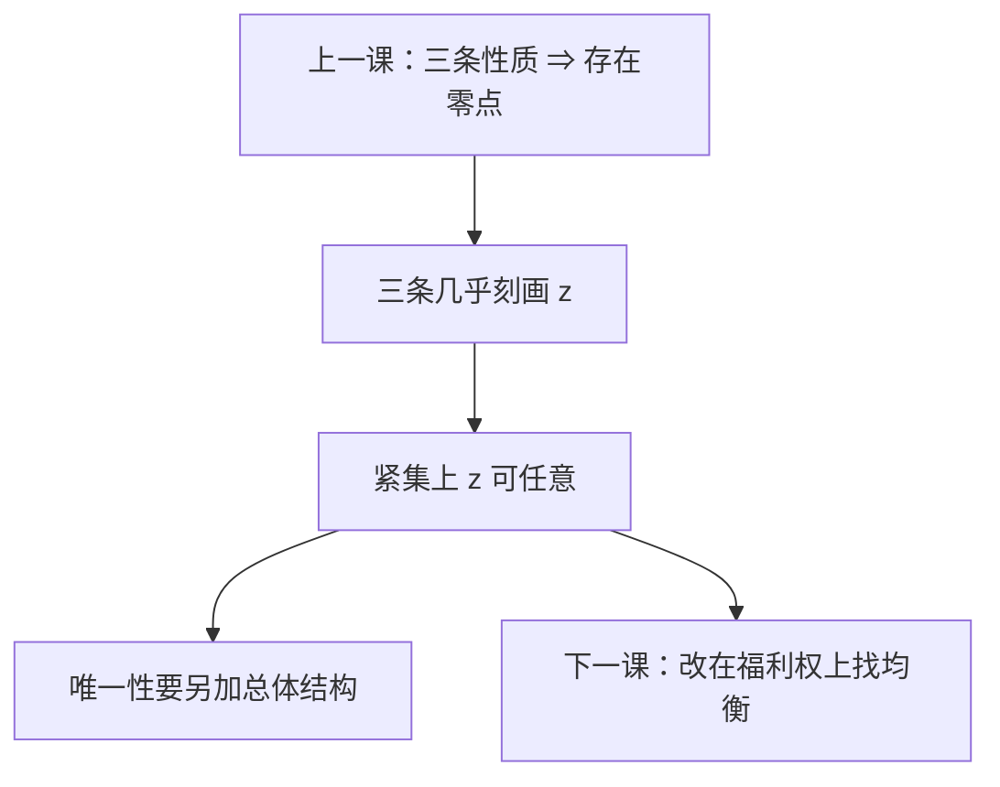

# Sonnenschein–Mantel–Debreu

个人需求很有结构；加总成超额需求之后，连续性、齐次性与瓦尔拉斯定律几乎就是全部——在紧集上，任意满足这三条的函数都可以是某经济的 $z(p)$。

<footer>—— Debreu, Excess Demand Functions, Journal of Economic Theory, 1974；Mantel, 1974；Sonnenschein, 1972–1973</footer>

[上一课](/econ/ge-existence)（存在性与不动点）。角谷在凸连续下保证 $z$ 有零点，并已经预告：这几条几乎也是 $z$ 的全部限制。本课不重写切立方体与 $F(p)$。缺口是把那句预告做成定理：总体超额需求没有「代表性消费者」免费送来的斯卢茨基负半定，比较静态与唯一性不能从「人人凸」推出。

## 问题

存在性用了 $z$ 的三条：零次齐次、$p\cdot z(p)=0$、连续（或对应上半连续），外加边界行为。个人需求还有斯卢茨基矩阵负半定、对称。加总之后，交叉项不能对消成同样的结构——不同人的财富效应指向不同商品。Sonnenschein、Mantel、Debreu 证明：对任意满足三条的连续函数，在单纯形内部的任意紧集上，只要消费者足够多，就能找到偏好与禀赋使该函数成为超额需求。缺口不是再证存在，而是：**存在定理用过的结构，已经穷尽了总体 $z$；「市场像一个人」不是定理。**

因此下一课的唯一与试错必须另加总替代一类总体条件；本课先把「几乎任意」钉死。

### 不是需求理论破产

个人层面的显示偏好、斯卢茨基，仍然成立。SMD 说的是加总映射：从剖面到 $z(\cdot)$ 的值域，在那三条约束下是大的。宏观若只用一个 $z$，等于直接假设总体结构，不是从微观凸性推出来。

Debreu 1974：在单纯形的紧子集上分解任意连续、齐次、满足瓦尔拉斯定律的 $z$ 为 $L$ 个消费者的超额需求。Mantel 允许同位相似偏好。Sonnenschein 1972/73 先给出近似与多项式版本。

## 方法

证明策略是构造，不是再对个人需求求导。给定目标 $\hat z$，造出若干消费者，使其超额需求在指定紧集上逼近 $\hat z$。人数至少与商品数同阶（Debreu 用 $L$ 个）。财富效应被用来生成「任意」的方向，替代效应的负半定被加总稀释。

含义。比较静态：$\partial z_\ell/\partial p_k$ 的符号没有总体限制。均衡个数：可以很多。试错 $\dot p=z(p)$ 的雅可比没有免费的负定。代表性主体等于额外假设总体斯卢茨基，不是 SMD 的推论。唯一性课要另加总替代，不能从本课的构造里长出来。

本课不给算法。它说明：对着 $z(p)=0$ 做全局牛顿，没有微观保证只有一个根。

## 机制

加总失结构的机制是异质财富效应：价格变动改相对购买力，有人买更多 $x$、有人买更少，总体交叉导数不受个人斯卢茨基束缚。齐次与瓦尔拉斯来自预算，加总后仍在，因为每人都有预算；负半定不来自预算，来自偏好凸与内部最优，加总对不齐。

边界行为（某价趋于零时超额需求不掉到 $-\infty$）仍限制 $z$ 在单纯形边缘的样子，所以「任意」是内部紧集上的局部刻画，不是 $p$ 碰到轴也可以乱画。存在性证明需要的正是边缘加上内部连续——SMD 不否定存在，只否定存在之后的免费唯一。

人数不够时构造失败：商品很多、只有一两个人，总体更接近个人斯卢茨基，$z$ 没那么野。SMD 要足够多的异质财富效应当「基」。宏观代表性主体等于宣布只用一个人，从而直接假设总体结构，不是从微观加总推出来的定理。

SMD 与[核等价](/econ/core-equivalence)不打架：核等价是复制后核缩到瓦尔拉斯配置，谈的是配置与联盟；SMD 谈的是作为价格函数的 $z$ 有多野。人多可以让核变瘦，同时 $z$ 仍然任意。

## 边界

生产加入后供给对应也可以很野；精神不变。

同质位似偏好加共线禀赋，总体像一个人，SMD 的构造用不上——那是额外假设。[弱公理](/econ/sarp-garp)在总体上成立也会限制 $z$，但那不是从个人 WARP 免费加总来的。不完全市场、生产、税收会改 $z$ 的定义，但「加总没有免费结构」的精神仍在。下一课把未知数从 $p$ 换成福利权重，不宣称 $z$ 变好，只换一条找均衡的路。

后课默认：总体超额需求在齐次、瓦尔拉斯、连续之外几乎不受限；唯一、稳定、代表性主体都要另加假设。

本课不把存在性改成唯一性。

## 小结

- 存在性用过的三条，在紧集上几乎就是 $z$ 的全部。
- 个人斯卢茨基不能抬进总体；市场不必像一个人。
- 均衡可以多、比较静态可以任意符号。
- 下一课用福利权重参数化均衡，不靠驯服 $z$。
- 出处：Sonnenschein, 1972/73；Mantel, *JET*, 1974；Debreu, *JET*, 1974。
