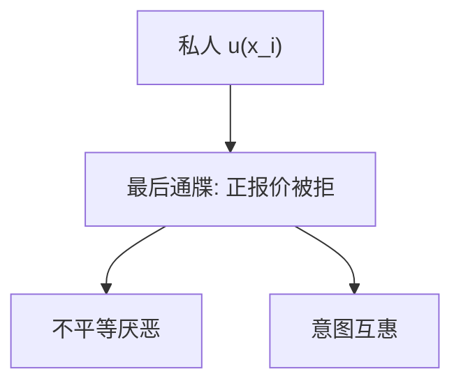

# 社会偏好与公平

最后通牒里正的拒绝率说明：支付里可以含别人的份额，钱不是唯一参数。

<footer>—— Güth, Schmittberger and Schwarze, 1982；Fehr and Schmidt, QJE 1999；Rabin, AER 1993</footer>

[上一课](/econ/bounded-rationality-satisficing)改程序。本课缺口是目标：即使算得完，人也可能拒绝不公平的正金额。不重写满意。

## 问题

标准私人支付 $u(x_i)$ 预测最后通牒博弈接受任何正报价。实验里低报价被拒，提议集中在 40–50%。独裁者博弈仍有正给予。Fehr 与 Schmidt（1999）用不平等厌恶：效用惩罚自己过多与过少。Rabin（1993）用意图：同样的物质结果，善意与恶意得到不同互惠。缺口是在已有[偏好](/econ/preference-choice)上把 $X$ 扩成配置，而不是再推独立性。

家庭金融接口弱而真实：家族保险、遗赠的公平规范、对「市场公平价格」的抵制。本课不把这些写成定价模型。

最后通牒拒绝是有代价的惩罚，区别于廉价的公平表态。策略性公平（为了声誉）与内在公平要靠匿名与一次性设计分开。

## 方法

实验博弈：最后通牒、独裁者、公共物品、信任博弈。理论：FS 不平等厌恶、Rabin 互惠、Charness–Rabin 的社会偏好一般式。本课只钉「支付可以依赖别人的支付与意图」，不比较哪一套拟合最好。

## 机制

机制是配置进入偏好。拒绝低报价提高相对公平，牺牲绝对货币。这与损失厌恶不同：参考点可以是平等分割，不公平被编码为损失。也可以没有拐折，直接是 $u(x_i,x_j)$。市场里若匿名竞争足够强，社会偏好可能被价格挤出（市场实验里的收敛）；双边谈判里它留下来。行为金融后段的噪声交易者不必是公平偏好，本课不要混。

最后通牒的拒绝用私人支付无法解释：正的钱被扔掉，为的是惩罚不公平。FS 把不平等写成自己相对别人过多过少的线性惩罚；Rabin 把同样的物质结果按「对方是否善意」分叉。独裁者仍给，说明不只是策略性恐惧报复。家庭遗赠的公平规范、对涨价的愤怒，可以用同一零件，但加总到资产价格没有识别——噪声交易者课用的是错误信念与风险，不是 $\alpha$ 嫉妒。

## 边界

利害增大时拒绝率下降但仍非零。跨文化差异大。把实验室公平直接写进资产定价没有识别。本课也不处理政治上的再分配偏好作为宏观主干——那是另一门课。

后课默认：助推可以利用公平规范（能源账单上的邻居比较），那是选择架构，不是把 FS 效用写进欧拉。

最后通牒拒绝正金额，私人 $u(x_i)$ 不够；配置与意图进入偏好。

匿名竞争可挤出公平，双边与家庭内部留得住。噪声交易者不要写成嫉妒。

实验室公平不直接写进资产定价核；加总识别在噪声交易者课另做。

## 小结

- 社会偏好把别人的支付与意图写进 $u$，解释有代价的拒绝。
- 与有限理性分工：目标变了，不是没算完。
- 匿名市场可能挤出公平；双边与家庭内部留得住。
- 独裁者仍给，说明不只是怕报复。
- 利害增大时拒绝率下降，但通常非零。
- 出处：Güth et al. 1982；Rabin, *AER* 1993；Fehr and Schmidt, *QJE* 1999。
