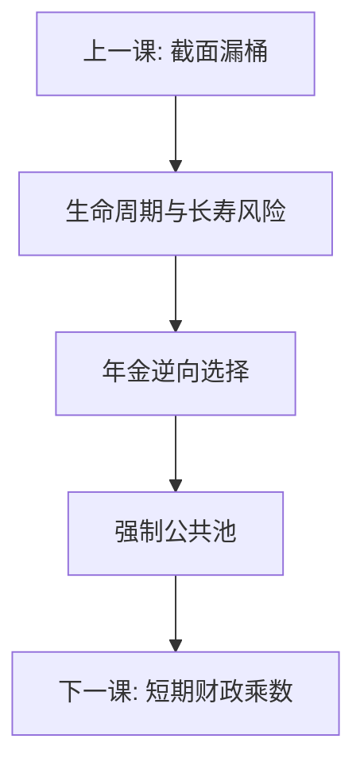

# 社会保障与年金

私人年金市场会按风险筛选：长寿者更愿买，费率上升，短寿者退出。强制公共年金用跨代与跨风险的强制池，换来一生消费平滑，代价是劳动楔子与财政承诺。

<footer>—— Diamond, National Debt in a Neoclassical Growth Model 与后续社保论文；Feldstein 论社保与资本积累；对照 Akerlof 柠檬与 Atkinson–Stiglitz</footer>

[上一课](/econ/redistribution-efficiency)把截面再分配写成漏桶。本课缺口是生命周期：退休消费、长寿风险、短视与强制。市场可以提供自愿年金，但逆向选择让池变贵；政府用工资税加确定给付（或名义账户）强制参保。不重写漏桶公式。后课把支出侧从生命周期承诺换成短期乘数争议。

## 问题

工作期收入、退休期零劳动，完全市场下个人储蓄即可平滑。缺口在摩擦：长寿不确定、年金按平均寿命定价则短寿补贴长寿，知情者选择把费率推向「只有长寿者购买」；短视与流动性约束让年轻期储蓄不足；家庭内风险分担有限。强制社保把所有人扔进同一池，切断选择，用工资税换领取权。Feldstein 担心挤出私人储蓄、降低资本；Diamond 强调市场缺失与再分配（累进给付、遗属）。缺口是：**社保首先是缺失市场的强制合同，其次才是当期贫困转移**；两笔账不要合成「就是税」。

现收现付：当代工人养当代退休者，回报绑定工资增长与人口，不是基金市场回报。积累制：回报绑资本，但转轨要把上一代的隐性债显化。

### 社保不是强制储蓄口号

若只是强制储蓄，个人账户加最低监管即可。年金的保险部分要求风险池；再分配部分要求给付公式不按精算中性。把社保改成「各自账户」会改善激励，也可能拆掉逆向选择保险与累进。政策争论应分清三件：强制储蓄、长寿保险、截面再分配——弹性与漏桶分别打在工资税上。

Akerlof 柠檬在年金里是长寿类型。强制参保是「所有车都进保险」的公共版本。Diamond 多次强调：最优社保规模随市场不完全程度上升。

## 方法

三层分解。(1) 保险：强制年金对抗逆向选择与长寿。(2) 再分配：给付相对缴费的累进，用上一课权重评价，漏是劳动供给与逃缴。(3) 宏观：现收现付的隐含回报 $n+g$，与资本回报 $r$ 比较；Feldstein 挤出发生在积累下降时。转轨：认旧债则要额外税或发债，李嘉图与乘数下一课才展开，本课只标成本存在。给付按物价还是按工资指数化，决定池在通胀冲击下是保险还是放大——滞胀史会回头对照这一条款。

不要把人口老化写成「社保破产」一句话：参数（退休年龄、给付指数、缴费率）都是合同条款，可持续是下一课主权债语言的近亲。名义账户或积分制改变的是给付如何跟踪工资，不自动消除逆向选择——强制池仍在，只是精算外观不同。短视与承诺：强制可以纠正年轻期储蓄不足，也可能把流动性约束者的当期消费压得过低，权重与弹性又一次同时出现。

## 机制

机制是切断选择以恢复池。市场年金的费率反映购买者的条件期望寿命；强制把无条件分布塞回去，短寿者事后吃亏、事前可能仍愿买保险。工资税是劳动楔子，与所得税叠加，extensive 弹性在老年人与年轻人上不同。现收现付是代际合同：未出生者无法签约，政治可改条款——承诺的时间一致性比私人年金弱，这是制度风险，不是精算表上的 $q_x$。

与公共品对照：国防非竞争；年金在领取上可排他，失败主要来自选择与家长主义，不是萨缪尔森加总。工具仍是税，漏桶仍适用，对象换成生命周期。遗属与残疾给付是池内再分配，不是长寿保险的同一矩；改革若只动「个人账户回报」，会把这两层当噪声删掉。

Feldstein 的挤出估计有争议，但机制清楚：若家庭把给付当财富，私人储蓄下降。李嘉图是否完全对冲，取决于流动性约束——接到财政乘数课。

## 边界

本课不设计某国缴费率，不写个人账户投资菜单。医疗保险的逆向选择是近亲，不在此展开。主权债务可持续下一课再写隐性养老金负债如何进入政府跨期预算。后课默认：评价社保改革时拆开保险、再分配、宏观挤出三笔；不要只用「强制储蓄」或只用「破产」。提前领取与延迟领取的精算调整，是池内价格，不是取消强制。

## 小结

- 私人年金受长寿逆向选择；强制池切断选择。
- 社保含保险、截面再分配与宏观挤出三层，弹性各自不同。
- 现收现付回报绑工资与人口，不是基金 $r$。
- 工资税是劳动楔子，漏桶仍适用。
- 保险、再分配、挤出三层不要合成强制储蓄一句。
- 出处：Diamond；Feldstein；Akerlof；Atkinson and Stiglitz。
