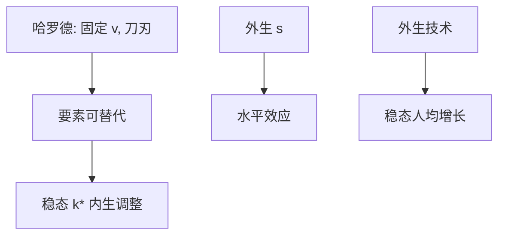

# Solow 1956 增长原文

    
资本与劳动可替代时，储蓄率决定稳态资本密度，不决定稳态增长率；哈罗德的刀刃不是生产函数的必然。

    <footer>—— Solow, A Contribution to the Theory of Economic Growth, Quarterly Journal of Economics 1956</footer>

附录对照，不插入主干。[上一课](/econ/diamond-dybvig-paper)对照的是活期合同与挤兑。本篇转到宏观增长：**Solow 1956 原文的问题设定**不是发展核算，而是哈罗德–多马的刀刃。主干[索洛模型](/econ/solow-growth)已取 $\dot k=sf(k)-(n+g+\delta)k$ 与「$s$ 只有水平效应」；这里对照 *QJE* 如何把固定系数增长写成可以避免的特例，以及 1957 年残差核算为何是另一篇。

## 问题

Harrod 与 Domar 把资本产出比写成技术常数，于是有保证的增长率 $s/v$ 必须刚好等于劳动力（加技术）的自然增长率，否则永久失业或永久短缺。Solow 问的缺口是：若 $F(K,L)$ 允许要素替代，资本密度 $k$ 能否自己走到使 $s f(k)/k$ 等于摊薄率的那一点，从而刀刃消失？储蓄率仍是外生的——原文没有欧拉方程。技术可以外生增长，但文章的锋芒在替代，不在把 $g$ 识别成研发。

原文用的生产函数足够一般：规模报酬不变、边际产出递减即可，不必先钉 Cobb–Douglas。固定系数作为对照出现，为的是说明刀刃是零替代弹性的极限，不是增长理论的必然。人口与储蓄被写成参数，不是政策规则下的决策——这一点正接得上后一篇 Lucas：外生 $s$ 的比较静态不是政策实验室。

Swan（1956）同期用类似图在 *Economic Record* 上写。本附录钉 Solow 的连续时间版本，不把两人并成一篇文献综述。

Solow, *QJE* 70(1), 1956, 65–94。1957 年 *REStat* 的技术变化与总量生产函数是核算残差，不是 1956 年模型里已经估计出的 $g$。两篇不要混引。

## 方法

规模报酬不变，$k=K/L$（或有效劳动），运动方程使 $\dot k$ 的符号由 $sf(k)$ 与摊薄项比较决定。凹性与 Inada 给出内部稳态与单调收敛。固定系数（里昂惕夫）作为极限：替代弹性为零时刀刃回来。原文用相位图说话，没有 Ramsey 的最优储蓄，也没有跨国回归。

人口增长 $n$ 提高摊薄、压低 $k^*$；提高 $s$ 提高 $k^*$，过渡期增长加快，稳态人均增长回到外生的技术项（若有）。这是比较静态，不是「提高储蓄率的因果识别」。

主干课已写 Inada；附录对照的是刀刃作为被拒绝的先修，而不是从自然率失业再起笔。

## 机制

机制是递减报酬下的自我纠正。$k$ 太低时资本的平均产出高，同样的 $s$ 使投资超过摊薄，$\dot k\gt 0$；反过来 $k$ 下降。哈罗德的不稳定来自 $v$ 不能动；Solow 让 $v=k/f(k)$ 随 $k$ 变。长期人均增长若还要持续，必须另有 $A$ 的增长——原文把这条写成外生，留给后文内生增长去打开。

过渡动态上，提高 $s$ 会加快增长一阵子，然后回到由 $n$ 与技术决定的稳态路径。把过渡期增长率当成新的稳态，是误读 1956 年相位图最常见的方式。主干课已警告这一点；附录对照的是原文本来就在谈稳态与趋近，而不是永远的 $s$ 引擎。

### 对照主干索洛课，不插入挤兑与增长之间

主干[索洛模型](/econ/solow-growth)已从自然率上的资本积累起笔。本附录对照 1956 年对哈罗德–多马的回应、外生 $s$、以及刻意不含的最优储蓄。把 *QJE* 1956 接在[Diamond–Dybvig 原文](/econ/diamond-dybvig-paper)之后只因为附录链如此排列，**不插入**银行课序，也不插进增长主干当「第 6.5 课」。读完回主干索洛课。

黄金律选择 $s$ 使稳态消费最大，是 Phelps 等人后写的比较静态，1956 年只把 $s$ 当参数。AK 与内生增长是再后面的刀刃。

## 边界

不要把 1956 写成已经包含人力资本、制度或收敛回归。条件收敛是模型推论：参数相同才走到同一 $k^*$；跨国是否收敛是经验缺口。也不要把索洛残差（1957）读成 1956 年的定理编号。

原文没有失业波动、没有货币、没有限价簿。周期对照是 RBC/NK；资本在此是单一 $K$，不是公司证券。

Ramsey–Cass–Koopmans 把 $s$ 内生化，稳态增长仍靠外生 $g$——那是主干后课，不是 1956 年未写完的章节。

宏观与货币附录链在增长原文处接上；不要当成从挤兑理论推出来的增长模型。

Inada 与凹性保证内部稳态；零替代弹性把刀刃请回来。本附录对照的是 1956 年拒绝刀刃的方式，不是已经写好的黄金律或内生 $g$。

## 小结

- 附录对照 Solow 1956：要素替代取消哈罗德刀刃；$s$ 定水平，稳态增长靠外生技术。
- 方法是资本密度的运动方程与相位图，不是最优储蓄。
- 1957 残差是另一篇；Swan 同期但不在本课重写。
- 出处：Solow, *QJE* 1956。
