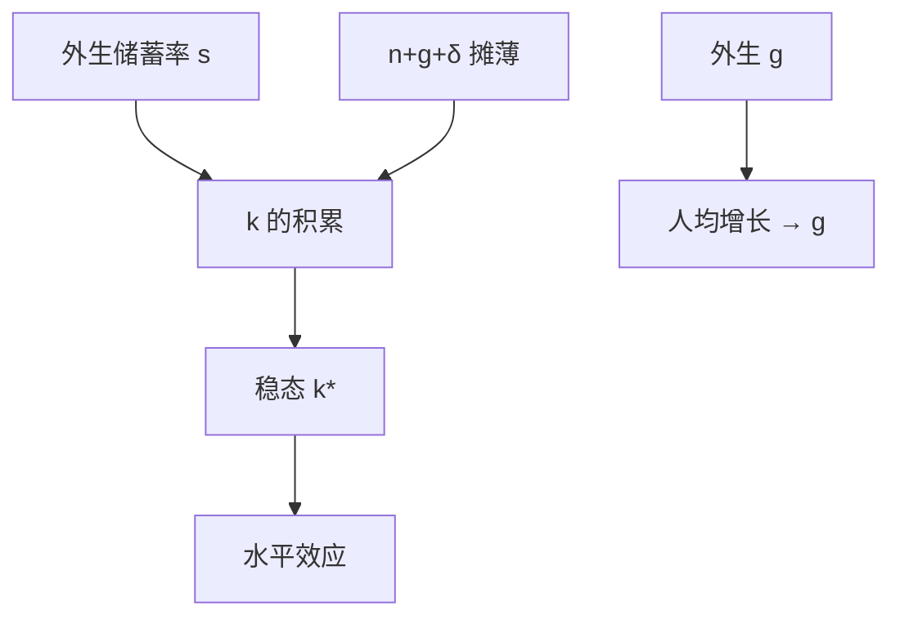

# 索洛模型

储蓄率决定稳态资本密度，不决定稳态增长率；人均产出的长期增长要靠外生的技术。

<footer>—— Solow, A Contribution to the Theory of Economic Growth, QJE 1956</footer>

[上一课](/econ/natural-unemployment)把充分就业钉在自然率与潜在产出 $y^*$ 上。潜在产出仍可以随时间变。本课的缺口不是再分解失业，而是：在劳动力按自然率使用时，资本如何积累，人均产出的水平与增长率各由什么决定。Solow（1956）把储蓄率写成外生，技术写成外生；黄金律与内生增长是后课对这两个外生的缺口。

## 问题

核算恒等给出 $S=I$，没有资本的运动定律。若每年把产出的固定比例 $s$ 变成投资，资本存量 $K$ 仍可能被折旧 $\delta$ 与人口增长 $n$ 摊薄。问题是稳态里人均资本是否收敛、收敛到哪里、那里的增长还剩什么。

生产用规模报酬不变的 $Y=F(K,AL)$，$A$ 为劳动增进型技术。人均有效劳动变量 $k=K/(AL)$。没有 $A$ 的增长，人均产出在稳态停止增长——这是对「提高 $s$ 就能永远加快增长」的拒绝。$s$ 只移动水平。

Solow 1956 与 Swan 1956 同期。本课用 Solow 的连续时间写法。技术 $A$ 在本课是外生；把它当成研发产出是 [Romer](/econ/endogenous-growth) 的缺口。

## 方法

运动方程

$$
\dot{k}=sf(k)-(n+g+\delta)k,
$$

$g=\dot{A}/A$，$f(k)=F(k,1)$。稳态 $\dot{k}=0$ 给出 $sf(k^*)=(n+g+\delta)k^*$。索洛残差（Solow 1957）把产出增长里不能由 $K$、$L$ 解释的部分叫技术变化，那是核算，本课模型把 $g$ 直接当作参数。

政策：提高 $s$ 使 $k^*$、$y^*$ 上升，过渡期增长加快，稳态增长率回到 $g$。人口增长 $n$ 提高摊薄，压低 $k^*$。这是比较静态，不是因果计量。

### 为何需要 Inada 与凹性

$f$ 凹、$f(0)=0$、Inada 条件保证内部稳态唯一、鞍点式的全局收敛（一维无须鞍点，只是单调收敛）。若 $f$ 是 AK，稳态增长由 $s$ 决定——那正是后课内生增长要打开的刀刃。本课保持递减报酬，使 $s$ 不能充当永久增长引擎。

## 机制

递减报酬使追加资本的边际产出下降，直到刚好覆盖摊薄。收敛是模型内的：$k<k^*$ 时投资超过摊薄，$\dot{k}>0$。跨国是否收敛，是[发展核算](/econ/convergence-accounting)的经验缺口；本课只给出条件：同样的 $s,n,g,\delta,f$ 才会走到同一 $k^*$。

消费 $c=(1-s)f(k)$。稳态消费未必对 $s$ 单调：太高的 $s$ 把太多产出锁进资本，吃掉消费。哪个 $s$ 使 $c^*$ 最大，是黄金律。本课不优化 $s$，只把它当参数。

索洛残差（1957）把增长里不能由 $K$、$L$ 解释的部分叫技术变化。本课模型把 $g$ 当参数；残差是核算，不是已经识别了研发部门。过渡动态上，提高 $s$ 会加快增长一阵子，然后回到 $g$——把过渡期增长率当成新的稳态，是最常见的误读。

Inada 与凹性保证内部稳态。若 $f$ 是 AK，稳态增长由 $s$ 决定。那是后课内生增长的刀刃，本课刻意保持递减报酬。

## 边界

外生 $s$ 切断了消费的欧拉方程；Ramsey–Cass–Koopmans 会把 $s$ 内生化，但稳态增长仍靠外生 $g$。本课也不含失业波动：周期对照是 RBC/NK 的课。资本在此是单一 $K$，不是公司金融里的证券；更不是限价簿。人口增长 $n$ 提高摊薄、压低 $k^*$，不是「人多必然穷」的因果计量。

后课默认：谈到「索洛稳态」时，水平由 $s$ 等参数决定，人均增长由 $g$ 决定。下一课问：这个 $s$ 会不会积累过度。

## 小结

- 充分就业路径上，资本按 $s$ 积累、按 $n+g+\delta$ 摊薄。
- $s$ 有水平效应，稳态人均增长等于外生 $g$。
- 递减报酬使稳态存在；过渡期增长加快不等于稳态 $g$ 变了。
- 黄金律选择 $s$，内生增长解释 $g$。
- 出处：Solow, QJE 1956；技术变化核算见 Solow 1957。
