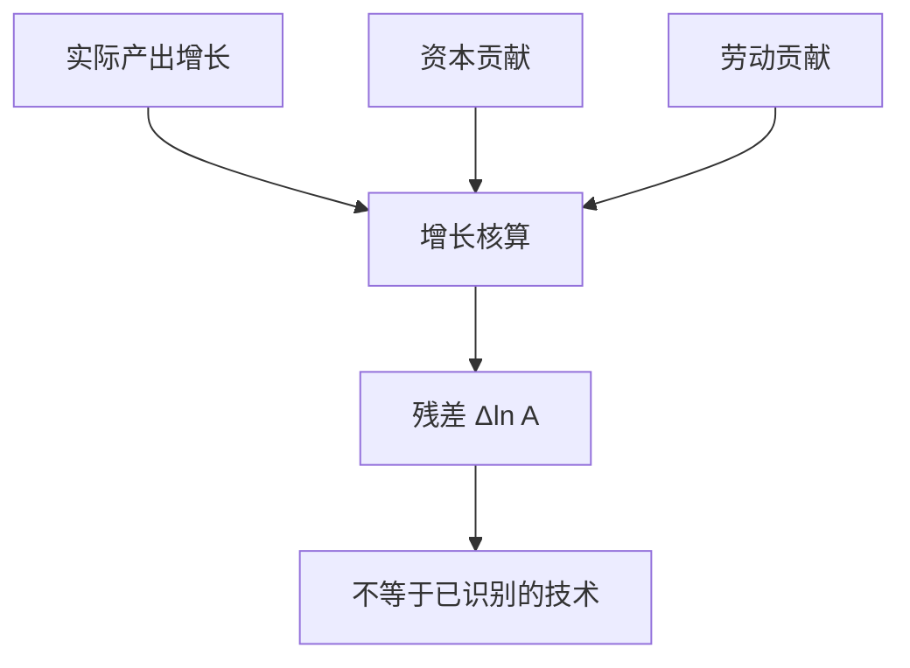

# 索洛残差

把产出增长里不能由可测要素解释的部分叫技术变化，是会计；把它直接读成发明与研发，已经多走了一步。

<footer>—— Solow, Technical Change and the Aggregate Production Function, REStat 1957</footer>

[上一课](/econ/solow-growth)把 $Y=F(K,AL)$ 的 $g=\dot{A}/A$ 当成外生参数，并声明索洛残差是核算、不是已经识别了研发部门。本课的缺口就是把那句核算写开：残差如何从账户里算出来，以及它为什么**不是**技术本身。黄金律下一课仍在外生 $g$ 下选 $k$；内生增长再把 $A$ 的来源打开。本课只钉残差的身份。

## 问题

索洛模型需要一条 $A$ 的路径，数据里没有直接观测的「技术」。可观测的是实际产出、资本存量与劳动投入。若假定规模报酬不变、要素按边际产出付酬，则增长中被 $K$ 与 $L$ 解释掉的部分可以扣掉，剩下的叫全要素生产率（TFP）或索洛残差。缺口不是再写 $\dot{k}=sf(k)-(n+g+\delta)k$，而是：这个剩余包含什么，不能当成研发政策的充分统计量。

1957 的残差是时间序列上的 $\Delta \ln A$。截面上把穷国的落后写成同一个 $A$，是发展核算，公式同源、问题不同，更后的课再拆。

## 方法

对数线性后，增长核算写

$$
\Delta\ln Y = \alpha\Delta\ln K + (1-\alpha)\Delta\ln L + \Delta\ln A,
$$

$\alpha$ 用收入法中的资本份额代理弹性。$\Delta\ln A$ 是残差。劳动要先按质量或工时调整，否则教育与努力进入 $A$。资本要用实际存量，价格平减与利用率一错，$A$ 跟着错——回到[价格指数](/econ/price-index-real)与链式物量。

索洛模型里的 $g$ 是这条残差的模型对应物。把残差当参数，模型才能关闭；把残差当「发明」，需要独立的研发、专利或品种数据。本课停在会计。

### 份额与利用率

$\alpha$ 不是常数：不完全竞争、测量误差、自我雇用的混合收入都会让份额漂。产能利用率顺周期时，衰退里 $K$ 的贡献被高估、$A$ 被低估（或反向，取决于是否调整利用率）。劳动窖藏同样把周期塞进残差。这些是对「$A$=技术」的直接警告。

## 机制

残差吸收一切模型没写进去的东西：技术、制度、误配置、质量调整、加总误差。Hicks 中性、劳动增进型只是把同一剩余塞进不同位置的 $F$。即便每家工厂技术不变，资源从高生产率企业转到低生产率企业，加总 $A$ 也会掉——那是错配课的入口，本课先承认加总残差无法区分「不会做」与「配错了」。

周期中残差亲周期，并不证明技术冲击驱动了周期：利用率与窖藏足够编出同样的剩余。RBC 把残差当冲击，是理论选择；本课的会计不替那一课做决定。增长核算还可以把劳动质量（教育、经验）从 $L$ 里提出来，残差会变小——那不是「技术变少了」，是把一块剩余改名为 $h$。链式物量与 hedonic 已经把一部分质量写进 $Y$，再从残差里读「发明」，会重复计算。

要素投入若用小时而非人数，$A$ 的周期更干净一些，仍不是技术。开放经济里，贸易条件变动可以让实际收入与实际产出分叉，残差不要混用 GNI 与 GDP 物量。

规模报酬不变加欧拉定理，才用收入份额当产出弹性。有递增报酬或经济利润时，残差的「技术」解释更弱。内生增长正是要离开这个封闭。

## 边界

不要把残差写成专利数，也不要把某一两年的 TFP 跳跃写成「改革成功」而不核对 $K$、$L$ 与平减。本课不估计研发弹性。外汇 CIP 与资产价格不进生产函数；PPP 篮子进入截面比较，那是发展核算，不是本课的时间差分。量化栏的成交不是 $A$。

GDP 与 GNI 的物量不同，残差要声明用哪一个 $Y$。链式水平不可加时，产业 TFP 加总也不等于宏观残差，那是指数性质。黄金律下一课仍把 $g$ 当外生参数；本课只禁止把参数 $g$ 与核算残差偷偷画等号。

后课默认：谈到索洛的 $g$ 或 TFP，先把它当残差，再决定要不要赋予技术含义。下一课问：外生 $s$ 会不会把 $k$ 推过黄金律。

## 小结

- 索洛模型把 $g$ 当参数；1957 的残差是从 $Y$、$K$、$L$ 里扣出来的会计。
- $\Delta\ln A$ 含技术，也含利用率、质量、错配与加总误差。
- 收入份额当弹性，依赖竞争与报酬不变。
- 残差不是研发部门，也不是周期技术冲击的证明。
- 把教育从 $L$ 中提出来，只是给剩余改名，不是识别发明。
- 出处：Solow, REStat 1957；对照 1956 的模型。
