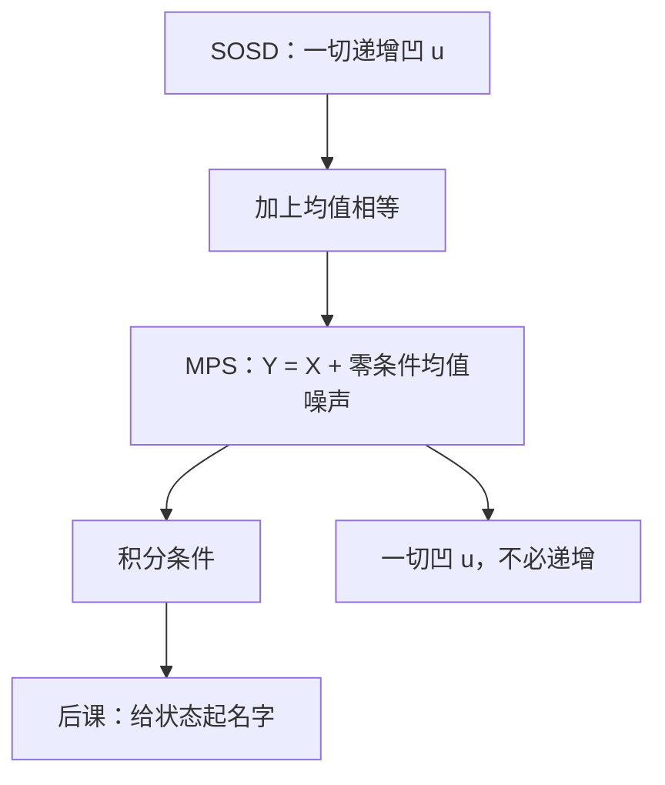

# 二阶占优与均值保持展开

    
均值相同的两份分布，二阶占优与「加上均值为零的噪声」是同一句话——方差更大既非定义，也非充分。

    <footer>—— 据 Rothschild and Stiglitz, Increasing Risk: I. A Definition, Journal of Economic Theory, 1970 整理</footer>

[上一课](/econ/stochastic-dominance)给出了 FSD 与 SSD 的积分条件，并把「更有风险」点名到均值保留展开。本课不重写一阶占优，也不把生存函数再推一遍。缺口是把 SOSD 与 Rothschild–Stiglitz 展形收成一组等价定义：何时「一切凹 $u$ 都同意更差」就是「同一均值加噪声」，以免后课把方差排序或上一课的均值方差刀刃误当成占优。

## 问题

SSD 允许均值不同：均值更低且更散，递增凹的人可以一致讨厌。Rothschild–Stiglitz 问的是更窄的一句：均值已经对齐，风险是否增加。缺口是三条等价，而不是再画一条 CDF：

1. $Y=X+\tilde\varepsilon$，其中 $\mathbb{E}(\tilde\varepsilon\mid X)=0$ 几乎处处（均值保持展开，MPS）。
2. 对一切凹函数 $u$，$\mathbb{E}u(X)\ge\mathbb{E}u(Y)$（不必递增）。
3. $\int_{-\infty}^x F_X\le\int_{-\infty}^x F_Y$ 对一切 $x$，且两端均值相等。

有了等价，后课写「风险增加」必须能指出噪声或积分条件，不能只报 $\sigma_Y\gt \sigma_X$。上一课已警告方差不是 SOSD；本课把这句话收成定义。

### 等均值的 SOSD 才是展形

若均值不等，SOSD 更弱：它可以来自「左移」而不是展形。FSD 蕴含 SOSD，但 FSD 会改均值。故「二阶占优」四个字不够钉风险增加；必须加均值相同，或直接说 MPS。Hadar–Russell 的积分条件覆盖不等均值；Rothschild–Stiglitz 1970 钉的是等均值那一层。

单次交叉：两条 CDF 交叉一次且均值相等，往往给出 MPS，但不是定义。多峰、离散支撑上要回到积分或噪声表示。

## 方法

对象仍是一维财富的客观分布，与主干 $\mathbb{E}u$ 一致。构造 MPS：从 $X$ 的某区间取走中间质量，对称地堆到两端，保持均值，即「展形」。反过来，任何条件均值零的噪声都是一次展形；复合若干次仍是 MPS。

比较两个已给的分布：先查均值；再查积分条件（3）。不必估 $u$，也不必估 $r_A$。这与[显示偏好](/econ/revealed-preference)用成对观测打公理同类：直接打在分布上。

本课仍比较无名分布。哪一个状态穷、有没有 Arrow 证券，下一课才引入。也不把展形写成限价簿上的波动率上升。

## 机制

噪声表示的机制是 Jensen：凹函数对条件均值零的扰动掉期望，故一切风险厌恶者（凹 $u$）都讨厌 MPS。积分条件的机制是把二阶差分累加：CDF 的面积差记录「左边堆了多少未能被右边补偿的质量」。方差只看见二阶矩，看不见质量如何搬；把质量搬到更远的两端可以保持方差却改变更高阶，也可以增大方差却被某条凹 $u$ 喜欢——故方差不是等价项。

与[均值方差](/econ/mean-variance-eu)的分工：MV 在二次或正态刀刃上用 $(\mu,\sigma)$；本课在一般分布上用整条 $F$。正态且均值相同，$\sigma$ 更大确是 MPS，这是刀刃上的重逢，不是一般定义。

Rothschild–Stiglitz 的「increasing risk」不要译成「方差增加」。原文三条等价里没有方差。后续他们讨论风险增加如何改变储蓄、组合，那是应用，本课只钉定义。

## 边界

占优是偏序：许多等均值的分布对不可比，必须回到特定 $u$ 或 $r_A$。三阶占优、下偏距对应谨慎，主干用不到。多维结果要把噪声写成随机向量，积分条件改成多维；本课只钉一维。

独立性失败时，$\mathbb{E}u$ 表示不成立，SOSD 的效用刻画一起塌；积分条件仍可作为分布的几何性质，但不再等于「一切风险厌恶者」。主干仍在 vNM 内部使用本课。模糊没有 $F$ 可积。

后课默认：「更有风险」指 Rothschild–Stiglitz 的 MPS；等均值的 SOSD 与之等价，方差排序不算数。

## 小结

- 等均值时，SOSD、一切凹 $u$ 同意、MPS 三条等价。
- 不等均值的 SOSD 可以只是左移，不是展形。
- 方差更大既非必要也非充分；正态刀刃上才重逢。
- 本课仍比较无名分布；下一课给状态起名字。
- 出处：Rothschild and Stiglitz, *Journal of Economic Theory*, 1970；Hadar and Russell, *AER*, 1969。
