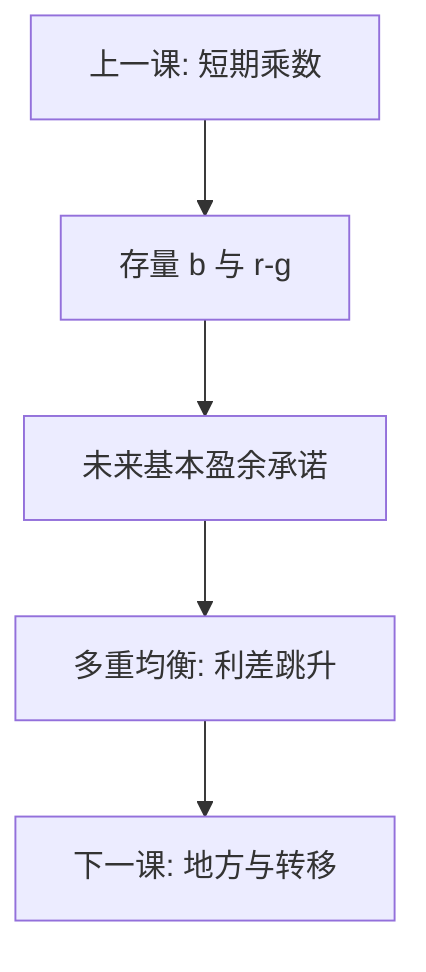

# 主权债务可持续

债务滚得下去，当且仅当贴现的未来基本盈余盖住存量——$r-g$ 与主权利差决定滚的松紧。阈值不是物理定律，违约是多重均衡加上偿付意愿。

<footer>—— Eaton and Gersovitz 主权借贷；Blanchard 对 $r-g$ 的讨论；Reinhart and Rogoff, This Time is Different, 2009（当危机叙事，不当机械阈值）；对照 Bohn 的可持续检验</footer>

[上一课](/econ/fiscal-multiplier-debate)把一次性 $G$ 的短期导数写清楚。本课缺口是存量：连续赤字之后，债能否无庞氏地滚。乘数可以大于 1 仍把债务路径推上不可持续轨道——两句话必须分开。后课地方财政把同一跨期预算拆到多级政府；本课先钉主权。

## 问题

政府跨期约束：现债 $= $ 贴现基本盈余流 $+$ 铸币税（若有）。差分近似：$\Delta b \approx (r-g)b - s$， $b$ 为债/GDP，$s$ 为基本盈余/GDP。$r\lt g$ 时存量自己缩小，空间变大，但 $r$ 含主权利差，危机里可以跳。缺口不是再写一遍政府预算恒等，而是：**可持续是对未来政策的陈述**，不是对今天 $b$ 的一个砍断点。Reinhart–Rogoff 的历史违约表是对照，把 90% 当定律是误读（且计算争议已知）。Eaton–Gersovitz：主权不能被法庭像公司那样清算，约束是意愿加未来市场准入，于是有多重均衡——利差升则路径坏，预言自我实现。

### 债务/GDP 阈值不是物理定律

同一 $b$，在储备货币、金融压抑、$r-g$ 为负时可以稳；在原罪、短债、银行持有主权时可以脆。欧元区成员国不能印自己的货币，主权利差行为像新兴市场——主干[欧元区危机](/econ/eurozone-crisis)已写，经济史课还会对照。用单一阈值做国际比较，漏掉的正是 $r$ 与制度。

Bohn：若基本盈余对 $b$ 的响应足够强，债务可以满足跨期约束，即使看起来一直在涨。检验的是反应函数，不是某一个 $b^*$。

## 方法

会计：写清名义/实际、$r$ 是平均还是边际、是否含隐性养老金负债（接社保课）。压力：利差跳升、增长下滑、$s$ 政治上调不动。货币主权：能发本币债且央行可当最后买家，通胀税是出口；不能则突然停止。乘数状态进入：$G$ 紧缩若把 $Y$ 打低，$b$ 的分母缩小，巩固可能暂时抬高 $b$——这是上一课与本课的接头，不是「所以永不巩固」。

不要用评级字母替代跨期约束：评级是市场利差的滞后描述，不是 $s$ 的现值。或有负债（担保、银行、养老金）在平静期不进 $b$，危机时一次性进表，路径在几天内改写——东亚与 2008 都是这张表。可持续分析若只看明债，等于用 SCP 的 $HHI$ 当势力。

## 机制

机制是无庞氏条件加意愿。私人债务有抵押与破产；主权有税收权与违约权。违约成本是声誉、制裁、金融中断，不是资产拍卖。于是存在「能还但不愿」与「愿还但不能」（流动性）。最后贷款人（对本币）把流动性那一支压住，把问题推到通胀。货币同盟把这一支拿走，多重均衡更尖——后课欧债史会对照。

$r-g$：增长把分母做大，低安全利率把分子做小；两者都是宏观状态，不是财政美德。把低 $r$ 当永久许可，忽略利差跳变，是另一类「这次不同」。平均期限短则滚动风险高，$r$ 的边际是新发债利率，不是存量票面。巩固若全靠一次性资产出售，盈余流不可重复，现值仍对不上。

Blanchard 强调发达经济体 $r-g\lt 0$ 的时期里，滚动更松，但不是许可证去忽略或有负债与利率风险。Reinhart–Rogoff 的贡献是长期叙事，不是回归里的折断点。

## 边界

本课不提供如何做空主权债的任何步骤，不重写量化栏的 CDS 定价。地方债、转移支付下一课。经济史将用金本位、欧债把同一约束放到制度里，本课只给会计与均衡语言。后课默认：谈可持续写 $r-g$、基本盈余反应、货币主权与隐性负债；禁止丢一个 $b^*$ 当结论。通胀意外可以削减名义债的实际负担，那是隐蔽税，不是免费午餐，漏桶与激励仍在。

## 小结

- 可持续是贴现盈余能否盖住存量，不是某一个债/GDP 砍断点。
- $r-g$ 与利差是状态；利差可跳，多重均衡存在。
- 货币主权决定通胀税与突然停止哪一条打开。
- 紧缩的乘数可以暂时抬高 $b$，与跨期约束同时写。
- 出处：Eaton and Gersovitz；Blanchard；Bohn；Reinhart and Rogoff 2009。
