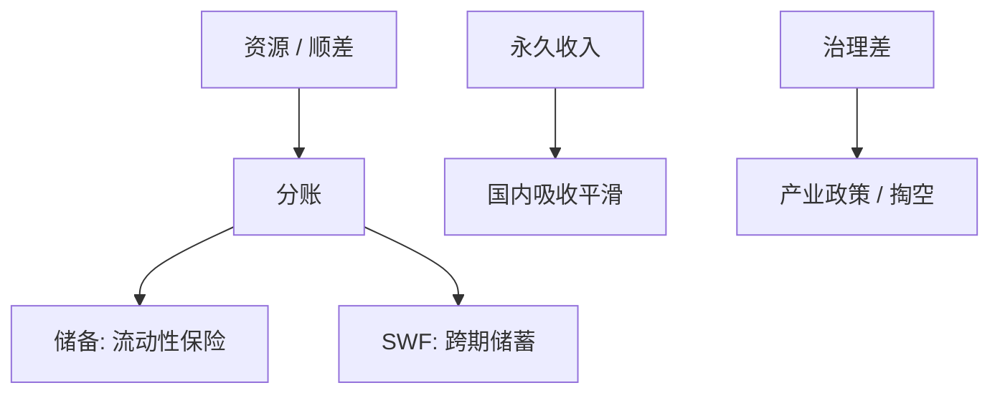

# 主权财富基金

把不可再生收入或外汇顺差从短期储备换成跨期资产组合，是官方的永久收入；治理与稳定目标决定它是储蓄还是另一只干预的手。

<footer>—— 据 Truman 主权财富基金记分；Aizenman 储备与 SWF；对照永久收入与资源诅咒讨论</footer>

[上一课](/econ/capital-controls)写资本流的闸。本课换官方资产：主权财富基金（SWF）。欧元区危机下一课换一种货币下的主权债。本课钉 SWF 与储备的分工，接到[永久收入](/econ/permanent-income)与全球失衡，不写某只基金的持仓清单。

## 问题

储备：流动性、干预、自我保险，资产短、安全、美元。SWF：来自资源租金或持续顺差，目标是跨代平滑、或降低持有储备的准财政成本。永久收入：资源是财富一次总付，应把大部分投资到海外金融，国内吸收平滑——否则 $G$ 与实际汇率荷兰病。缺口不是再讲怕浮动，而是：同一官方外汇，保险库存与储蓄组合要分账，否则干预会掏空储蓄，或储蓄目标会绑死汇率政策。

Santiago 原则是治理自愿准则。透明度、与央行分家、国内产业政策禁区，决定 SWF 是宏观工具还是政治钱包。Truman 记分卡量的是这个，不是 α。

## 方法

分账：央行储备 vs 财政部 / 独立 SWF。负债侧：无明确负债（资源）vs 有 implicit 养老金。资产侧：从国债向股票、公司债、另类——风险与政治敏感上升（投资审查）。与失衡：石油与东亚 SWF 是上流的官方腿之一，比干预储备期限更长。计量不在本课估 SWF 对东道国股价的平均效应。

与 Lucas：官方可以买富国资产（上流），私人 $MPK$ 仍可不南流。SWF 不解决穷国制度，只是资源国自己的组合。

## 机制

机制是跨期与代理。资源价格冲击若全部进国内 $G$，实际汇率升、可贸易部门伤（荷兰病）。SWF 把冲击拦在海外资产，国内按永久收入花。代理：若 SWF 被用来补贴国内关联企业，平滑失败，且变成隐性产业政策，贸易课的补贴逻辑进来。稳定基金（短）与储蓄基金（长）应不同久期；混用会在油价跌时被迫在底卖出——与私人基金的赎回螺旋同构，对象是政治。

干预：部分国家让 SWF 兼做汇率，分账失败，储蓄变成怕浮动的弹药。本课主张分家，不是经验上总是分家。

挪威政府养老基金是教科书分家与规则。许多资源国的基金更接近财政余账。不要用一只基金的治理外推全部。

## 边界

本课不评估某笔港口投资的安全含义。不写东道国 CFIUS 的法律条文。欧债下一课是没有独立货币的主权，与 SWF 的债权国视角不同。不要把 SWF 写成「国家资本主义必然有效」或必然无效；治理是变量。量化栏的主权债定价不在此重做。

后课默认：SWF 是官方永久收入与顺差的久期转换，应与干预储备分账。治理决定平滑还是政治钱包。上流的长期官方腿在此。欧元区危机下一课。

## 小结

- 储备是保险流动性；SWF 是跨期储蓄。应分账。
- 资源国按永久收入把租金投资海外，减轻荷兰病。
- 治理失败把 SWF 变成产业政策或干预弹药。
- 官方上流可以与私人 Lucas 缺失并存。
- 出处：Truman；Aizenman；永久收入 / 资源诅咒传统；Santiago 原则。
