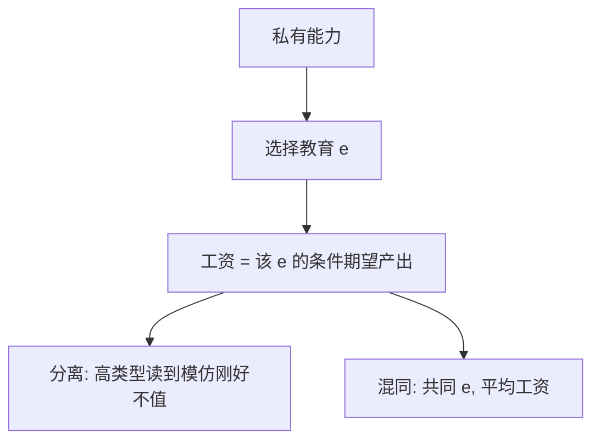

# Spence 市场信号原文

教育不必提高生产率；只要信号对高能力更便宜，雇主就可以用它把类型分开。

<footer>—— Spence, Job Market Signaling, Quarterly Journal of Economics 1973</footer>

附录对照。主干[信号发送](/econ/spence-signaling)已取分离均衡与单交叉。本篇对照 **Spence 1973 原文**：劳动力市场里的教育作为信号，信息均衡（informational equilibrium）的定义，以及过度教育作为均衡现象。不把[柠檬](/econ/akerlof-1970)的供需螺旋再写一遍——Akerlof 是质量不可验证且无行动；Spence 给了类型一个有成本的可观察行动。

## 问题

雇主在雇佣时看不见生产率，只看得见教育年数一类指标。若教育不进入生产函数，古典理论会说它是浪费。Spence 的缺口是：浪费也可以是信息。高生产率工人获得同样教育的成本更低（时间、痛苦、补考），于是存在一套工资–教育日程，使高类型愿意读到雇主能认出他们、低类型不愿意模仿。市场可以在分离处站住，即使教育的社会边际产品为零。

原文用「信息均衡」而不是后来的完美贝叶斯：信念与选择一致，工资等于该教育水平下的条件期望生产率。多重均衡被明确写出——不同的教育门槛都可以自洽，福利可以比无信号时更差。

单交叉（Spence–Mirrlees）在原文里以「成本对能力递减」出现，尚未成为机制设计的标准术语。信号是发送者先行动；筛选是接收者设计菜单，下一篇 Rothschild–Stiglitz。

## 方法

两类工人，生产率 $1$ 与 $2$，教育成本 $c(e,\theta)$，$\theta$ 高则成本低。雇主给出工资函数 $w(e)$。工人选 $e$ 最大化 $w(e)-c(e,\theta)$。均衡要求：$w(e)$ 等于选择该 $e$ 的工人的平均生产率；若某 $e$ 无人选，信念仍需指定。分离均衡里两类选不同 $e$，工资等于各自生产率；混同均衡里两类选同一 $e$，工资等于先验平均。

原文强调教育可以完全是信号。后文的人力资本理论把教育同时写成生产与信号；1973 年论文为了钉机制，先把生产效应关掉。

## 机制

机制是差别成本使模仿有代价。工资日程必须陡到让低类型在「装作高类型」上无利可图，又不能陡到让高类型也不愿分离。Akerlof 的价格是一维的，只能反映平均质量；Spence 的 $w(e)$ 是函数，维度够用来分离。代价是可能的过度投资：社会不需要那么多 $e$，私人却需要它当门票。这与福利定理的对照是：信息均衡可以存在且帕累托劣于无信号的混同——竞争不再自动有效。

## 边界

不要把 1973 写成已经精炼掉混同。Riley、Cho–Kreps 的直觉标准是后十年的工作；主干完美贝叶斯课才处理。也不要把文凭立法或义务教育当成原文的政策结论——原文是存在性与福利含混。经验上教育当然有生产效应；附录对照的是「即使没有，信号仍可撑起市场」。

下一篇对照保险公司作为筛选者：接收者出合同菜单，而不是发送者先选教育。

## 小结

- 附录对照 Spence 1973：有成本信号可分离类型，即使信号无社会产品。
- 信息均衡允许多重，分离可以过度教育。
- 发送者先行动；筛选留给下一篇。
- 出处：Spence, *QJE* 1973。
