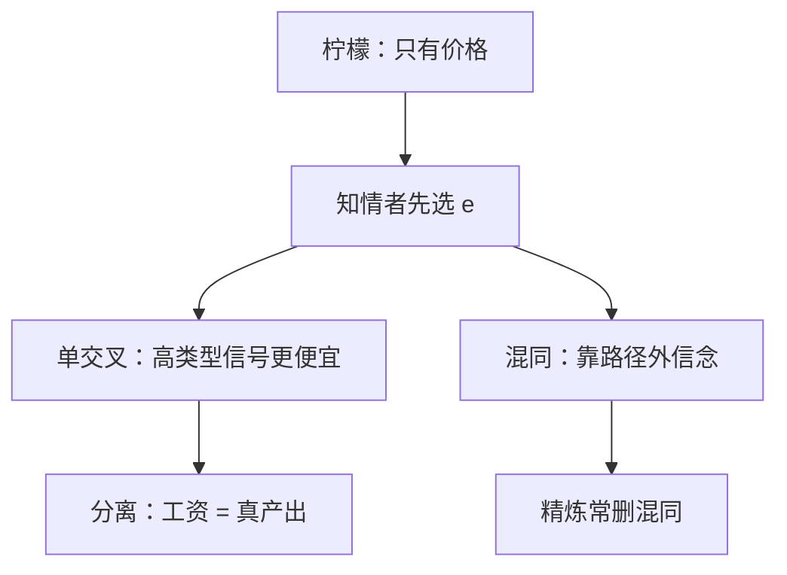

# 信号发送

若发信号的成本对高生产率者更低，教育可以在均衡中分离类型，即使教育本身不提高产出。

<footer>—— Spence, Job Market Signaling, QJE, 1973</footer>

[上一课](/econ/akerlof-lemons)里买方只看见价格，好车无法把自己摘出来。缺口是知情者先动：选一个有成本的可观察行动，让接收者的[信念](/econ/perfect-bayesian)在路径上退化到真类型。Spence 把行动读成教育年限，类型读成生产率。本课钉分离的单交叉与混同的脆弱，不把菜单设计写成筛选。

## 问题

类型 $\theta\in\{H,L\}$，信号 $e\ge 0$，成本 $c(e,\theta)$，且 $c_e(e,L)>c_e(e,H)$（单交叉 / Spence–Mirrlees）。接收者看见 $e$，付工资等于该后验下的期望产出。分离均衡：$\theta$ 选不同的 $e$，工资等于真产出。低类型模仿高类型的代价，必须大于工资差；高类型宁可付自己的信号成本，也不愿被当成低类型。

关键：教育可以完全是浪费的社会成本，只要成本差能排序类型。分离把柠檬里被切断的互利交易救回来，代价是烧信号。混同：大家都选同一 $e$，工资等于平均产出；要挡住高类型用别的 $e$ 跳出去，路径外信念往往得把偏离判给低类型——这正是 PBE 过松之处。

### 信号不是筛选

信号是知情者先动、自选成本。筛选是不知情者先出合同菜单，让类型自己对号。时序决定信息租金归谁、有没有浪费的信号。下一课换时序。

工资等于期望产出，来自买方竞争。若买方有市场力，工资低于产出，分离条件改写，但单交叉仍是分离的引擎。Riley 反应均衡、直觉标准通常删掉「浪费最多」的混同，留下最小成本分离。

## 方法

对象：两类型、连续信号、竞争性接收者。先写分离：低类型选其完全信息最优（常是 $e=0$），高类型选使低类型无差异的最低 $e^*$。再写混同：共同 $e$，检查高类型是否想偏离到能被当成高类型的 $e'$；若路径外把 $e'$ 判给低类型，混同可被撑住。用直觉标准：低类型更不想发 $e'$ 时，不应把 $e'$ 判给他，混同垮。

## 机制

单交叉让无差异曲线只交一次，高类型能用「多一点 $e$」换「被当成高」而低类型觉得不划算。这是激励相容的几何，不是教育生产函数。社会看，$e$ 的资源耗尽可以是纯耗散；私人看，它买到了正确的信念。

与柠檬对比：好车若能烧一笔对柠檬更痛的鉴定费，就能分离。若鉴定费对两类一样痛，单交叉失败，信号帮不上，市场仍可能萎缩。

## 边界

多于两类型，分离的 $e(\theta)$ 由微分方程钉住，仍靠单交叉。信号若同时提高产出（人力资本），分离与生产纠缠，实证难分。多个接收者、逆向选择加信号，均衡可以不存在（Rothschild–Stiglitz 在保险筛选侧更突出）。廉价空谈（cheap talk）成本为零，单交叉谈不上，要另用 Crawford–Sobel，不在本课。

后课默认：知情者先动、有成本信号、单交叉，则最小成本分离是基准 PBE；混同依赖怪信念。不知情者先动则换成筛选与信息租金。

## 小结

- 知情者先动，用成本差分离类型；教育可以不提高产出。
- 单交叉是分离的关键条件。
- 混同比分离更依赖路径外信念，精炼常留下最小成本分离。
- 时序一换，问题变成筛选。
- 出处：Spence, *QJE* 1973。
