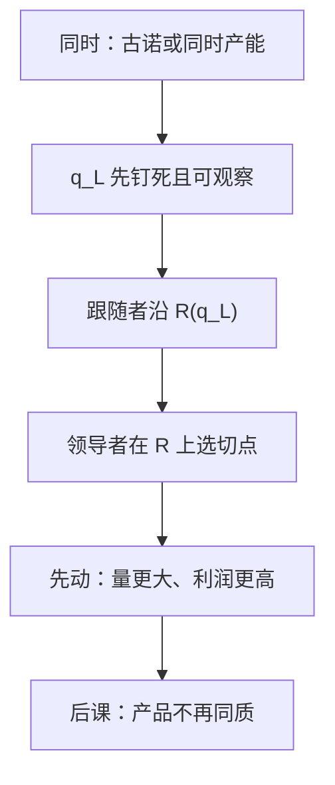

# 斯塔克尔伯格与领导者

若一家能在对方之前把产量写进可观察的承诺，它会把跟随者的反应函数当作约束，而不是当作同时的猜测。

<footer>—— 据 von Stackelberg, Marktform und Gleichgewicht, 1934 整理</footer>

[上一课](/econ/collusion-cartel)（合谋与卡特尔）。表明：同时选价格可以落到 MC，同时选产能可以回到古诺。本课不重讲配给规则。缺口是：两阶段里产能仍是**同时**选的。若一家能先把数量（或产能）钉死、并让对方看见，跟随者的问题变成古诺里的单侧反应，领导者在反应曲线上选最利点。同时均衡与先动均衡不是同一个点。

## 问题

跟随者 $F$ 在看见 $q_L$ 之后解 $\max_{q_F} P(q_L+q_F)q_F-c_F(q_F)$，得到 $q_F=R(q_L)$——这正是[古诺](/econ/cournot-oligopoly)的一条反应函数，但现在它是真实的后手，不是互相猜测。领导者解

$$
\max_{q_L}\, P\bigl(q_L+R(q_L)\bigr)q_L-c_L(q_L).
$$

一阶条件多出一项 $P'\cdot R'(q_L)\cdot q_L$：领导者内化「我多产一单位，对方会减产」。通常 $R'<0$，这一项为正，领导者比古诺产得更多，跟随者更少，总产量更高、价格更低，领导者利润高于古诺，跟随者低于古诺。缺口不是再画一次 MR，而是：**可观察的先动把反应从猜测变成约束**。

承诺必须不可撤销。口头「我会产很多」若能在对方行动前改口，博弈缩回同时选择。产能、合同、沉没投资是承诺的物质形式，上一课序的沉没在这里变成策略工具。

### 先动优势不是先喊价优势

数量上的领导常常有利。价格上的领导在同质产品里往往不利：先贴出的价被后手底切，回到伯川德逻辑。故「领导者」必须声明策略变量。本课钉产量（产能）领导，与古诺、与 Kreps–Scheinkman 的同时产能对照。不要把零售里的「价格领导」未经翻译写成斯塔克尔伯格。

逆向归纳：先写跟随者的最优，再代回领导者。这与后课子博弈完美是同一算法，本课只在双寡头产量上用一次，不展开扩展式的一般定义。

## 方法

几何：在跟随者的反应曲线上，找领导者等利润线的切点。切点一般不在古诺交点——古诺交点是两条反应曲线的交，领导者并不站在自己那条同时反应上，因为他不把对方的产量当给定，而把对方的**规则**当给定。比较静态：领导者成本下降，自己产量升得比古诺更猛，因为还要多挤占跟随者。

若两家都能抢先，会出现「谁当领导」的元博弈；双方都想当数量领导时，可能过度扩张。本课把领导身份当给定，以免滑进同时选时机的复杂均衡。

线性常 MC 教具上，领导者产量等于垄断产量，但市场总量大于垄断、也大于古诺，价格介于二者之间。追随者利润低于古诺。没有可观察、不可逆的承诺，先走没有用，退回同时行动。

产品仍同质。差异化之后，反应函数的斜率会变，先动的符号也可能变；那是下一课。

## 机制

内化反应的机制是链式法则：领导者的边际收入比古诺多出「对方让出的数量」。策略替代（$R'<0$）时，多产是进攻，把跟随者挤到更陡的剩余需求上。若策略互补，先动逻辑会翻转——差异产品价格竞争里常见，本课不同质数量下通常遇不到。

承诺的机制是沉没：先建的工厂改变后手面对的剩余需求，后手再优化时已经晚了。没有沉没、没有合同、没有公开的产能，斯塔克尔伯格点不可实施，观测上应回到古诺或伯川德。故本课与[短长期](/econ/sunk-cost)是同一把刀：沉没从「不影响本期歇业」变成「能改别人的反应」。

von Stackelberg 1934 的原书用德文讨论市场形式。现代教科书的反应曲线图是后人对数量领导的标准写法。不要把这篇写成 1980 年代的产业组织综述。

## 边界

信息不完全时，先动可能变成信号而不是单纯承诺，那是信号课。多跟随者、连续时间抢先，会改先动优势的分配。卡特尔里指定一家领导，是合谋安排，不是本课的非合作先动。

也不要把限价簿上的先行委托单写成斯塔克尔伯格：时间优先是微观结构，对手不必沿一条光滑 $R(q)$ 反应。

后课默认：可观察的产量承诺给出斯塔克尔伯格点；同时选择仍读古诺。下一课撤掉同质，让位置本身成为策略。

## 小结

- 跟随者走古诺反应；领导者在这条约束上选产量，内化 $R'$。
- 数量领导通常产得更多、利润更高；承诺必须不可撤销。
- 价格领导与数量领导符号可以相反，必须声明策略变量。
- 下一课用线性城市把产品差异做成位置与价格。
- 出处：von Stackelberg, *Marktform und Gleichgewicht*, 1934；Cournot, 1838；Mas-Colell, Whinston and Green 第 12 章。
