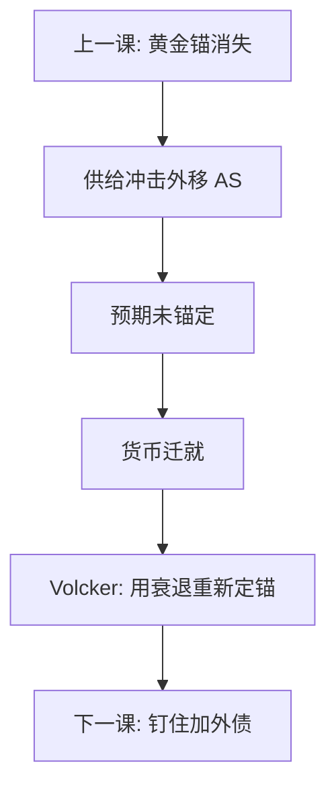

# 1970 年代滞胀

供给冲击把菲利普斯曲线外移；适应性或弱锚定的预期把一次价格跳变写成持续通胀；货币政策若稳定失业而迁就，通胀就停不下来。滞胀是这三层叠在一起，不是「曲线失效」四个字。

<footer>—— Gordon 的供给冲击与菲利普斯曲线；Lucas, Econometric Policy Evaluation: A Critique, 1976；Volcker 紧缩的经验对照；Blinder 对大通胀的叙述</footer>

[上一课](/econ/bretton-woods-collapse)把定锚从黄金换成浮动后的国内政策。本课缺口是 1970 年代：高通胀与高失业并存。石油与粮食是供给冲击；工会与工资指数化是传播；美联储在 Burns 时期把失业目标放在通胀前面，是迁就。Lucas 批判警告：把 1960 年代的曲线当结构去「买」更低失业，预期一变曲线就移。后课东亚危机换到钉住与短期外债，不再堆石油年表。

## 问题

需求拉动下，通胀与失业短期替代。供给冲击：$P$ 升、$Y$ 降，替代消失。若预期把核心通胀抬高，名义冲击过后仍要更高的通胀才能维持原失业。缺口不是再画一次曲线，而是：**冲击可以是暂时的，定锚失败使它变成十年。** 财政赤字与商品税不是本课主角，但赤字货币化会加强迁就。浮动汇率让各国选择不同的 $M$：西德更早稳定，美国更晚——截面又一次当证据，类似金本位脱离时点。

### 滞胀不是菲利普斯曲线「失效」

曲线在给定预期下仍可以有短期斜率；失效的是把这条斜率当可永久开采的结构。Lucas 1976 正是对着这种政策评价。供给冲击解释「为何同时坏」；预期与政策规则解释「为何持续」。只骂曲线，会漏掉 Volcker 用衰退把预期拧回来的那一截——那是代价，也是机制证据。

Blinder 把大通胀写成政策错误加冲击，而不是神秘的制度命运。Volcker 紧缩证明：再通胀预期可以被高利率打破，代价是深度衰退。

## 方法

三层。(1) 供给：石油、生产率减速，AS 内移。(2) 预期：适应性或弱锚定，工资物价螺旋。(3) 规则：利率对通胀反应不足（泰勒原则的反面），失业优先。对照：金本位下是通缩枷锁；布雷顿崩溃后是通胀枷锁缺失。政策实验是 Volcker：提高 $i$，失业升，通胀随后降——与「冲击永远主导」不相容。后课央行独立性把这次实验收成制度。同一供给冲击下，名义锚更硬的经济核心通胀爬升更慢——截面再一次当证据，类似脱离金本位的时点。

不要用滞胀否定所有短期乘数：状态是高通胀弱锚，不是流动性陷阱。两套宏观状态，乘数课已经分开。工资指数化把相对价格冲击写成自动的第二轮；若指数化覆盖面广，一次性石油涨价会变成核心通胀，央行再迁就就进入螺旋。这是制度传播，不是石油桶数本身。锚比冲击更决定持续期，而不是桶数。

## 机制

机制是定锚缺失下的供给冲击放大。相对价格应当一次调整；工资指数化与迁就的 $M$ 把相对价格变成总价格水平的持续上升。浮动使各国 $M$ 可分，于是「谁更早接受失业换锚」成为截面。与金本位对照：那里政策不能再通胀；这里政策可以，却选了再通胀。约束从金属换成了政治。Lucas 批判是同一机制的计量表达：简化式含旧规则。

石油以美元计价，美元在布雷顿崩溃后贬值，冲击幅度含汇率——时序接头，不是「都是石油的错」的单一因果。财政若用扭曲税或管制价格去「遮」相对价格，短缺与黑市会把官方指数压住、把真实 $P$ 推得更乱，计量上的菲利普斯更脏。本课要的是定锚，不是价格管制史。

Gordon 把菲利普斯曲线写成惯性加供给因素加需求缺口。本课用它当组织，不把某一国回归系数当普适常数。

## 边界

本课不写能源交易，不把每次欧佩克会议编年。资本税与供给学派口号不是机制核心。下一课：新兴市场的钉住加原罪，失败形态从通胀螺旋换成突然停止。后课默认：滞胀用供给冲击 × 弱锚 × 迁就来读；Volcker 是重新定锚的代价证据。不要只说「曲线死了」。工资–物价管制若短暂压住指数，预期仍可在黑市与合同指数化里存活，解除管制后通胀会跳回来——那是锚没钉住的另一条证据。

## 小结

- 供给冲击造成通胀与失业同时坏；弱锚使它持续。
- 菲利普斯短期斜率不是可永久开采的结构。
- 浮动后各国定锚分化；Volcker 用衰退拧回预期。
- 与金本位通缩枷锁对照：这里是通胀枷锁缺失。
- 指数化与迁会使一次相对价格冲击变成核心通胀螺旋。
- 出处：Gordon；Lucas 1976；Blinder；Volcker 时期经验。
