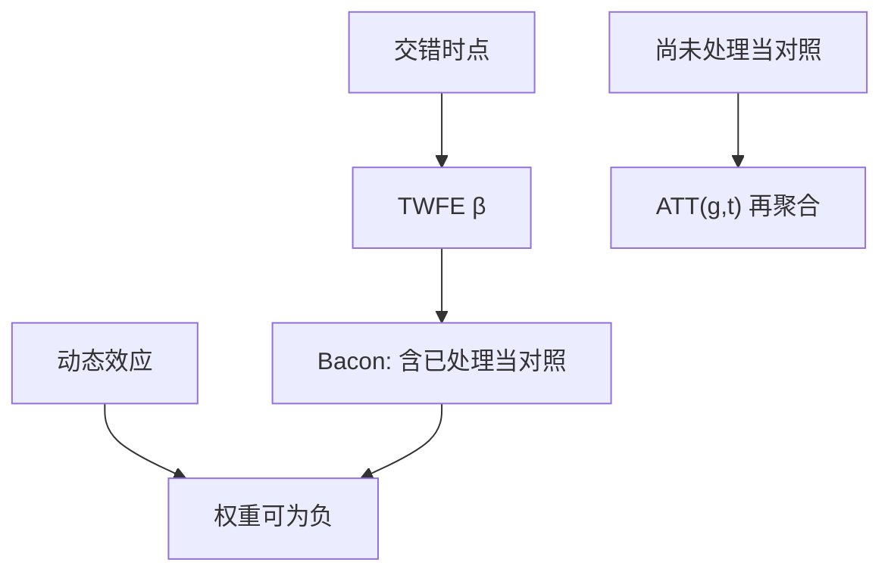

# 交错 DiD

处理时点参差不齐时，双向固定效应把已经处理的组拿来当对照；效应随时间变，则权重可以为负，点估计不再是 ATT 的凸组合。

<footer>—— Goodman-Bacon, Difference-in-Differences with Variation in Treatment Timing, J. Econometrics 2021；Sun and Abraham, Econometrica 2021；Callaway and Sant'Anna, J. Econometrics 2021</footer>

[上一课](/econ/difference-in-differences)在两期两组把 DiD 写成平行趋势下的 ATT。本课缺口是采纳时点交错：TWFE 估的不再自动是「所有 $2\times2$ 的平均」。断点回归下一课换截面设计，不再拆时间加权。

## 问题

多个组在不同期进入处理，之后通常不退出。TWFE $Y_{it}=\alpha_i+\lambda_t+\beta D_{it}+u_{it}$ 仍可跑。Goodman-Bacon 分解：$\hat\beta$ 是所有两期两组 DiD 的加权平均，权重由组规模与处理时点的方差决定。其中一类对照是「后来处理的 vs 已经处理的」。若处理效应随时间加强（动态 ATT），已经处理的组的 $Y(1)$ 还在变，拿它当 $Y(0)$ 的代理会把效应减掉甚至翻号。缺口是：看见 TWFE 的 $\beta$ 接近零，可能是负权重，不是没有效应。

Borusyak、Jaravel 与 Spiess；de Chaisemartin 与 D'Haultfœuille 给出另一套诊断：有多少权重为负、这些权重乘在哪些组上。诊断先于「换一个估计量」。

## 方法

先报告 Bacon 分解或负权重份额。再换目标：组–时平均处理效应 $\mathrm{ATT}(g,t)$，只用不曾处理或尚未处理的组当对照。Callaway–Sant'Anna、Sun–Abraham 的 cohort 事件研究、Borusyak 的 imputation（先在未处理格点估 $\alpha_i+\lambda_t$ 再外推）都是这一原则的算法。不要用「加组趋势」假装已经解决交错：组线性趋势吸收的是另一类偏离，不是负权重。

平行趋势仍要，只是对照集必须干净。已处理当对照等于假设处理效应在对照窗口里为常数——与动态效应冲突。

## 机制

机制是加权。两期两组只有一套差中差。交错产生许多套，TWFE 用残差化 $D_{it}$ 的方差当权重，不保证正。负权重不是软件 bug，是线性投影的代数。换成 $\mathrm{ATT}(g,t)$ 是换参数：先定义要平均哪些组、哪些时点（政策相关的目标），再估计，而不是让软件挑一组符号不定的权重。

与[潜在结果](/econ/potential-outcomes)：交错下 SUTVA 仍在；另外要「无预期」（处理前 $D$ 的信息不应已改变 $Y(0)$）。预期会把效应提前到事件研究的负期，看起来像预趋势失败。

Sun–Abraham：交互的组–时虚变量再按样本份额加权，避免把后期组的动态和早期组的动态搅在同一条事件研究系数里。

## 边界

本课不宣称某一种新估计量在所有设计下最优。不把 2021 年后的每一篇稳健 DiD 写成清单。连续处理、退出处理、多值剂量，代数更脏，本课只标。下一课 RDD 回到截面资格变量，不依赖平行趋势。

后课默认：交错采纳禁止默默报告 TWFE 当 ATT；先分解权重，再报告基于干净对照的 $\mathrm{ATT}(g,t)$。两期两组上一课仍然成立。

## 小结

- TWFE 在交错下是 $2\times2$ 的加权，可含已处理对照。
- 动态效应 + 负权重 ⇒ 点估计可远离任何凸 ATT。
- 目标改成 $\mathrm{ATT}(g,t)$，对照只用尚未处理。
- 无预期是额外假设；提前反应像假预趋势。
- 出处：Goodman-Bacon 2021；Sun and Abraham 2021；Callaway and Sant'Anna 2021；de Chaisemartin and D'Haultfœuille。
