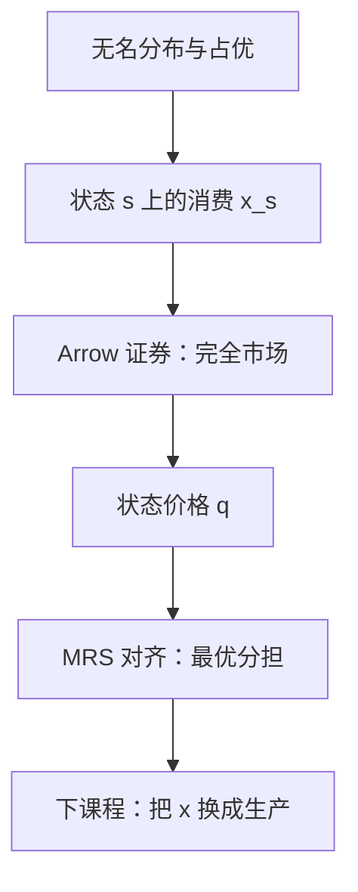

# 状态依存与或有要求权

最优风险分担不要求再发明一种商品：只要每个状态有一张只在该状态支付的证券，竞争价格就能完成配置。

<footer>—— 据 Arrow, The Role of Securities in the Optimal Allocation of Risk-Bearing, Review of Economic Studies, 1964（1953 年法文稿）整理</footer>

上一课[随机占优](/econ/stochastic-dominance)在无名财富的分布上给偏序。本课不重讲 FSD/SSD，也不再估 $r_A$。缺口是：轮盘彩票把结果当成可交换的数字，市场里的风险却绑在有名字的状态上——下雨、违约、衰退。没有状态，就没有可交易的或有要求权，后课一般均衡也无法把不确定性写进商品空间。

## 问题

[期望效用](/econ/expected-utility)的对象是 $\Delta(X)$：同一财富数字在任何实现里可互换。若状态 $s\in S$ 有经济含义，消费是向量 $x=(x_s)_{s\in S}$，偏好是

$$
U(x)=\sum_{s\in S}\pi_s u(x_s),
$$

概率 $\pi$ 仍客观，但 $x_s$ 不能再被重排。占优只看见 $x$ 诱导的分布，看不见「哪一个 $s$ 穷」。缺口是把商品重新定义为**状态依存消费**，并把最简单的资产定为 Arrow 证券：状态 $s$ 的证券在 $s$ 支付一单位计价物、其余状态支付零。

完全市场：Arrow 证券张成整个 $\mathbb{R}^S$，任何或有束都可以当一篮子买到。预算变成 $\sum_s q_s x_s=w$，其中 $q_s$ 是状态价格。不完全市场是后课宏观与公司金融的缺口；本课只钉完全这一端。

### 彩票与或有商品不是同一菜单

把状态上的 $x$ 推成财富的分布，再拿 SSD 排序，会丢掉状态之间的价格信息。两份分布相同的或有束，在 $q$ 不与 $\pi$ 成比例时，预算成本可以不同。占优仍用于「同一预算下哪份分布更好」；配置问题要用 $q$。不要把上一课的积分条件直接写成资产需求。

主观概率是 Savage；本课 $\pi$ 给定。状态价格 $q_s$ 不必等于 $\pi_s$：风险厌恶者让倒霉状态更贵。后课随机折现因子把 $q_s/\pi_s$ 叫状态价格密度，这里只需要比值存在。

## 方法

有限状态、有限个人。每人禀赋 $\omega=(\omega_s)$，在完全的 Arrow 市场上选 $x$，使 $\mathbb{E}u(x)$ 最大。一阶条件是 $\pi_s u'(x_s)=\lambda q_s$。两人之间，最优风险分担要求状态间的 MRS 对齐：

$$
\frac{\pi_s u_A'(x_s^A)}{\pi_t u_A'(x_t^A)}=\frac{\pi_s u_B'(x_s^B)}{\pi_t u_B'(x_t^B)}=\frac{q_s}{q_t}.
$$

若两人同权并都是凹 $u$，则更倒霉的状态里两人一起少消费，而不是把全部风险推给一个人。这与[风险厌恶](/econ/risk-aversion)的公平保险全额投保是同一线性期望结构，只是状态有了名字。

本课不引入生产。或有商品可以后补进生产集，但技术和成本是下一课程的对象。也不把 Arrow 证券写成限价簿上的合约清单。

## 机制

独立性把跨状态的权衡收成逐点的 $u'(x_s)$，概率当权重；市场把同一权衡标成 $q_s$。二者相除，得到「一单位概率在状态 $s$ 值多少」。风险厌恶（凹）让 $u'$ 在穷状态更高，故穷状态的 $q_s/\pi_s$ 更高——这就是风险溢价在完全市场上的微观来源。没有状态名字，溢价只能停留在分布的 SSD 上，不能写成可交易的价差。

完全性的机制是张成：任何再分配都等价于 Arrow 篮子的组合。缺一张证券，就有一个不能对冲的方向，分担条件只在可张成的子空间上成立。本课标明这个刀刃，但不展开不完全市场的一般理论。

Debreu《价值理论》把商品写成（物理、时间、地点、事件）。Arrow 的贡献是：不必为每个或有商品开一个现货市场，一组证券即可。后课福利定理默认的是这一商品空间。

## 边界

$S$ 有限、$\pi$ 客观、市场完全，是本课的工作假设。连续状态要用测度；模糊与阿莱对照仍在课序前段，这里不把问卷搬进 Arrow 价格。也不处理道德风险下「状态不可验证」——那是信息课的隐藏行动，不是或有商品缺定义。

不确定课序在此结束。下一课程换对象：决策者不再只是带着禀赋买或有束的消费者，而是把投入变成产出的技术。不要把生产函数写成状态上的 $u$。

道德风险会让某些或有合同写不成，那是信息课。连续状态需要测度与无限证券，主干用有限 $S$。量化栏的成交机制不是状态指标：本课定义契约按状态交付，不定义谁先报价。

后课默认：不确定性下的商品是状态依存的；完全市场用状态价格 $q$ 配置风险。

## 小结

- 状态给结果起名字；Arrow 证券把或有消费变成可交易篮子。
- 完全市场上最优分担即状态间 MRS 等于状态价格比。
- 占优比较无名分布；配置要用 $q$，二者不要焊死。
- 不确定课序到此；下一课打开技术与成本。
- 出处：Arrow, *Review of Economic Studies*, 1964；Debreu, *Theory of Value*, 1959；Mas-Colell, Whinston and Green 第 6 章。
