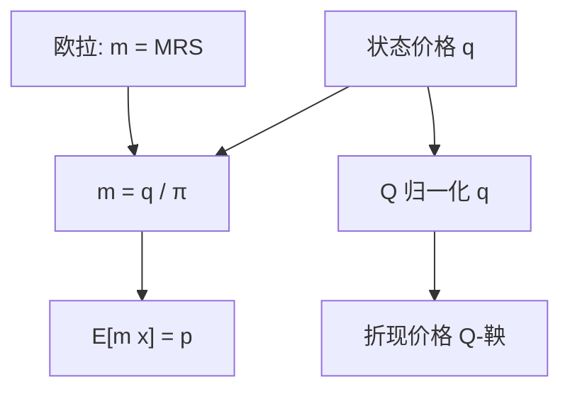

# 状态价格到 SDF

Arrow 价格除以概率就是一期随机折现因子；密度过程就是多期的 $m$。两套语言指同一线性泛函。

<footer>—— 据 Arrow 1964；Harrison–Kreps 1979；Hansen and Richard, Econometrica 1987</footer>

[上一课](/econ/harrison-kreps-martingale)把 FTAP 写成鞅。主干里 [状态价格](/econ/state-prices) 与 [SDF](/econ/stochastic-discount-factor) 已经分别出现。本课缺口是**一座桥**：后文 Lucas 树要用 $u'(c)$ 同时说出 $q$、$m$ 与 $\mathbb{Q}$，不允许三套符号各讲各的。不重推存在性，不校准消费。

## 问题

有限状态：Arrow 价格 $q_s$，物理概率 $\pi_s$，一期 SDF $m_s=q_s/\pi_s$（差计价因子）。于是 $p=\sum q_s x_s=\mathrm{E}[m x]$。风险中性概率 $\mathbb{Q}(s)\propto q_s$，$p=B^{-1}\mathrm{E}^{\mathbb{Q}}[x]$。三行是同一内积。多期：状态价格变成过程，$m_{t,t+k}$ 是从 $t$ 到 $t+k$ 的随机折现，$Z_t$ 是 $\mathrm{d}\mathbb{Q}/\mathrm{d}\mathbb{P}$ 的密度，$m$ 把 $Z$ 的增量与利率折现绑在一起。Hansen–Richard 强调条件信息：所有等式在 $\mathrm{E}[\,\cdot\mid\mathcal{F}_t]$ 上成立，投影随信息变，会计不变。

缺口是强迫后课只用一套会计。信息课序的部分揭示，说的是 $\mathcal{F}_t$ 里有没有别人的信号；SDF 课序的条件期望，说的是给定已经写入价格的信息如何定价。桥在「信息集」上相切，对象仍不同。

完全市场：$q$ 唯一，$m$ 唯一，$\mathbb{Q}$ 唯一。不完全：三者都是集合，但集合一一对应——选一个 $q\gg 0$ 即选一个 $m>0$ 即选一个 EMM。

## 方法

写翻译表，不再推导。计价：若 $B$ 是无风险账户，$q$ 已含时间折现，$m$ 的期望 $\mathrm{E}[m]=1/R^f$。欧拉：均衡再加 $m=\beta u'(c_{t+1})/u'(c_t)$，这是从可行集对偶走进偏好。FTAP 不要求这一步；Lucas 树要求。CAPM 是再加「$m$ 对市场回报线性」，见 [CAPM 作为均衡](/econ/capm-theory)，本课不加。

与接口课对照：买卖价差意味着没有单一 $p$，翻译表对 ask 与 bid 各写一行，或对中间价写近似。桥不消灭价差，只在无摩擦处把符号焊死。

## 机制

机制是同一对偶变量的三种坐标。商品语言（Arrow）便于一般均衡与福利；概率语言（$\mathbb{Q}$）便于复制与对冲计算；随机折现（$m$）便于接到欧拉与 Hansen–Jagannathan 界。换坐标不改「线性定价」。风险溢价永远是与 $m$ 的协方差，也永远是 $\mathbb{P}$ 与 $\mathbb{Q}$ 的倾斜——同一句话。

信息：若价格部分揭示，$\mathcal{F}_t$ 小于知情者的域流，$m$ 对 $\mathcal{F}_t$ 可测时定价的是「价格已经知道的」，知情租金是对更大域流的优势，不是 $m$ 不存在。GS 与 FTAP 不互否。

连续状态用密度对 Lebesgue；若 $q$ 对 $\pi$ 奇异，SDF 没有普通随机变量表示，要用状态价格测度本身。教室里假定绝对连续。

## 边界

不要在桥上塞进股权溢价之谜：那是 $m=\beta(c_{t+1}/c_t)^{-\gamma}$ 这一特化失败，不是翻译失败。下一课 Lucas 树给出特化的一般均衡来源——禀赋经济里 $c$ 等于股利流的总量。本课只保证：树一旦给出 $u'(c)$，我们就知道怎么把它读成 $q$ 与 $\mathbb{Q}$。

后课默认：$q$、$m$、$\mathbb{Q}$ 一一对应（完全则唯一）。欧拉是均衡选取，FTAP 是无套利存在。条件信息改变投影，不改变会计。

## 小结

- $m_s=q_s/\pi_s$，$p=\mathrm{E}[m x]=\mathrm{E}^{\mathbb{Q}}[x/B]$。
- 完全则三者唯一；不完全则三个集合对应。
- 欧拉选取其中一个 $m$；FTAP 只保证集合非空。
- 出处：Arrow, 1964；Harrison and Kreps, *JET* 1979；Hansen and Richard, *Econometrica* 1987。
