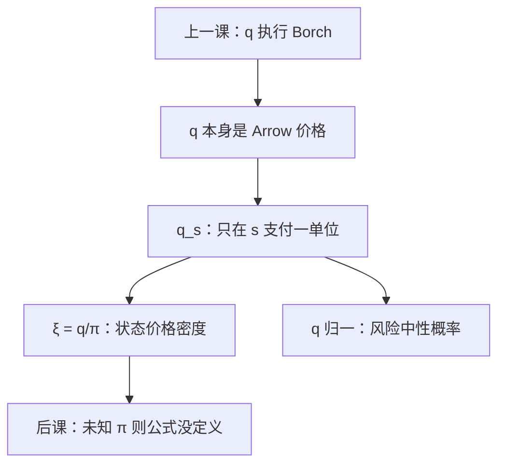

# 状态价格

完全市场上，每个状态一单位计价物都有一个价格。Borch 的边际效用比，就是这些 Arrow 价格的比。

<footer>—— 据 Arrow, The Role of Securities in the Optimal Allocation of Risk-Bearing, Review of Economic Studies, 1964 整理</footer>

[上一课](/econ/risk-sharing)用完全市场上的 $q$ 执行 Borch 规则：$u_A'/u_B'$ 跨状态为常数。本课不重写分担的一阶条件，也不把 Wilson 容忍加总再推一遍。缺口是：$q$ 在分担课里像拉格朗日乘子的比，还没有被当成**商品价格**本身。Arrow 1964 的贡献是：不必发明新商品，只要每个状态有一张只在该状态支付一单位的证券，竞争价格 $\{q_s\}$ 就是风险配置的全部语言。本课把 $q$ 从「用来执行 Borch」收成定价核。

## 问题

张成课已经给出：无套利当且仅当存在 $q\gg 0$ 使证券价格 $p=A^\top q$。完全则 $q$ 在计价物归一后唯一。分担课用过 $q_s/q_t=\pi_s u'(x_s)/\pi_t u'(x_t)$。缺口是把 $q_s$ 命名为状态 $s$ 的 Arrow–Debreu 价格：买一张「只在 $s$ 支付一单位」的证券，今天付 $q_s$。任意或有束 $x$ 的成本是 $q\cdot x$。概率 $\pi$ 仍在偏好里，不在会计里——$q_s$ 不必等于 $\pi_s$。

状态价格密度 $\xi_s=q_s/\pi_s$（差一个计价因子）把「倒霉状态更贵」写成随机折现因子的一期版本。风险中性概率 $q_s/\sum q$ 则把定价收成贴现期望。本课只钉这些记账，不把无限期 SDF 写完。

### $q$ 不是主观概率

若人风险中性且 $\pi$ 共同，$q$ 与 $\pi$ 成比例。凹 $u$ 让总量穷的 $s$ 对应更大的 $\xi_s$。把 $q$ 读成「市场以为的概率」，会把风险厌恶偷运成信念。埃尔斯伯格下一课会撤掉 $\pi$；本课仍假定 $\pi$ 已知，$q$ 是价格。

Arrow 1953 年法文稿、1964 年英译。对象是证券如何完成风险配置，不是再证一次存在性。Debreu 的商品空间已经把状态写进坐标；Arrow 指出有限证券即可。

## 方法

完全市场：列出 $S$ 张 Arrow 证券，或任意 $\mathrm{rank}(A)=S$ 的菜单再反解 $q$。无套利给出 $q$；完全给出唯一。个人一阶条件 $\pi_s u'(x_s)=\lambda q_s$ 把 $q$ 与最优分担焊死——上一课已有，本课只反向读：观测到 $q$，就知道市场在各状态的相对稀缺，不必先猜 $u$。

不完全：存在一整个锥的 $q$ 与 $p=A^\top q$ 相容，未张成方向没有唯一价格。Borch 只在 $\mathrm{span}(A)$ 上被执行。本课主干写完全这一端，与分担课同一刀刃。

本课不估计 $q$。也不把状态价格写成限价簿上的档位：这里没有买卖价差，只有或有商品的竞争点。计价物选定之后 $q$ 才是一向量；换计价物是同乘正数，密度 $\xi$ 的形状不变。

## 机制

为什么一张 Arrow 证券就值 $q_s$：它是或有商品的单位向量。完全性让任意 $x$ 复制为这些单位向量的线性组合，定价线性。总量禀赋 $\omega_s$ 低的状态，所有凹 $u$ 的 $u'(x_s)$ 一起高，$q_s$ 被抬起——这与 SOSD 一致：总量展形改变价格结构，分担改变谁持有哪一张证券。价格与配置是同一均衡的两面。

CARA、CRRA 把 $q$ 与总量的函数形式写死（指数或幂的边际效用），那是形状课的加总，不是 $q$ 的定义。定义先于函数形式。

风险中性测度把 $q$ 改写成概率，贴现若外生则任意或有支付的价格是该测度下的期望。无套利的改写，不是市场上真有一群风险中性的人。

## 边界

连续状态要把 $q$ 换成测度，密度对 Lebesgue 不必存在。多期动态完备用折现过程代替静态向量。本课停在有限 $S$、一期。异质信念会让 $q$ 同时反映投机；主干仍用共同 $\pi$。

模糊一旦撤掉 $\pi$，$\xi=q/\pi$ 没有定义。下一课钉这条边界。也不要把 $q$ 写成微观结构的瞬时报价：状态价格是竞争均衡对象，没有订单簿。

占优课比较的是无名分布；有了 $q$，同一分布的两份或有束可以成本不同——状态有名字。分担课已经用 MRS 对齐等于 $q_s/q_t$；本课补的是：这个比来自证券价格，不是规划者另定的权。Radner 式逐期交易能动态张成时，$q$ 变成过程，本课不写。主干先会用静态向量。

后课默认：完全市场上的 $q$ 是唯一（计价归一）的 Arrow 价格；Borch 用它执行分担；密度 $\xi=q/\pi$ 是一期随机折现因子。不完全则 $q$ 不唯一。

## 小结

- $q_s$ 是状态 $s$ 上单位计价物的 Arrow 价格，不是拉格朗日的别名。
- 完全则 $q$ 唯一；$p=A^\top q$ 给任意证券定价。
- $\xi=q/\pi$ 抬高倒霉状态；风险中性概率是 $q$ 的归一化。
- 下一课：没有 $\pi$，这些比没有定义。
- 出处：Arrow, *Review of Economic Studies*, 1964。
