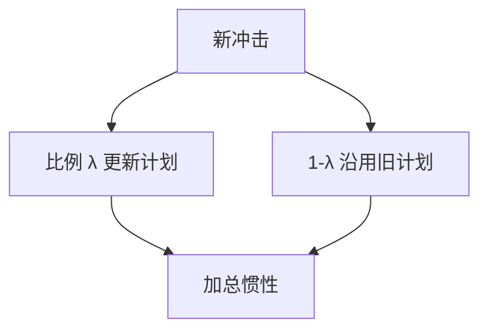

# 粘性信息

不是价格不能动，是计划不是每期都基于最新信息重算；老计划与新信息并存，加总出现惯性。

<footer>—— Mankiw and Reis, Sticky Information versus Sticky Prices, QJE 2002</footer>

[上一课](/econ/adaptive-learning)让人每期用全部公开数据更新系数。本课缺口是**更新频率**：信息粘性。不重写 E-稳定性，不把 Calvo 价格再推一遍——对照的是另一套惯性来源。

## 问题

Calvo 粘性价格：每期只有一部分人改价，但改价者用当前 RE。Mankiw–Reis：价格可灵活，但每期只有比例 $\lambda$ 的人获得新信息并重解计划，其余人沿用旧信息集下的计划。通胀对货币冲击的反应因而缓慢、峰值滞后。缺口是给 NK 惯性一条「信息」通道，而不是再估一个指数化参数。

Mankiw and Reis, *QJE* 117(4), 2002, 1295–1328。Reis 的粘性信息消费。Carroll 的流行病学预期是相关的传播装置。

## 方法

加总通胀是不同 vintage 计划的加权。脉冲：未更新者仍按旧货币路径定价，冲击后通胀慢慢被新 vintage 替换。估计：$\lambda$ 可用调查预期的更新速度或宏观 IRF。与 SW：习惯、指数化、粘性工资是惯性的其它包；粘性信息可部分替代它们，识别上常共线。

企业与家庭都可粘性信息。工资设定粘性信息给出劳动侧惯性。财政：未更新者对减税反应迟，乘数动态与 RANK 不同。

## 机制

机制是交错的信息集，不是交错的不能改的价格。含义：公布一次完全可信的路径，未更新者仍按旧路径行事，沟通的效力被 $\lambda$ 打折——后课预期管理。与学习：学习改的是模型系数；粘性信息改的是谁看见了当前冲击。两者可叠：看见的人还在估错的模型。

最优政策：对未更新者的历史路径依赖，使承诺的价值不同（Reis）。本课不求最优规则。

Woodford 的信息不完全（与 Lucas 岛屿）是另一支：噪声观察而非延迟更新。下一课理性疏忽把延迟变成最优选择。

## 边界

本课不把 $\lambda$ 写成深度学习注意力。理性疏忽、诊断性预期分列后课。微观价格每天可改却加总惯性，粘性信息是候选，不是唯一（还有搜寻、菜单成本异质）。不进限价簿报价频率。

后课默认：惯性可以来自计划更新频率，而不只来自 Calvo。下一课：更新频率本身由注意力成本决定。

## 小结

- 粘性信息：交错更新计划，价格可以灵活。
- 加总惯性与滞后峰值来自 vintage 混合。
- 与学习、Calvo 是不同状态变量。
- 出处：Mankiw and Reis, *QJE* 2002。
