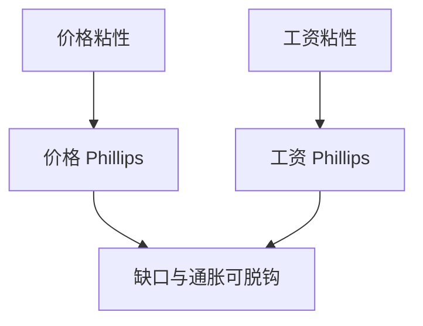

# 粘性工资

名义工资不能随效率立刻改写时，劳动市场的错位与价格错位不再是同一件事；稳通胀不必稳就业。

<footer>—— Taylor 交错工资合同传统；Erceg, Henderson and Levin, JME 2000 把工资粘性写进 NK</footer>

[上一课](/econ/menu-cost)把商品价格的状态依赖微观写开，对照仍是 Calvo/Rotemberg。本课的缺口是换对象：劳动的名义价格可以比货物更粘，或至少同样粘。Taylor 的交错合同与 Erceg–Henderson–Levin（EHL）的工资菲利普斯，使真实工资刚性进入 NK。神圣巧合会因此破裂——那是政策课；本课先钉工资粘性相对价格粘性多出来的那一块。交错合同的日历结构下一课收紧。

## 问题

只有价格 Calvo 时，需求下降 → 边际成本下降 → 能改价的厂商少涨价，真实工资可以立刻调到清劳动市场。若名义工资也被交错钉住，真实工资在需求下降时过高，就业多掉一块，通胀对缺口的映射变。缺口不是再讲菜单成本，而是：工资粘性与价格粘性不是同一条 NKPC。EHL：家庭在垄断竞争劳动市场上交错定工资，得到一条工资通胀方程，与价格 NKPC 并联。

真实工资刚性可以来自名义工资粘性加价格粘性的组合，也可以来自效率工资、公平工资。本课取名义交错这一条，以便接到 Taylor 合同与 NK。

## 方法

价格 NKPC 把 $\pi$ 接到真实边际成本；工资 NKPC 把工资通胀接到工资加成缺口（劳动的边际效用与边际产品）。两条都前瞻。若工资能灵活调，价格粘性下的自然产出仍接近有效（补贴后）；工资也粘时，自然产出与有效产出分开——Blanchard–Galí 后来用来拆神圣巧合。Taylor（1980）用固定期限交错合同，而不是 Calvo 抽签，是下一课；本课先承认「工资也可以粘」。

菜单成本对工资同样适用：改薪有谈判成本，状态依赖。宏观主干仍常用工资 Calvo，理由与价格侧相同——线性可解。本课不估计工资合同长度。

### 不要把粘性工资写成「劳动力卖不掉」的会计

失业可以来自 DMP、效率工资或名义刚性。本课的机制是合同未到期，真实工资错位。把调查 $u$ 全部写成工资 Calvo，会取消匹配课。周期分解必须声明通道。

### 真实刚性可以没有名义合同

效率工资、公平工资给出真实工资不能降到出清。名义交错给出的是名义路径不能跳。二者都能拆神圣巧合，政策含义不同：一个是激励，一个是合同日历。

本课取名义交错，是为了接到 Taylor 与 EHL，不是否认真实刚性。

## 机制

央行加息，需求降。若只有价格粘：部分货物相对价格错，劳动市场仍可靠灵活工资出清。若工资也粘：真实工资偏高，厂商少雇人，边际成本未必按灵活工资那样降，价格通胀的反应变钝，就业波动变大。反向的扩张同样：粘性工资使实际劳动成本下降更慢，供给更紧。长期中性仍在：合同都重订之后，$u$ 回摩擦均衡，$\pi$ 由名义锚决定。

效率工资给出的是真实工资下限；名义粘性给出的是名义路径不能跳。二者叠加时，纪律 $u^*$ 与合同错位并存。本课不把 Shapiro–Stiglitz 重推一遍。

Taylor 下一课会把「不能跳」写成固定叠期。本课只要：价格 NKPC 不是劳动市场的充分统计。神圣巧合课将用真实工资刚性拆掉「稳 $\pi$ 即稳缺口」；微观来源可以是本课的名义工资交错，也可以是真实刚性本身。先有对象，后有政策权衡。

开放经济下名义工资粘性还会把实际汇率的调整压到数量上。那是蒙代尔课的对象。CIP 仍在 `/quant/irp`。

## 边界

本课不校准 EHL 的 $\theta_w$，不把工会法写成微观基础。量化栏没有宏观工资合同。下一课把「交错」从随机抽签收成 Taylor 的固定叠期，价格与工资都可以用那一套日历。

指数化工资（按过去通胀自动调）会减轻真实工资错位，但也把滞后项写进工资通胀，接到混合 NKPC。完全指数化接近真实刚性消失、只剩相对工资离散。本课默认不完全指数化，否则「粘性工资」没有周期内容。效率工资的真实下限与名义交错仍是两句话。

后课默认：NK 可以有价格粘性与工资粘性两条；只有前者时神圣巧合更易成立。下一课：固定期限的交错合同如何把滞后与前瞻写进加总。

## 小结

- 菜单成本与 Calvo 默认改的是货价；工资可以同样粘。
- EHL：工资菲利普斯与价格菲利普斯并联。
- 真实工资错位使稳 $\pi$ 不必稳就业。
- 与 DMP、效率工资是并列通道，不要互相取消。
- 出处：Erceg, Henderson and Levin, *JME* 2000；Taylor 交错合同传统。
