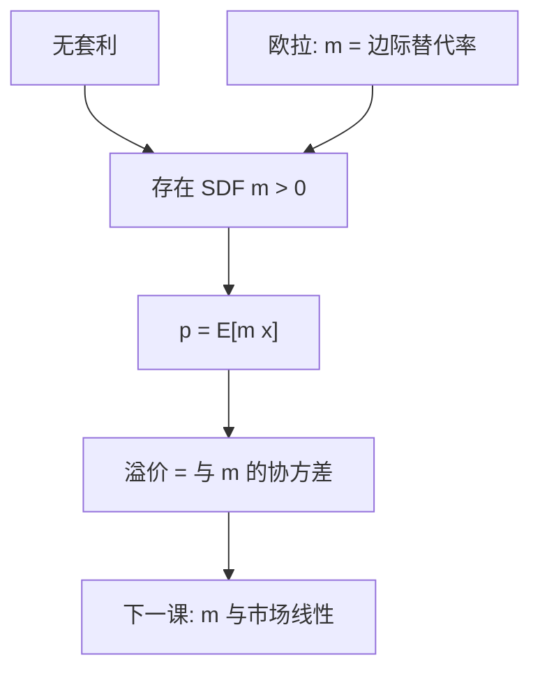

# 随机折现因子

任意可交易收益的价格，是其收益与同一个随机折现因子的内积。

<footer>—— 据 Harrison and Kreps, Journal of Economic Theory 1979；Hansen and Richard, Econometrica 1987；Cochrane, Asset Pricing 整理</footer>

定位：[有效市场假说](/econ/emh)。有效已经要求「经风险调整后无经济利润」，但没有写出调整本身。本课缺口是把调整收成一个随机变量 $m$：价格是 $p=\mathrm{E}[m\,x]$。不重做信息分层，不估计横截面 beta。后课默认已经读完：有无套利即有（严格为正的）定价核。

## 问题

上一课的联合假说停在口头：「用某个均衡模型调整」。候选很多——CAPM、消费欧拉、线性因子——看起来像不同理论。Ross（1978）、Harrison–Kreps（1979）指出它们共享同一会计：若市场无套利，存在随机折现因子（SDF、定价核）$m$，使所有可交易的或有支付 $x$ 满足

$$
p = \mathrm{E}[m\,x].
$$

用收益写成 $1=\mathrm{E}[m\,R]$，超额收益写成 $0=\mathrm{E}[m\,R^e]$。缺口不是挑选一个因子，而是先承认：**定价是找一个 $m$，再问它由偏好还是由因子张成。** [或有要求权](/econ/state-contingent)里的状态价格 $\pi(s)$ 就是离散版本：$m(s)=\pi(s)/\mathrm{Prob}(s)$。

无套利给出 $m>0$ 的存在（等价鞅测度）。市场完全时 $m$ 唯一；不完全时 $m$ 是一个集合，价格仍由该集合里任一元素给出。Hansen–Richard：条件信息改变的是投影，不是这套会计。

## 方法

从消费者欧拉接过来。一单位资产今天的代价是少一单位消费，明天回报是 $x$ 单位消费。在正则偏好下，

$$
m = \beta \frac{u'(c_{t+1})}{u'(c_t)},
$$

这是[跨期欧拉](/econ/consumption-euler)的资产定价写法。无套利版本不需要指定 $u$：只要不能用可交易资产做成「今天非正、明天为正」的组合，$m$ 存在。完全市场时它与 Arrow–Debreu 状态价格一一对应；不完全时，只能对可交易的 $x$ 定价，不可交易的风险没有唯一价格。

风险溢价从协方差来。由 $0=\mathrm{E}[m R^e]$ 得到

$$
\mathrm{E}[R^e] = -\frac{\mathrm{Cov}(m,R^e)}{\mathrm{E}[m]}.
$$

与 $m$ 负相关的资产——在 $m$ 高（消费差、边际价值高）时回报低——必须提供正溢价。这就是「系统风险」的一般定义，尚未指定 $m$ 等于市场组合回报的线性函数。

[有效](/econ/emh)现在可写成：$m$ 对信息集 $\mathcal{F}$ 可测时，基于 $\mathcal{F}$ 的超额收益满足 $\mathrm{E}[m R^e\mid\mathcal{F}]=0$。可预测的是经 $m$ 折现后的收益，不是未折现的价格变动。

## 机制

机制是状态之间的相对稀缺。$m$ 高的状态，消费（或总财富）令人难受，那里的支付更值钱。资产不是因为方差大而贵，是因为方差与 $m$ 对齐。家庭层面的特异风险若可被市场组合掉，不会进入 $m$；进 $m$ 的是不可分散、且与边际价值相关的部分。

这与公司金融的接法：MM 的「公平价格」就是用同一个 $m$ 去折现债与股的或有支付；切片不改变 $p$，因为 $m$ 对总支付线性。优序破坏的是「经理与市场用同一个关于 $x$ 的信息」，不是线性定价本身。

### 因子是 $m$ 的投影，不是另一套会计

线性因子模型写 $m=a-b'f$。若 $f$ 能张成 $m$ 在收益空间上的投影，则 $E[R^e]=\beta'\lambda$。CAPM 是 $f$ 取市场超额的那一个均衡特化，下一课才说明为何均衡会给出这一特化。本课禁止把某个实证因子直接叫成 $m$：因子是候选基，检验的是投影是否定价。Hansen–Jagannathan 界约束 $|m|$ 的波动：可交易夏普比越高，定价核必须越波动。这是会计约束，不是校准消费模型。

等价鞅测度把 $m$ 写进概率：风险中性期望下用无风险利率折现。两种写法是同一线性定价泛函，不是两个理论。

## 边界

不要把 $m$ 当成可直接观测的时间序列：观测的是价格与收益，$m$ 要从偏好或因子里识别，识别不足时集合很大。Hansen–Jagannathan 界给出 $|m|$ 波动的下界，本课不拿它做校准。也不要把「存在 $m$」说成 CAPM 成立——CAPM 是对 $m$ 的额外限制，下一课才加。

本课不估计市场 beta，不写消费 CAPM 的股权溢价之谜。那些是量化栏与宏观金融的实证；这里只把会计钉死，以便把 CAPM 读成均衡里的一个特殊 $m$。

$m$ 可以依赖不可交易的消费或人力资本，投影到股票市场上会留下残差。残差是模型误差，不一定是套利。不要把「存在 $m$」说成价格已经出现在屏幕上——那是主干最后一课才交出的协议问题。

## 小结

- 无套利 ⇔ 存在 $m>0$ 使 $p=\mathrm{E}[m x]$。
- 风险溢价是收益与 $m$ 的协方差，不是方差本身。
- 欧拉给出 $m$ 的偏好表示；完全市场给出唯一状态价格。
- 出处：Harrison and Kreps, *JET* 1979；Hansen and Richard, *Econometrica* 1987；Ross, *Journal of Business* 1978。
