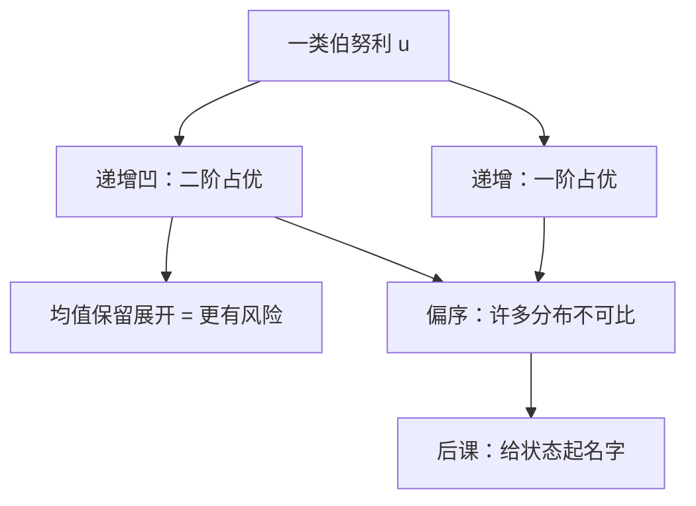

# 随机占优

若 $Y$ 可由 $X$ 加上一个均值为零的噪声得到，则一切凹效用都把 $X$ 排在 $Y$ 前面——「更有风险」不必再指定某一个 $u$。

<footer>—— 据 Rothschild and Stiglitz, Increasing Risk: I. A Definition, Journal of Economic Theory, 1970 整理</footer>

上一课[风险厌恶与阿罗–普拉特](/econ/risk-aversion)在给定伯努利函数上用 $r_A$ 比较「更厌恶」。本课不重讲 Pratt 的局部溢价，也不把某一个 $u$ 再估计一遍。缺口是：后课保险与或有要求权经常只知道决策者凹、递增，不知道他是哪一条 $u$。必须问分布之间有没有不依赖具体 $u$ 的排序。

## 问题

[期望效用](/econ/expected-utility)把彩票的值写成 $\mathbb{E}_F u$。换一个 $u$，排序可以翻转。若只比较两个已估出的 $r_A$，仍然绑在特定函数上。缺口是给出两类偏序，使「所有某类 $u$」同时同意：

一阶随机占优（FSD）：$F$ 一阶占优 $G$，当且仅当一切严格递增的 $u$ 都有 $\mathbb{E}_F u\ge\mathbb{E}_G u$，等价于生存函数处处不差，$F(x)\le G(x)$ 对一切 $x$。它只动单调，与凹性无关。

二阶随机占优（SSD）：把类收成递增且凹。积分条件是 $\int_{-\infty}^x F\le\int_{-\infty}^x G$。均值为零的噪声加在 $X$ 上得到 $Y$，则 $X$ 二阶占优 $Y$：这就是 Rothschild–Stiglitz 的「风险增加」。Arrow–Pratt 比较的是人，本课比较的是分布。

### 占优是偏序，不是完备排序

多数分布对既不一阶也不二阶可比：均值更高但更散，递增凹的人会分裂。占优因此不是「风险的完备刻度」，只是后课能写「不必指定 $u$」时的许可证。均值–方差排序只在椭圆分布或二次 $u$ 上与 SSD 对齐；二次 $u$ 上一课已经排除出主干。

一阶占优允许方差更大：把质量往右推可以同时提高均值与方差。把「占优」读成「方差更小」是把 SSD 的特例（均值保留展开）误当成 FSD。

## 方法

对象仍是结果上的分布，概率客观，与[阿莱](/econ/allais-independence)之后主干保留的 $\mathbb{E}u$ 一致。检验 FSD：画两条累积分布，看是否一条处处在另一条下方。检验均值保留的风险增加：看积分条件，或看是否存在噪声表示。不必估计 $u$，这与显示偏好课用成对观测打公理同类。

保险：公平保费的全额投保，上一课已由凹性给出。本课补的是：若损失分布被均值保留展开变得更散，一切风险厌恶者的投保意愿不下降。这只是偏序上的比较，不是某一 $r_A$ 的定量。

均值—方差排序一般不是 SOSD：方差大未必是均值保留展开，还要看偏度与支撑。二次效用除外，而二次不是本课的工作函数类。占优是偏序，许多分布对既非 FOSD 也非 SOSD。

本课仍把结果当成无名的财富数字。哪一个状态实现、状态上有没有可交易的要求权，下一课才引入。

## 机制

FSD 的机制是单调：任何「好结果的概率质量右移」，一切喜欢更多的人都同意。SSD 的机制是 Jensen：噪声在凹函数下掉期望，故「同一均值、更散」被所有风险厌恶者讨厌。积分条件是把二阶差分写成累积分布的面积——分布函数交叉一次时，面积比较给出是否仍能排序。

与 $r_A$ 的分工：给定 $u$，小风险溢价由方差乘 $r_A$ 近似，那是局部、参数化的。占优是全局、非参数的。二者在「无穷小均值保留噪声」上相遇，但不互相替代。后课若写「风险厌恶者都更喜欢 $A$」，默认指 SSD，不是某一 CRRA。

Hadar–Russell（1969）用积分条件写随机占优；Rothschild–Stiglitz 把「更有风险」钉成均值保留展开。引用时不要把 1970 的定义写成方差比较。

## 边界

占优不处理模糊：概率未知时没有 $F$ 可积。也不处理阿莱式的共同结果敏感：那是独立性失败，排序不再能写成 $\mathbb{E}u$，FSD/SSD 的等价刻画一起塌。主干仍在期望效用内部使用占优。

多维结果、状态相关的背景风险，积分条件要改成多维；本课只钉一维财富。也不把占优写成限价簿上的订单流占优——那是量化栏的对象。

三阶占优、下偏距对应谨慎与偏度偏好，主干用不到。均值—方差分析只在椭圆分布或二次 $u$ 下与 SOSD 对齐；二次 $u$ 有餍足，不是工作函数。占优是偏序：不可比时必须回到特定 $r_A$。

后课默认：不指定 $u$ 而给分布排序时，用一阶或二阶随机占优；「更有风险」指均值保留展开。

## 小结

- 一阶占优：一切递增 $u$ 同意；二阶占优：一切递增凹 $u$ 同意。
- 均值保留展开等价于对风险厌恶者而言更差；占优是偏序。
- 本课比较分布，不比较两个 $r_A$；概率仍是客观的。
- 下一课给状态起名字，彩票变成或有要求权。
- 出处：Rothschild and Stiglitz, *JET*, 1970；Hadar and Russell, *AER*, 1969；Mas-Colell, Whinston and Green 第 6 章。
