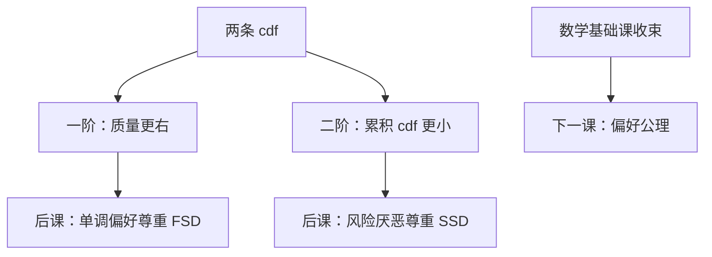

# 随机占优预备

两条分布谁更「好」，可以先在 cdf 上比较，不必先有一套期望效用数字。

<footer>—— 据 Mas-Colell, Whinston and Green, Microeconomic Theory 第 6 章；Rothschild and Stiglitz, "Increasing Risk," Journal of Economic Theory, 1970 整理</footer>

上一课[大数定律与中心极限](/econ/lln-clt)比较的是许多拷贝的平均与极限律。决策者面对的是**两条**彩票、两种收入分布，拷贝数是一，LLN 帮不上。缺口是随机序：用 cdf 的积分说出「所有单调者都同意」或「所有厌恶风险者都同意」。本课只预备这些序。下一课起进入微观主干：[偏好、完备与传递](/econ/preference-choice)。效用函数、vNM 公理、风险厌恶的阿罗–普拉特，都不在本课重写——边界交给偏好公理。

## 问题

实值随机变量 $X,Y$，cdf 为 $F,G$。**一阶随机占优**（FSD）：$F(t)\le G(t)$ 对一切 $t$，即 $X$ 的质量更靠右。若后再有期望效用，一切非减 $u$ 给出 $\mathbb{E}u(X)\ge\mathbb{E}u(Y)$；本课把这条当作序与单调函数的积分刻画，不把 $u$ 解释成已证明的效用表示。**二阶随机占优**（SSD）：$\int_{-\infty}^t(G-F)\ge 0$ 对一切 $t$（等均值时即均值保持展开的积分形式）。积分刻画对应凹的 $u$。Rothschild–Stiglitz 的「风险更大」是等均值的 SSD 劣势。

均值–方差只在正态或二次 $u$ 上与 SSD 对齐。一般分布，方差大不必被厌恶风险者讨厌（可能右尾补偿）。后课[均值方差何时等于 EU](/econ/mean-variance-eu)再收窄；本课不要用 $\sigma$ 代替随机序。

### 占优不是偏好公理

FSD/SSD 比较的是给定的概率分布，不是决策者会不会比较任意两个菜单。完备、传递、连续，是下一课对**备选集上的二元关系**提出的要求。可以把占优想成「若偏好后来满足单调或风险厌恶，则必须尊重这些序」，但本课不倒过来从占优推出偏好。也不把占优写成资产定价的状态价格——那是完全市场后课。

FSD 不要求均值相等，SSD 的风险比较常加等均值。FSD $\Rightarrow$ 均值更大（在积分存在时），但均值更大远远不够 FSD。

## 方法

积分检验：FSD 看 $G-F$ 非负；SSD 看 $G-F$ 的累积非负。离散分布用手算阶梯 cdf。连续密度则看生存函数或分位数：$X$ 一阶占优 $Y$ 当且仅当分位数函数 $F^{-1}(q)\ge G^{-1}(q)$ 对一切 $q$。构造：给 $Y$ 加上一个正的随机项（不必独立）可得到 FSD；等均值下加噪声（均值保持展开）得到 SSD 劣势。

与条件期望的接口：$\mathbb{E}[X\mid Y]=Y$ 且 $X\neq Y$ 时，$X$ 是 $Y$ 的均值保持展开，$Y$ 二阶占优 $X$。这是「信息更多未必风险更小」的反面：多一层噪声变差。后课[二阶占优与均值保持展开](/econ/sosd-mps)会展开；本课只留定义。

## 机制

为什么 cdf 点点更小就是「更好」：对每个阈值 $t$，落到 $t$ 以下的概率更低，所有「超过 $t$ 就算成功」的单调计数都同意。二阶把「成功」改成对阈值的积分，等价于对凹变换平均——凹惩罚分散。没有偏好理论也能做这两条积分比较；偏好理论稍后决定决策者是不是「所有单调者」或「所有凹者」中的一员。

数学与优化基础课在此结束。拓扑、凸、分离、KKT、包络、不动点、贝尔曼、条件期望、随机序，后课将默认已经可用。微观从比较关系 $\succsim$ 起笔，不再从开集或 cdf 起笔。

三阶占优接谨慎（$u'''\gt 0$），本课不写。非期望效用可以不尊重 SSD，那是后课对照，不是本课的反例作业。

## 边界

不在本课写 vNM 公理、不证明效用表示、不定义阿罗–普拉特系数。不进入限价簿、不写 CAPM 实证、不把随机序说成投资组合优化软件。下一课[偏好、完备与传递](/econ/preference-choice)是微观主干第一课：对象换成菜单上的排序，随机占优作为后续风险课的约束再回来。

后课默认：会用 cdf 检验 FSD/SSD；讨论风险态度时，SSD 是「所有凹变换都同意」的候选序；偏好本身从公理开始讲。

## 小结

- FSD：cdf 点点更小；对应一切非减变换的积分比较。
- SSD：cdf 积分占优；等均值时即「更少分散」。
- 占优是分布上的序，不是完备传递的偏好公理。
- 均值–方差不能代替 SSD。
- 下一课：[偏好、完备与传递](/econ/preference-choice)。
- 出处：MWG 第 6 章；Rothschild and Stiglitz, *JET* 1970。
