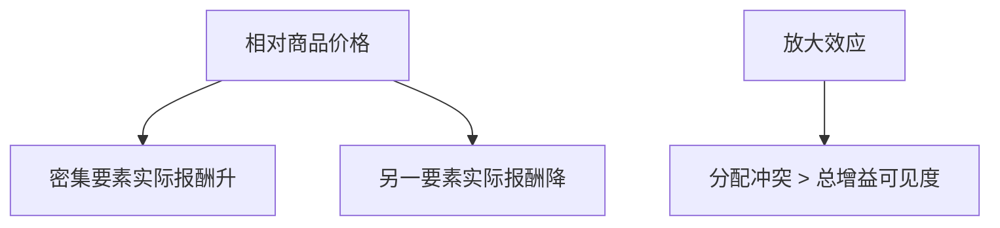

# Stolper–Samuelson

一种产品相对价格上升，密集使用的那种要素的实际报酬上升，另一种要素的实际报酬下降——贸易的分配效应可以比国家总增益更刺耳。

<footer>—— Stolper and Samuelson, Protection and Real Wages, Review of Economic Studies 1941</footer>

[上一课](/econ/heckscher-ohlin)给出出口方向与 FPE。本课缺口是价格变动如何切分要素报酬。Krugman 下一课引入规模与品种，分配机制会换；本课先钉 $2\times2$ 的 Stolper–Samuelson（SS）。

## 问题

自由贸易改变相对商品价格。SS：商品 1 相对价格上升，则资本密集的 1 扩张，劳动密集的 2 收缩（Rybczynski 的对偶），资本实际报酬 $r/P$ 升，劳动实际报酬 $w/P$ 降—— Magnification：要素价格变动比例大于商品价格变动比例。缺口不是再讲 HO 谁出口什么，而是：国家作为整体有贸易增益（上一课），内部可以有确定的输家。保护进口竞争的劳动密集型产品，可以提高该国劳动的实际工资——这是 1941 年论文对着当时美国关税辩论写的。

Jones 的放大效应：$\hat r\gt \hat p_1\gt \hat p_2\gt \hat w$（帽子为对数变动）。名义工资甚至可以升，但相对物价篮子仍使实际工资降。要用两套物价说话。

## 方法

成本等于价格（零利润）：$c_1(w,r)=p_1$，$c_2(w,r)=p_2$。商品价格变动沿单位成本函数映射到 $w,r$。要素密集不逆转时映射可逆。特定要素模型（Jones–Samuelson–Mussa）是对照：短期资本困在行业内，两行业资本报酬可以反向，劳动作为流动要素效应较弱——时间维度上 SS 是长期、两要素都流动。

与计量：China shock 后课用通勤区暴露估劳动市场效应，那是设计；SS 是 $2\times2$ 的符号预测。两者要对：特定要素、技能、不可贸易，都会改谁输谁赢，不能把 SS 当所有贸易冲击的充分统计。

## 机制

机制是零利润加要素密集。贵了的行业要扩张，必须从另一行业抽要素；抽的时候密集使用的要素变得更稀缺，其报酬升得比商品价更狠，才能把单位成本拉到新价格。输家的要素被「赶」进扩张行业，边际产出掉。总饼可以变大（贸易增益），切法可以更不平等。

与[再分配](/econ/theory-of-second-best)精神：有总增益就可以补偿输家。补偿在政治上常常不发生，于是 SS 成为贸易政治的核，而不是「经济学家说有增益所以无输家」。

要素价格均等化是水平：贸易后 $w$ 对齐。SS 是变动：给定贸易条件变动，$\Delta w$ 的符号。两国同时进入自由贸易，丰裕要素赢、稀缺要素输——与 HO 方向一致。

## 边界

多要素下没有简单的「一种商品对应一种要素」；要用成本份额与一般均衡弹性。技能偏向技术与贸易会纠缠，Feenstra 把外包写成有效扩大低技能劳动供给——后课任务。本课不估美国工资不平等的分解。下一课 Krugman：即便要素禀赋相同，规模与偏好多样性也能产生贸易，分配故事换成品种与企业，而不是 $w$ 对 $r$。

后课默认：相对价格变动按要素密集切分实际报酬，放大效应使要素价动得比商品价更猛。总增益与输家可以同时真。不要用「贸易有增益」否认 SS 的分配。

## 小结

- SS：产品相对价格升 ⇒ 其密集要素实际报酬升、另一要素降。
- 放大：要素价格变动比例更大。
- 长期两要素流动；短期特定要素符号可不同。
- 补偿在理论里可能，在政治里常缺，故有贸易冲突。
- 出处：Stolper and Samuelson, *RES* 1941；Jones 放大效应。
