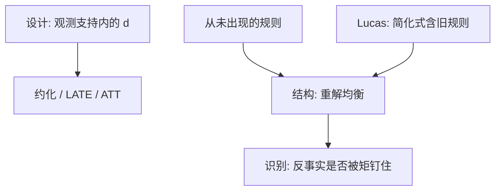

# 结构对约化形式

约化形式是给定制度下的统计关系；结构是偏好、技术与均衡约束。政策一改制度，约化形式可以整张表作废——这正是卢卡斯批判。

<footer>—— Marschak, Economic Measurements for Policy and Prediction；Lucas, Econometric Policy Evaluation: A Critique, 1976；Heckman 论结构与因果</footer>

[上一课](/econ/event-study-econ)把公告窗的累积异常写成设计。准实验在支撑内已经能估「这个政策在这个制度里做了什么」。本单元缺口是另一类问题：制度若改成从未发生过的规则，设计没有对照。结构对约化是本课序的第一课；离散选择下一课给出第一个参数化例子。

## 问题

DiD 估的是观测到的处理对观测到的结果。若要问「若把税率改成从未出现的课表」或「若市场变成伯川德而不是现在的谈判」，潜在结果的支持里没有这些 $d$。Marschak 的目标：政策评价需要的是对干预稳定的参数（弹性、调价成本、折现），不是简化式斜率。Lucas（1976）：把 $C=cY$ 当结构去模拟新规则，等于假设预期规则不变。缺口不是再骂一次回归，而是划分：哪些问题设计够用，哪些必须进均衡与决策规则。

Heckman：实验与 IV 识别的是政策不变（或局部不变）的因果效应；外推到新环境要选择模型或一般均衡。两边不是教派。随机化培训实验不自动给出「全国强制培训后的工资」，因为一般均衡工资会动。

约化形式不是贬义词。它是 $\mathbb{E}[Y\mid Z]$。IV 的约化形式除以第一阶段就是 Wald。结构失败时，诚实的约化形式仍是证据；失败的结构不是「因为更深所以更真」。

## 方法

写清反事实：是对观测处理赋值的干预（设计），还是对均衡映射的干预（结构）。结构：声明不变对象（$u$、技术、$c_i$ 的分布），解均衡，用观测矩估参数，再在新政策下重解。识别要另证：观测等价的结构可以给出不同反事实——那是后课 BLP、拍卖的核心。

校准与估计：宏观常用校准深层参数再匹配矩；微观产业常用 GMM / MLE。本课不选边，只要求：目标函数对应的矩要能分开要的弹性。

## 机制

机制是不变性范围。ATE 的不变性是 SUTVA 加赋值；结构的不变性是偏好与技术在新均衡里仍成立。一旦政策改变偏好（习惯养成）或技术（学习），结构也会垮，只是垮的位置不同。约化形式在旧规则的支撑上可以极准，这是 DML 的用武之地。

与[潜在结果](/econ/potential-outcomes)：结构给出一整张 $Y(d)$ 对未观测 $d$ 的表，靠的是函数形式与均衡。Rubin 式设计拒绝在支持外填表，除非额外假设。Heckman 的选择模型是中间：用选择方程填部分未观测处理，仍要排除。

Koopmans 的「测量而无理论」警告：没有不变对象，测量的是混合物。反过来，错误的理论会把混合物叫成弹性。检验（过度识别、样本外、制度变化）两边都要。

## 边界

本课不把 DSGE 或 IO 结构写成唯一科学。不重写[卢卡斯批判](/econ/lucas-critique)全文，只把它收成单元口号。下一课 logit / probit：在离散选择上第一次看到「效用参数 → 选择概率 → 反事实份额」。BLP 把这套放进价格内生与差异产品均衡。

后课默认：设计回答支撑内的因果；支撑外的政策要结构，并单独证明识别。灵活 ML 不能替代均衡。不要用「我们做了因果」拒绝一切反事实价格弹性。

## 小结

- 约化形式：给定制度的统计关系；结构：不变对象加均衡。
- 新规则不在观测支持内时，设计没有对照。
- Lucas：简化式系数嵌着旧规则。
- 识别失败的结构不优于诚实的 LATE。
- 出处：Marschak；Lucas 1976；Heckman 结构与因果；Koopmans 测量与理论。
