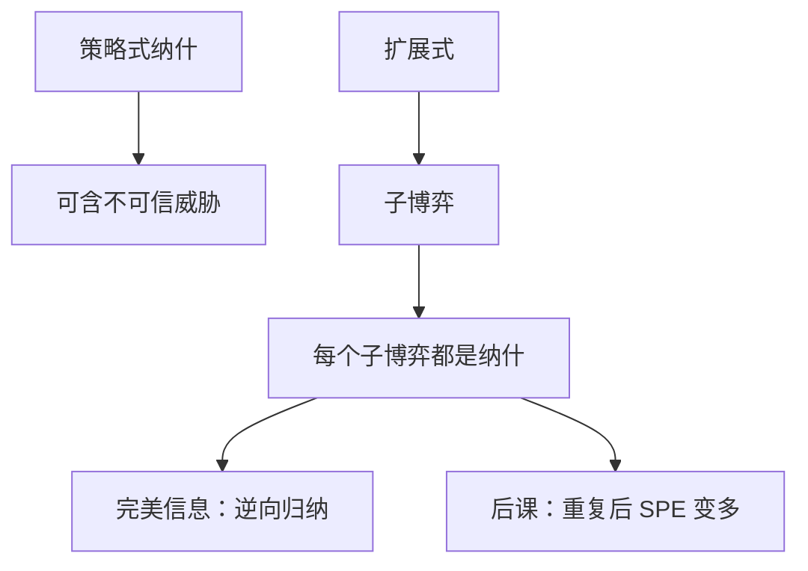

# 扩展式与子博弈完美

完美性要求均衡策略在每一个子博弈上仍构成均衡，从而删掉不可信的威胁。

<footer>—— Selten, Reexamination of the Perfectness Concept for Equilibrium Points in Extensive Games, International Journal of Game Theory, 1975</footer>

[上一课](/econ/mixed-strategy)保证有限策略式有纳什。把同一博弈写成树之后，纳什仍可能靠「若对方偏离、我就采取对自己更糟的惩罚」来撑住。进入遏制里，在位者威胁降价到亏损，只要进入者不信、威胁不必执行，支付在路径上说得通，但它不是到达那个节点后还会选的招。缺口是精炼：策略必须在每个子博弈里都是纳什。本课钉子博弈完美（SPE），不谈重复博弈的无名氏。

## 问题

扩展式给出节点、信息集、行动与终点支付。策略规定在每一信息集做什么。把策略式摊平后，纳什只约束整条策略的事前支付，不约束「若轮到这个未达信息集，还会不会按原计划做」。

子博弈是从单点信息集出发、包含其所有后续的小树，且不劈开原博弈的信息集。SPE 要求 $\sigma$ 限制在每一个子博弈上仍是该子博弈的纳什。完美信息有限博弈可用逆向归纳：从终点前回一步，每点选最优，往前叠。有限完美信息、无平局时，纯策略 SPE 存在。

### 子博弈不是任意一截树枝

信息集若跨两条枝，从其中一条「切开」会让玩家不知道自己在哪，那不是子博弈。不完美信息下，SPE 管不到许多信息集上的信念，那是后课完美贝叶斯的缺口。本课先把「单点、切得干净」的树钉住。

进入博弈：在位者「斗争」在进入已成事实后严格劣于「容纳」。斗争威胁支撑的纳什不是 SPE。逆向归纳留下：进入，容纳。Selten 1965 的完美性、1975 的颤抖手，是同一直觉的不同技术。

## 方法

对象：有限扩展式，完美回忆。解：SPE。算法（完美信息）：逆向归纳。不完美信息但子博弈仍多的，在每个子博弈里解纳什，再拼回。斯塔克尔伯格是完美信息两步量：领导者预见到追随者的最优反应，这正是 SPE，不是普通古诺的同时行动纳什。

策略式纳什集合包含 SPE 集合。精炼是缩小，不是另造支付。混合在树上用行为策略：每个信息集一个局部混合；完美回忆下与混合策略等价（Kuhn）。

## 机制

可信性来自到达之后还要最优。威胁要成为 SPE 的一部分，惩罚者在惩罚子博弈里必须真的愿意罚。一次性降价若伤害自己更深，就不可信。要把惩罚做可信，必须改支付（沉淀成本、合同）或改结构（重复，让惩罚变成未来路径上的最优）。[斯塔克尔伯格](/econ/stackelberg)已经用过「领导者预见追随者的反应」；用本课的话说，那是两步完美信息树上的 SPE，不是把古诺的同时行动纳什硬改成先手。

逆向归纳把整棵树的 SPE 支付唯一钉住（在无平局时），这比纳什强得多。但也脆：一丁点不完全信息或平局，归纳路径可以跳。实验中的最后通牒偏离，是对照，不是定义错误。无限地平线没有最后一步，归纳不能从终点开始，必须回到定义：每一截子博弈仍是纳什。下一课的无名氏定理就站在这条无限树上。

### 承诺必须改树

若在位者能在进入前烧掉「降价会亏损」的桥——合同、产能、沉淀广告——支付变了，SPE 可以变成「不进入」。台词上的威胁改不了树。Selten 1975 的颤抖手更强：每个信息集都被微小失误碰到。SPE 是其必要条件。信号博弈的路径外信念要等到完美贝叶斯。

有限完美信息、支付无平局时，逆向归纳给出唯一 SPE 路径。平局或多最优时，SPE 集合可以大于一条路径。

## 边界

SPE 不约束非单点信息集上的信念，信号博弈里「偏离后对方怎么想」仍自由，可以撑起很怪的纳什。下一课重复博弈会显示：SPE 集合在贴现因子高时变得非常大，精炼几乎不筛。颤抖手完美、直觉标准是更细的刀，主干只到 SPE 与后课的完美贝叶斯。

无限地平线没有最后一步，逆向归纳不能从终点开始，必须用「每一截仍是纳什」的定义本身。那正是无名氏定理的舞台。

有限完美信息再加「无平局」，逆向归纳给出唯一 SPE 路径；平局一开，归纳分叉，本课不靠唯一性说话。

后课默认：动态、可观察的行动，解概念从纳什升级为 SPE；不可信威胁删掉。

颤抖手让每个信息集以任意小概率被碰到，不可信威胁变成会执行的亏本招。SPE 更弱、更好算；有限完美信息树上两者常常重合。本课用 SPE，不预支序贯均衡。进入遏制里，在位者「斗争」在进入已成事实后严格劣于「容纳」，斗争威胁支撑的纳什不是 SPE。要把惩罚做可信，必须改支付或改成重复结构，让惩罚变成未来路径上的最优。

策略式纳什集合包含 SPE 集合。精炼是缩小，不是另造支付。完美回忆下行为策略与混合策略等价（Kuhn）。

## 小结

- 策略式纳什不管未达节点；SPE 要求每个子博弈仍是纳什。
- 完美信息用逆向归纳；斯塔克尔伯格是 SPE。
- 精炼缩小均衡集，不改支付。
- 重复与不完美信息会把 SPE 重新撑大。
- 出处：Selten, 1965；*IJGT* 1975。
