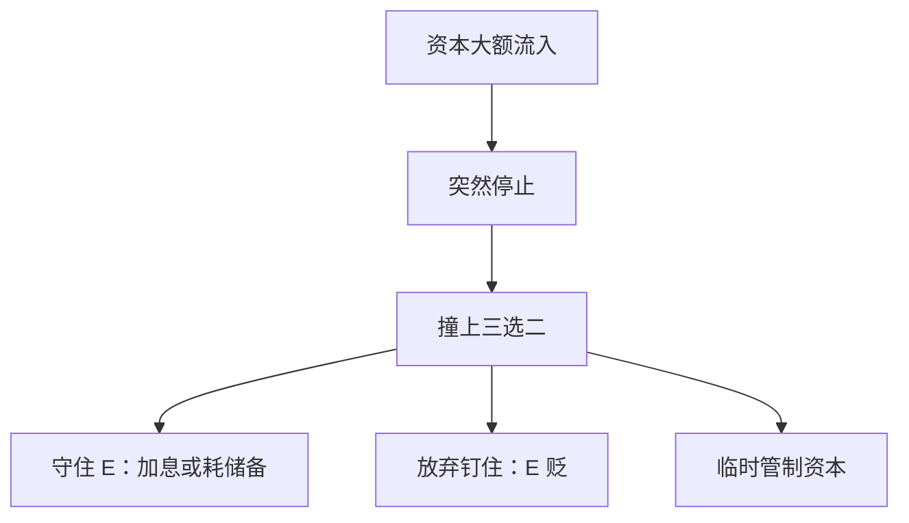

# 突然停止

资本流入可以在短时间内从顺转到骤停；三难里若还想钉住汇率又维持独立 $i$，储备与信贷一起断。

<footer>—— Calvo, Capital Flows and Capital-Market Crises: The Simple Economics of Sudden Stops, Journal of Applied Economics 1998</footer>

[上一课](/econ/impossible-trinity)把开放宏观收成三选二：独立货币、固定汇率、资本自由流动不能同时成立。本课的缺口是流量的断裂——Calvo 的突然停止：资本账户从大额净流入突然变成停止或逆转，与三角撞在同一周。原罪是下一课：外币负债如何把这次停止放大成资产负债表危机。中介功能从那之后另起课程，本课仍停在宏观制度。

## 问题

$CA=S-I$ 在事前可以靠金融账户融资。多年流入支撑吸收大于产出，$E$ 或储备看起来稳定。突然停止是融资约束突然收紧：愿意借给本国的外部资金骤减。缺口不是再画 IS–LM，而是：在三角的哪一角，这次骤停分别逼你放弃什么。钉住加开放资本时，$i$ 本已贴近 $i^*$，停止发生则要么加息到内爆、要么耗储备、要么放弃钉住。浮动角上 $E$ 可以贬，但若负债是外币，贬值本身变成下一课的错配。

三角已经把三选二写成制度边界。本课加的是流量可以断裂：不是慢慢改组合，而是同一周强制选边。原罪下一课才把外币债写进存量；本课先停在融资骤停与三角的遭遇。

突然停止是总量融资的断裂，不是某一种商品「失去竞争力」的评分。恒等仍成立：金融账户一停，吸收必须立刻对着产出调，$CA$ 被迫改善。

## 方法

Calvo 的装置强调不可逆的流入突然变成约束。吸收 $C+I+G$ 必须下降，或净出口必须上升，或两者同时。相对价格渠道：$q$ 贬值做支出转换；数量渠道：信贷收缩砍 $I$ 与受约束家庭的 $C$。钉住阻止 $E$ 动，转换更依赖衰退与储备。三角在此变成危机分派：三个目标里，停止强制你立刻丢掉至少一个——常常是钉住，或独立的低利率。

卢卡斯批判：用流入年代的简化式乘数去模拟「若突然停」，系数里嵌着当时还能借到钱的预期。时间不一致：宣布永恒钉住却在停止时想用独立 $i$ 顾国内缺口，正是三角上的再优化，结果是挤兑储备。

### 与经常账户恒等

停止发生后 $CA$ 必须改善，这是融资约束，不是美德。双赤字课已经说过因果不是一对一；这里的驱动项是资本账户的供给。自动稳定器在衰退中让 $S^g$ 下降，会**加大**需要私人调整或需要贬值的幅度——稳定器与外部融资约束可以打架，不是否定稳定器，是声明开放约束。

## 机制

流入年代 $i$ 可以偏低、资产价格偏高、不可贸易膨胀（巴拉萨–萨缪尔森加需求）。停止切断滚续，项目与消费必须砍，不可贸易相对价格逆转。银行若把流入转成本币信贷，下一课的货币错配会把 $E$ 贬值写成净值崩溃；本课先记下宏观流量。长期中性：名义锚最终仍要选一边——要么本国 $\pi$，要么外国锚——停止不创造第四个顶点。CIP/UIP 的报价层见 `/quant/irp`；宏观只保留：无抛补套利在管制或违约风险下不再把 $i$ 钉死在 $i^*$。

双赤字课已经说过：$CA$ 改善可以来自 $I$ 崩溃而不是 $S$ 美德。突然停止常常正是 $I$ 被砍。蒙代尔的短局在融资约束下改了形状：浮动贬值未必能「有效刺激」，若吸收必须立刻对着无法展期的债调。Dornbusch 超调假定资本仍按 UIP 流动；停止是流动被切断，超调公式不再是第一句。

中间制度（软钉、有限管制）在停止时往往先被冲到角上。Rey 的全球金融周期称浮动也买不到完全绝缘——边界修正，仍是三角内部的程度，不是新恒等。

## 边界

本课不把某一次危机写成校准，不发明储备耗尽的周数。不要把限价簿的外汇订单当突然停止。福利排序（浮动的 $q$ 波动对钉住的储备）要另评。公司债与主权债的原罪下一课才写。Calvo 后来与 Izquierdo 等人把突然停止写成可校准的约束，主干只取「流入可骤停并逼三角选边」，不把附录实证插进课序。

中间制度在停止时往往先被冲到角上，不是第四个可同时满足的顶点。管制可以提高套利成本、暂时让 $i$ 独立，代价是跨期贸易——三角课已经写过，本课只强调骤停把选择从「将来再改」变成「本周必须改」。

后课默认：开放资本下的流入可以骤停，并强制三角立刻作出选择。下一课：不能用本币借外债时，贬值把流量危机写成净值危机。

## 小结

- 突然停止是资本流入的骤停或逆转，Calvo 的宏观约束。
- 与不可能三角遭遇：必须立刻放弃钉住、独立 $i$ 或开放中的一个。
- $CA$ 被迫改善是融资会计，不是竞争力评分。
- 用流入年代的简化式模拟停止，再犯卢卡斯批判。
- Dornbusch 超调假定资本仍流动；停止切断那条 UIP。
- 出处：Calvo, *Journal of Applied Economics* 1998。
