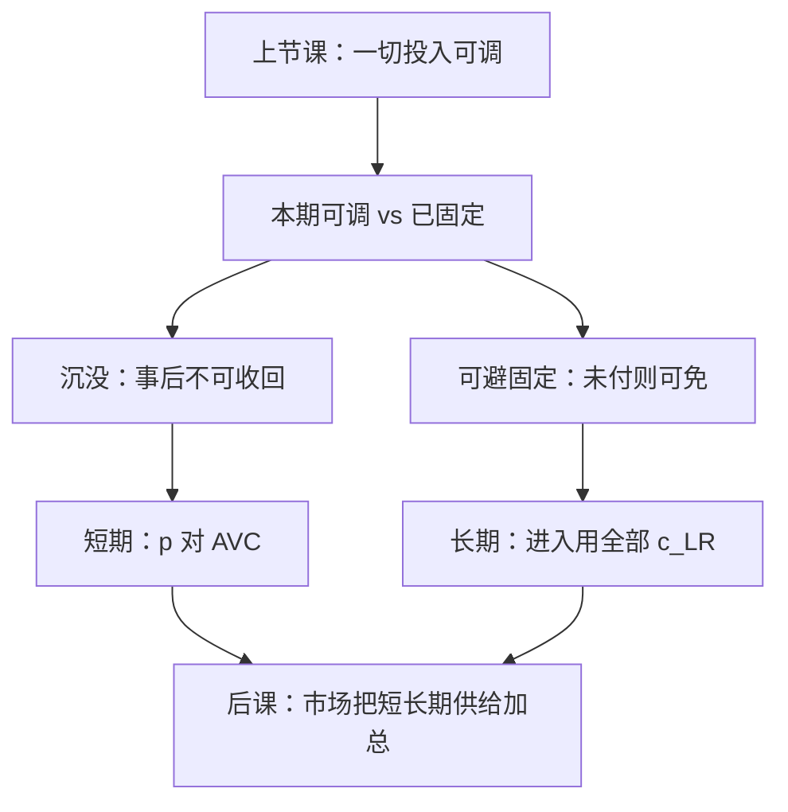

# 短长期与沉没成本

长期平均成本是一族短期平均成本的下包络；短期里已经钉死的工厂规模，不能再当成决策变量。

<footer>—— 据 Viner, Cost Curves and Supply Curves, Zeitschrift für Nationalökonomie, 1931 整理</footer>

[上一课](/econ/profit-supply)（利润最大化与供给）。在一切投入可按 $w$ 重选时写出 $p=\mathrm{MC}$ 与 Hotelling。本课不重讲利润函数的凸性。缺口是：真实决策有时间分层——厂房、执照、已经付出的研发，并不能在本期按租金退回。若仍用全部 $c(w,q)$ 当相关成本，歇业规则和供给弹性都会写错。

## 问题

把投入分成在本期可调的 $z_v$ 与已经固定的 $z_f$。短期成本是

$$
c_{\mathrm{SR}}(w,q;z_f)=w_v\cdot z_v(q;z_f)+w_f\cdot z_f,
$$

其中第二项若**沉没**，则决策时它不可避：比较的是收入与可变成本，不是与全部会计成本。缺口因此不是再发明一条 MC，而是问：哪些数字进入本期的机会成本？沉没的定义是事后无法收回，与「固定但可避」（尚未付出、选择歇业就不付）不是同一件事。

长期：所有 $z$ 可调，$c_{\mathrm{LR}}(w,q)=\min_{z_f}c_{\mathrm{SR}}(w,q;z_f)$。包络定理给出：长期 MC 曲线穿过每条短期 MC 在最优规模处的点；长期 AC 是短期 AC 的下包络。Viner 的图解把这层几何钉死；后课完全竞争的短、长期供给正是读这两条 MC。

### 沉没不是固定，固定不必沉没

教科书常把「固定成本」画成 AC 与 AVC 的垂直距离。若这笔钱尚未付出、歇业可免，它影响进入，不影响已经在场的短期停产。若已经付出且不能转卖，它两头都不影响：既不改短期停产（只比 $p$ 与 AVC），也不该进入事后的利润核算当「还要再付一次」。把沉没写进短期 MC，会让供给左移——那是会计，不是决策。

停产规则：短期若 $p<\min\mathrm{AVC}$，产量为零；若 $\min\mathrm{AVC}\le p<\min\mathrm{AC}$ 且固定部分已沉没，仍生产、会计亏损。长期不存在「沉没」：不弥补 $c_{\mathrm{LR}}$ 就退出。

## 方法

给定 $z_f$，短期供给仍是 $p=\mathrm{MC}_{\mathrm{SR}}(q;z_f)$，定义域在停产点以上。$z_f$ 不同，得到一族短期供给。长期供给沿 $\mathrm{MC}_{\mathrm{LR}}$，并且 $z_f$ 被选在使 $c_{\mathrm{SR}}$ 最小的规模上。CRS 加沉没的进入成本时，长期平均成本可以先降后平，后课自由进入会把价格钉在 $\min\mathrm{AC}$。

机会成本始终是前瞻的：已沉没的支出用零进入本期目标，但占用仍可转售的厂房要用转售价进入。本课只切这一刀，不引入融资约束或不可逆投资的实物期权——那是宏观与公司金融的后课。

本课仍是单一厂商、价格接受。市场有多少家、价格从哪来，下一课才拼。

## 机制

包络的机制：长期可以挑选 $z_f$，故任何产量上长期成本不会高于某一条已经选错规模的短期成本；在恰好选对的那一点，短、长期 MC 相等，否则还可以微调规模来省边际支出。Viner 当初在「短期 AC 是否切长期 AC」上画错过切点，后来的纠正正是包络：相切，不是相交穿过。

沉没影响进入的机制：进入决策比较的是进入后利润流与尚未付出的进入成本。一旦付出，历史成本退出一阶条件，只留下可变部分。这与[风险](/econ/risk-aversion)课的「已实现损失不进期望」不是同一对象，但都禁止把沉没的数字再减一次。

不要把沉没成本写成限价簿上的已挂订单。订单能否撤、费用是否退，是微观结构规则；这里是生产计划的时间分层。

## 边界

连续时间、部分可逆、转售市场有折价，会把「沉没」变成连续的不可逆程度，本课不展开。学习效应、调整成本让 $z_f$ 的选择带动态，长期不再是静态包络。IRS 的短期工厂一旦建好，竞争分析更脆，留给市场结构课。

劳动力也不必天生可变、资本不必天生固定：哪一种冻住由调整速度决定。专用性资产把沉没接到敲竹杠，那是契约课。不要把沉没写成限价簿上已挂、能否撤销的订单。

后课默认：短期供给读可变成本与既定规模；长期成本是短期的下包络；沉没不进入本期一阶条件。

## 小结

- 短期有不可调投入；沉没是事后收不回，固定未必沉没。
- 停产看 AVC；进入与退出看长期成本。
- 长期 AC、MC 是短期族的包络，在最优规模处相切。
- 下一课把短、长期供给推进价格接受的市场。
- 出处：Viner, *Zeitschrift für Nationalökonomie*, 1931；Mas-Colell, Whinston and Green 第 5、10 章。
