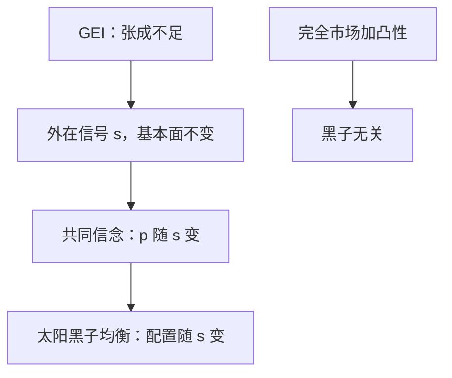

# 太阳黑子均衡

与基本面无关的外在不确定性，只要被共同相信，就可以进入均衡价格与配置。

<footer>—— Cass and Shell, Do Sunspots Matter?, Journal of Political Economy, 1983</footer>

[上一课](/econ/radner-plans)（Radner 均衡）。把证券张成写成真子空间：Radner 均衡只在可交易方向上对齐状态间 MRS，缺的方向无法保险，配置一般不是完全市场帕累托。缺口是这些缺掉的维度，会不会被「不影响禀赋、偏好与技术的随机信号」填上。本课钉太阳黑子：外在不确定性可以自我实现。不重写 GEI 的张成代数。

## 问题

外在不确定性（extrinsic）是不改基本面的随机变量：哪个太阳黑子实现，都不改变 $\omega$、$u$、生产集或证券红利。内在不确定性（intrinsic）则直接改这些对象。[状态依存](/econ/state-contingent)课里的下雨、违约是内在的。Cass–Shell 问的是前者：若人人把黑子写进预期，现货价格能否随黑子变，从而使配置也随黑子变？

完全市场、凸偏好、全员可买 Arrow 证券时，答案是否定的（太阳黑子无关）：黑子状态也可以被保险，凸性让「同基本面、不同消费」的随机化不优于确定性，均衡配置不依赖外在信号。GEI 或受限参与拆掉这张保险网，黑子可以进均衡。

### 黑子不是农业减产

太阳活动伤作物，那是内在冲击，不是本课对象。本课的黑子可以是任何公共随机装置：日斑、权威预言、与支付无关的阳光。它起作用是因为信念协调，不是因为物理进入生产函数。

Cass–Shell 的参与限制：一部分人被挡在证券门外，只能做现货。即使证券看起来不少，被挡的人无法对冲黑子，现货价格仍可随黑子跳。不完全张成是同一缺口的资产版本。

## 方法

两期、有限外在状态 $s$，基本面在 $s$ 上相同。证券在期初交易，现货在 $s$ 实现后开。GEI：证券种类少于对冲黑子所需。寻找 Radner 均衡，使不同 $s$ 的现货价格 $p(s)$ 不同，从而 $x(s)$ 不同。这就是太阳黑子均衡。

对照：把每个 $s$ 当成普通内在状态、补齐 Arrow 证券，回到完全市场，黑子熄灭。本课不把黑子均衡当成太阳物理学，也不写成限价簿上的公共信号。

## 机制

信念是协调装置。若大家都预期 $s=$ 斑时价格低，资产需求与期二超额需求按这个预期写，出清价格可以真的低。完全市场上可以买「斑时赔付」的证券，把价格风险对冲掉；凸偏好下确定性更好，支持「$p$ 随 $s$ 变」的预期站不住。GEI 缺这张证券，预期不必被保险市场拆穿。

受限参与同样：被挡在证券门外的人只能靠现货消化黑子，他们的需求把 $p(s)$ 拉开，能交易的人无法单独熄灭黑子。Cass–Shell 定理的「无关」方向要全员都能买卖一套对黑子状态也完备的 Arrow 证券；缺一边参与，无关性立刻掉。

### 外在信号可以部分补市场，也可以纯浪费

有时黑子碰巧提供额外随机化，让原本不可张成的方向变得可交易，福利可以升。有时只是在本已可保险的方向上加噪声，福利降。GEI 已经约束无效，符号不先验。本课要的是「可以自我实现」，不是「黑子一定有害」或「一定完成市场」。

Azariadis 在叠代货币模型里用太阳黑子做内生波动：基本面确定，信念仍可在高价与低价轨道间跳。那是宏观应用；本课的定义仍是 Cass–Shell 的外在不确定性进均衡。

## 边界

不是任何随机预言都是均衡：$p(s)$ 仍须出清，预算仍须守。连续统黑子、非凸、名义资产的不定性（价格水平随外在信号跳）是同一思想的技术延伸，主干不展开。也不要把太阳黑子写成量化栏的公共信息到达；这里没有队列。

与[相关均衡](/econ/correlated-equilibrium)的对照留到博弈课：那里外在信号协调行动，这里协调价格。两边都要求信号不改基本面；市场结构决定信号能不能被保险掉。

配置课序到此：商品空间、张成、外在信念能做什么，已经齐。后课问根本没被列进商品空间的影响——那是外部性，不是再加一张证券。

后课默认：谈到外在不确定性，先问市场是否完全、参与是否受限；完全且凸则黑子无关，GEI 里可以有太阳黑子均衡。

## 小结

- 外在不确定性不改基本面；完全市场加凸性时它不进入配置。
- GEI 或受限参与下，共同信念可让价格与配置随黑子变。
- 机制是自我实现的预期，不是物理进入生产函数。
- 黑子可改善也可恶化约束有效性，符号不免费。
- 出处：Cass and Shell, *JPE*, 1983；Shell, 1977；Azariadis, *JET*, 1981。
