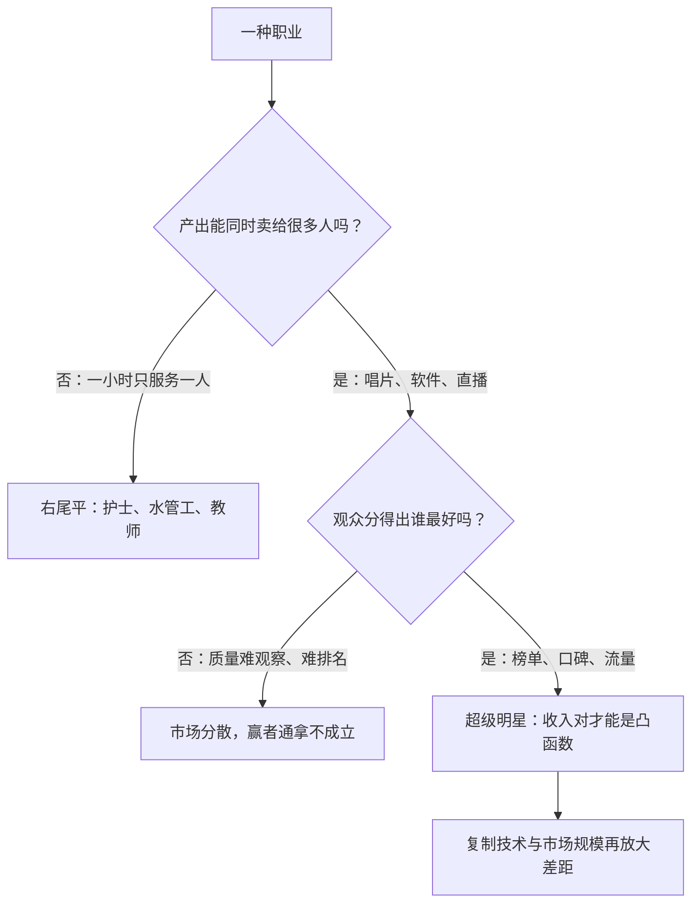
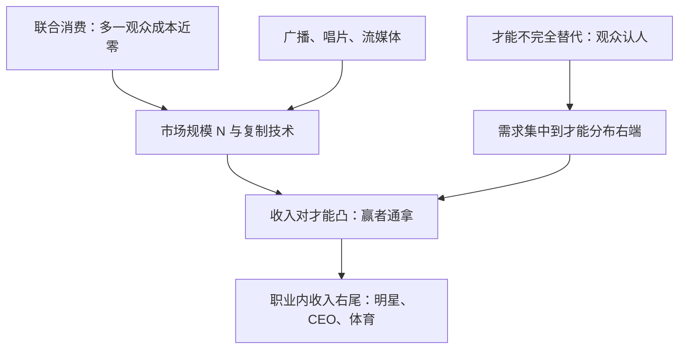

# 超级明星与赢者通拿

技术把每个观众送到同一位歌手面前；才能上小小的差距，被市场放大成天文数字的收入差。

<footer>—— 据 Rosen, The Economics of Superstars, AER, 1981；Gabaix and Landier, Why Has CEO Pay Increased So Much?, QJE, 2008 整理</footer>

[上一课](/econ/signaling-spence-labor)把教育溢价拆成技能与标签两笔账，工资结构的主叙事至此齐了：供需定溢价、人力资本定剖面、属性定补偿、信号分标签。本课收「谁赚得多」的最后一块——右尾：为什么顶尖者与第二名的收入差远大于才能差。Rosen 1981 的超级明星机制把答案压在市场规模与复制技术上。到此为止，这门课都在价格出清的前提下谈定价；下一单元换问题——没成交的人去哪了：失业的存量-流量。「谁赚得多」收在这里，给下一单元留下缺口。

## 问题

上一课的框架是两组劳动的相对价格；右尾问的是分布形状。同一职业内，第一名与第一百名的收入可以差百倍、千倍，而才能差远没有这么大——两组相对价格的模型装不下这个凸性。反例也摆在明处：护士、水管工、中小学教师的收入右尾很平。缺口是：什么条件让微小的才能差兑换成巨大的收入差，什么条件不让。

### 两个假设

Rosen 的机制只要两条。一、才能不完全替代：第二好的歌手替代不了最好的，观众认人。二、联合消费：同一场演出、同一张唱片可以同时卖给近乎无限多的人，多一个观众的成本近零。两条一起，需求涌向才能分布的右端，收入对才能是凸函数。

直觉类比：技术让全世界的听众挤进同一间音乐厅——座位从一万个变成十亿个，台上还是那一位第一名。第二名唱得只差一点点，却几乎没人听：才能差一毫米，舞台差一光年。

## 方法

Rosen 的基准：才能 $s$ 连续分布，市场大小为 $N$。均衡里才能的排序决定市场份额，收入取对数后对才能近似线性、并随市场技术整体放大：

$$
\ln y = \alpha + \beta\, s + \gamma \ln N, \qquad \beta, \gamma \gt 0 .
$$

唱片与广播之前，最好的歌手只能服务本地市场，$N$ 被剧场座位钉死；复制技术把 $N$ 放大几个数量级，右尾收入被同一比例重写——「技术放大」是模型里的 $\gamma\ln N$ 项，不是修辞。同一机制走到高管：公司规模巨大且分散，CEO 的边际判断被规模乘大。Gabaix–Landier 2008 用美国大公司市值校准：市值约六倍的增长对应 CEO 薪酬约六倍的增长，比例吻合把「治理全面失效」的解释挤出大半；激励与代理的内脏在[高管薪酬与激励](/econ/executive-compensation)里，这里只谈规模项。职业体育与娱乐的数据形态与模型同构：竞技差距极小（百米决赛前八名的差距通常只有零点几秒），收入差千倍级；转会费、代言、转播分成随名次陡降。

数字实例：取 $\beta=0.3$。两位歌手的才能分只差 1，收入比就是 $e^{0.3}\approx 1.35$；才能分差 10，收入比是 $e^{3}\approx 20$ 倍——才能的线性差距，经过凸性兑换成收入的数量级差距。

## 机制

放大通道是一张清单：复制成本近零（唱片、流媒体、软件）；市场半径（全球化把 $N$ 从城市放大到全球）；排名与中介技术（榜单把注意力更集中，发现与集中互相加强）。反例划出边界：护士与水管工的产出不联合消费（一小时只服务一人）、质量难观察也难排名，两条假设都不满足，右尾不会因为技术进步而变平。右尾因此既不是市场失灵也不是道德问题，是生产与复制技术的函数；技术一变，分布形状跟着变。

Gabaix–Landier 2008 的核心事实：美国大公司市值在 1980–2004 年间约增六倍，按其比例模型推得的 CEO 薪酬增长与之同量级。争议在「规模项算不算出清」，不在数据本身；把它直接读成治理失败的证据，会漏掉规模这一项。

## 边界

本课解释既定才能分布下收入的凸性，不解释才能分布怎么形成：童年投资、选拔体系、以及为挤进右尾的过度竞赛投入——竞赛性耗散的口径在[全支付拍卖](/econ/all-pay-auction)里。也别把赢者通拿当成所有行业的宿命：复制成本高、排名难、服务半径有限的职业，右尾不会变。政策上，再分配的争论要先承认机制：税收与规制改变不了联合消费技术，改的是事后分配——把两件事混在一句话里，是右尾讨论最常见的错位。

为什么重要：判断一个行业会不会走向赢者通拿，先看两个可观察指标——复制成本与可排名性。直播让化妆师、游戏玩家明星化（复制近零、可排名），却没能造出「水管工明星」：技术改的是复制，不是服务半径。

## 小结

- 超级明星只要两个假设：才能不完全替代、联合消费近零成本。
- 市场规模与复制技术放大收入的凸性；右尾是技术的函数。
- CEO 薪酬约六倍增长与大公司市值约六倍增长同比例（Gabaix–Landier 2008），规模项是主解释候选。
- 护士与水管工没有超级明星：联合消费与可排名性不成立。
- 工资结构收束于此；下一单元转出清失败——失业的存量-流量与贝弗里奇。
- 出处：Rosen, AER 1981；Frank and Cook, The Winner-Take-All Society, 1995；Gabaix and Landier, QJE 2008。
